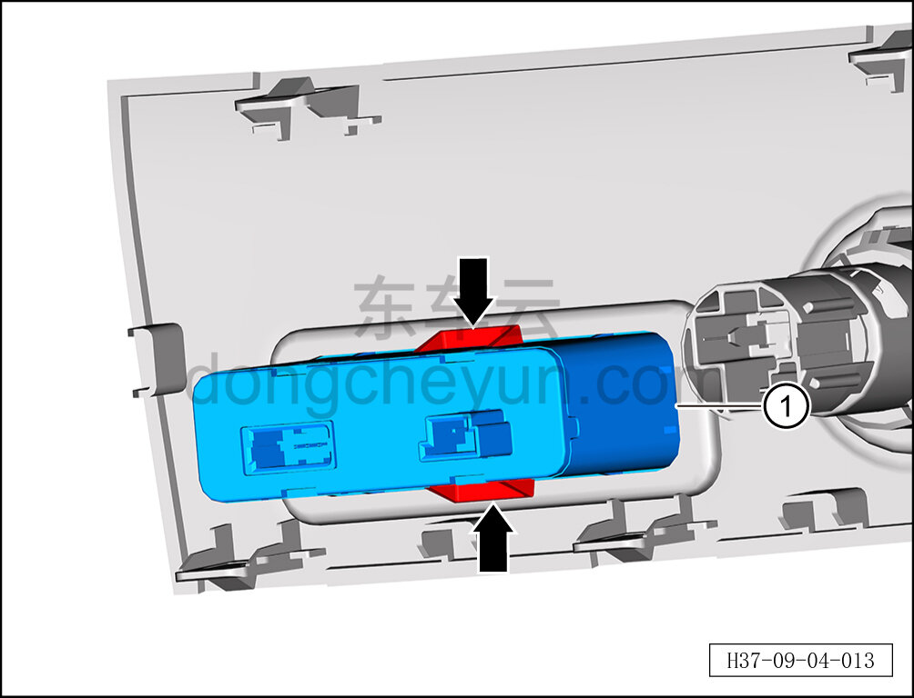

# Снятие и установка USB-зарядного устройства (с передачей данных)

> Электрическая и электронная система › Система низковольтного электропитания › Разъём питания 12 В  
> Оригинал: `拆卸与安装USB充电器（带数据传输）` · [dongcheyun 56746](https://dongcheyun.com/p/56746), страница `035ca7e812d9420cbaaba955c8bef66c` · [оглавление](../README.md)

**Порядок снятия**

1. Выключите все электроприборы, отключите питание.

2. Выполните обесточивание автомобиля для ремонта. [3.1.4.1 Обесточивание автомобиля](../03-техническое-обслуживание/005-обесточивание-автомобиля.md)

3. Снимите центральную консоль в сборе. См. [8.3.4.8 Снятие и установка центральной консоли в сборе](../08-внутренняя-и-внешняя-отделка/098-снятие-и-установка-центральной-консоли-в-сборе.md)

4. Снимите USB-зарядное устройство (с передачей данных).

a. Нажав на клипсы с обеих сторон USB-зарядного устройства, извлеките USB-зарядное устройство ①.

**Порядок установки**

Установка выполняется в обратном порядке.

**Внимание:**

**- При установке USB-зарядного устройства убедитесь в надёжной фиксации клипс.**

**- После завершения установки проверьте нормальную работу USB-зарядного устройства.**
