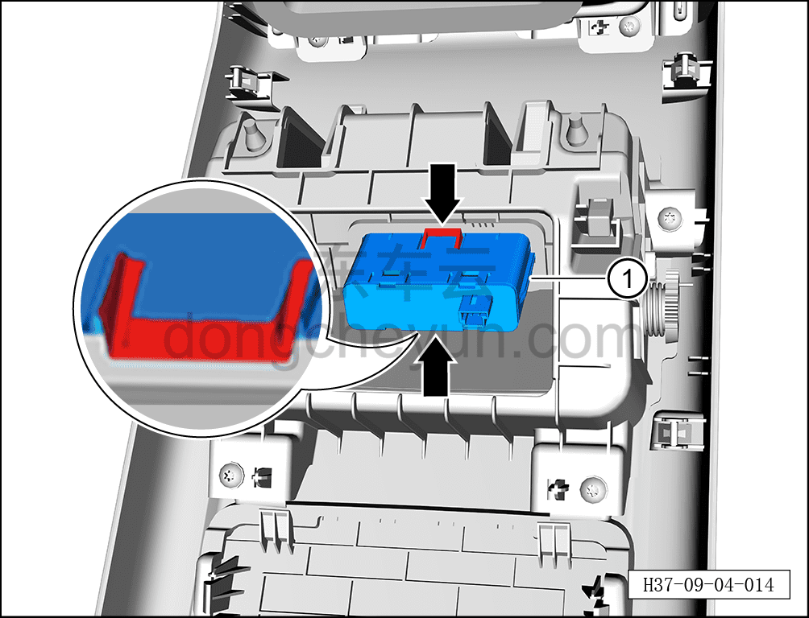

# Снятие и установка USB-зарядного устройства (задняя крышка)

> Электрическая и электронная система › Система низковольтного электропитания › Разъём питания 12 В  
> Оригинал: `拆卸与安装USB 充电器（后盖板）` · [dongcheyun 56746](https://dongcheyun.com/p/56746), страница `c6fad167d6e941c792457e6b87d44835` · [оглавление](../README.md)

**Порядок снятия**

1. Выключите все электроприборы, отключите питание.

2. Выполните операцию обесточивания автомобиля для ремонта. См. [3.1.4.1 Обесточивание автомобиля](../03-техническое-обслуживание/005-обесточивание-автомобиля.md)

3. Снимите заднюю крышку в сборе. См. [8.3.4.12 Снятие и установка задней крышки](../08-внутренняя-и-внешняя-отделка/102-снятие-и-установка-задней-крышки.md)

4. Снимите USB-зарядное устройство.

a. Нажав на фиксирующие клипсы с обеих сторон USB-зарядного устройства, извлеките USB-зарядное устройство ①.

**Порядок установки**

Установка выполняется в обратном порядке.

**Внимание:**

**- При установке USB-зарядного устройства убедитесь в надёжной фиксации клипс.**

**- После завершения установки проверьте нормальную работу USB-зарядного устройства.**
