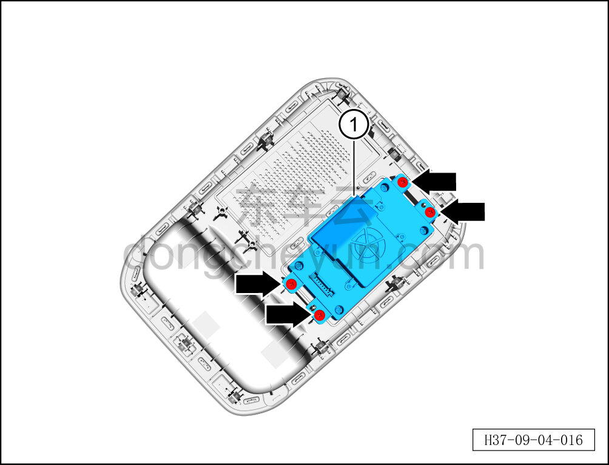

# Снятие и установка контроллера беспроводной зарядки телефона

> Электрическая и электронная система › Система низковольтного электропитания › Беспроводная зарядка телефона  
> Оригинал: `拆卸与安装手机无线充电控制器` · [dongcheyun 56746](https://dongcheyun.com/p/56746), страница `6c2cf89ff2f04799984877ea5346183a` · [оглавление](../README.md)

**Порядок снятия**

1. Выключите все электроприборы, отключите питание.

2. Выполните обесточивание автомобиля для ремонта. См. [3.1.4.1 Обесточивание автомобиля](../03-техническое-обслуживание/005-обесточивание-автомобиля.md)

3. Снимите верхнюю панель в сборе. См. [8.3.4.12 Снятие и установка верхней панели в сборе](../08-внутренняя-и-внешняя-отделка/097-снятие-и-установка-верхней-панели-в-сборе.md)

4. Снимите контроллер беспроводной зарядки телефона.

a. С помощью крестовой отвёртки выверните 4 крепёжных винта контроллера беспроводной зарядки телефона.

b. Снимите контроллер беспроводной зарядки телефона ①.

**Порядок установки**

Установка выполняется в обратном порядке.

**Внимание:**

**- После завершения установки проверьте нормальную работу функции беспроводной зарядки.**
