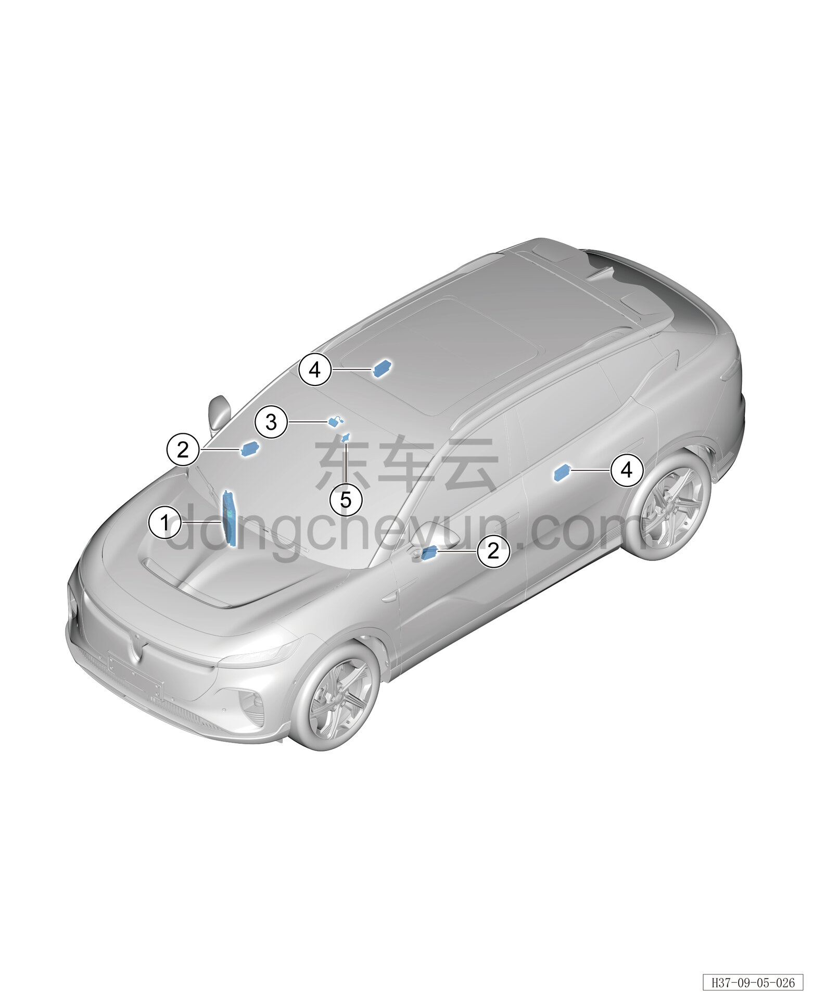

# Расположение компонентов

> Электрическая и электронная система › Система управления кузовом  
> Оригинал: `部件位置图` · [dongcheyun 56746](https://dongcheyun.com/p/56746), страница `58623330bc284448a5a97a9bc25e39a4` · [оглавление](../README.md)

| № | Наименование детали | Кол-во на автомобиль | Примечание |
|---|---|---|---|
| 1 | Центральный контроллер | 1 | Расположен с внутренней стороны нижнего каркаса панели приборов |
| 2 | Модуль передней двери | 2 | Расположен с внутренней стороны обивки двери |
| 3 | Система оплаты проезда без остановки ETC (опция) | 1 | Расположена с внутренней стороны декоративного кожуха внутреннего зеркала заднего вида |
| 4 | Модуль задней двери | 2 | Расположен с внутренней стороны обивки двери |
| 5 | Датчик дождя и освещённости | 1 | Расположена с внутренней стороны декоративного кожуха внутреннего зеркала заднего вида |
