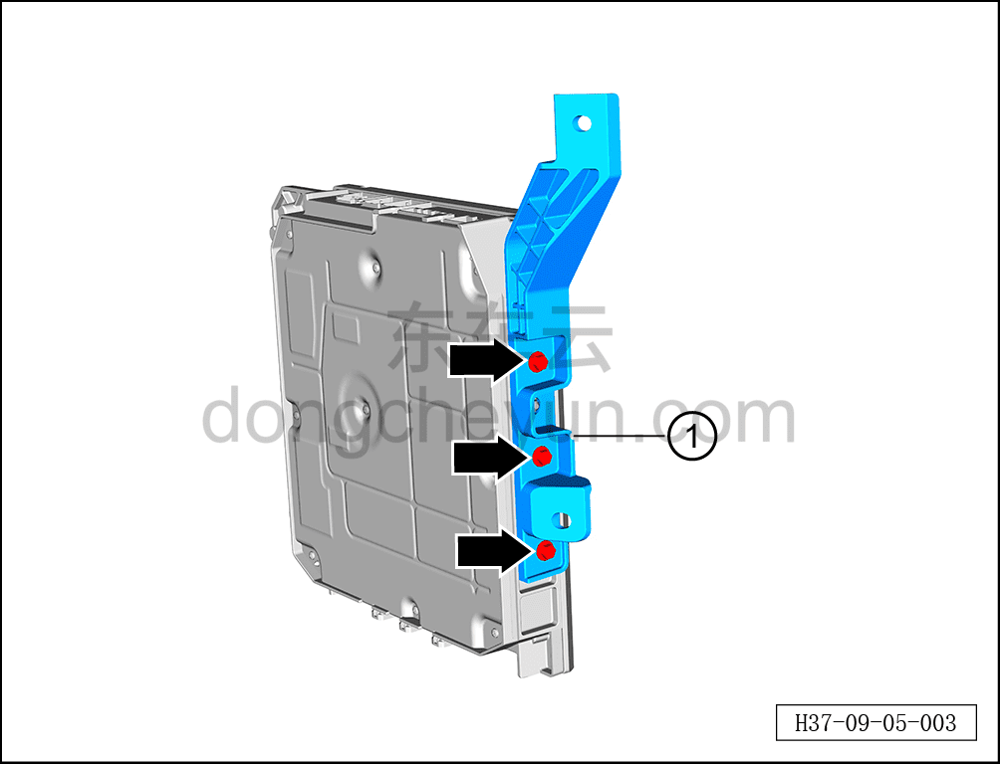

# Снятие и установка левого кронштейна центрального контроллера

> Электрическая и электронная система › Система управления кузовом › Блок управления кузовом  
> Оригинал: `拆卸与安装中央控制器左侧支架` · [dongcheyun 56746](https://dongcheyun.com/p/56746), страница `07e06a8c75264582b0bf81055af1bf0e` · [оглавление](../README.md)

**Порядок снятия**

**Внимание:**

**- Снимайте и устанавливайте контроллер осторожно, избегая ударов и попадания влаги.**

**- В процессе снятия и установки не касайтесь руками контактов разъёмов и не пытайтесь силой открыть корпус, чтобы не повредить внутренние электрические компоненты.**

1. Выключите все электроприборы, отключите питание.

2. Выполните обесточивание автомобиля для ремонта. См. [3.1.4.1 Обесточивание автомобиля](../03-техническое-обслуживание/005-обесточивание-автомобиля.md)

3. Слейте охлаждающую жидкость. См. [3.1.5.2 Замена охлаждающей жидкости HVAC](../03-техническое-обслуживание/007-замена-охлаждающей-жидкости-hvac.md)

4. Снимите центральный контроллер. См. [9.5.4.4 Снятие и установка центрального контроллера](041-снятие-и-установка-центрального-контроллера.md)

5. Снимите левый кронштейн центрального контроллера.

a. С помощью торцевой головки на 8 мм выверните 3 крепёжных болта левого кронштейна центрального контроллера.

Момент затяжки болта: 5,3±0,2 Н·м

b. Снимите левый кронштейн центрального контроллера ①.

**Порядок установки**

Установка выполняется в обратном порядке.

**Внимание:**

**- После завершения установки подключите диагностический сканер, проверьте автомобиль на наличие кодов неисправностей; если они есть, найдите причину и устраните коды неисправностей.**
