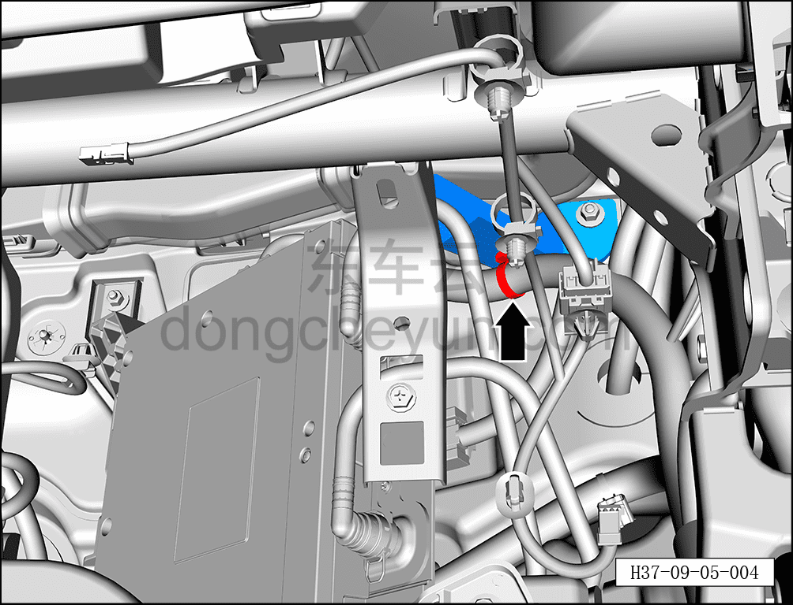
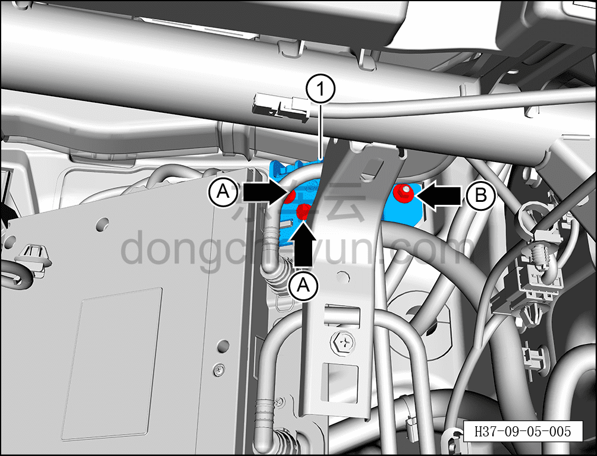

# Снятие и установка верхнего правого кронштейна центрального контроллера

> Электрическая и электронная система › Система управления кузовом › Блок управления кузовом  
> Оригинал: `拆卸与安装中央控制器右上支架` · [dongcheyun 56746](https://dongcheyun.com/p/56746), страница `a306c5eb3bbc4a839cb8cca3d8c2dd91` · [оглавление](../README.md)

**Порядок снятия**

1. Выключите все электроприборы, отключите питание.

2. Выполните операцию обесточивания автомобиля для ремонта. См. [3.1.4.1 Обесточивание автомобиля](../03-техническое-обслуживание/005-обесточивание-автомобиля.md)

3. Снимите перчаточный ящик. См. [8.2.4.7 Снятие и установка перчаточного ящика](../08-внутренняя-и-внешняя-отделка/060-снятие-и-установка-перчаточного-ящика.md)

4. Снимите верхний правый кронштейн центрального контроллера.

a. С помощью съёмника обивки отсоедините клипсу жгута проводов верхнего правого кронштейна центрального контроллера.

b. С помощью торцевой головки на 8 мм выверните 2 крепёжных болта A верхнего правого кронштейна центрального контроллера.

Момент затяжки болта: 5,3±0,2 Н·м

c. С помощью торцевой головки на 10 мм отверните крепёжную гайку B верхнего правого кронштейна центрального контроллера.

Момент затяжки гайки: 8±1 Н·м

d. Извлеките верхний правый кронштейн центрального контроллера ①.

**Порядок установки**

Установка выполняется в обратном порядке.

**Примечание:**

**- После завершения установки проверьте нормальную работу всех электрических устройств на панели приборов.**
