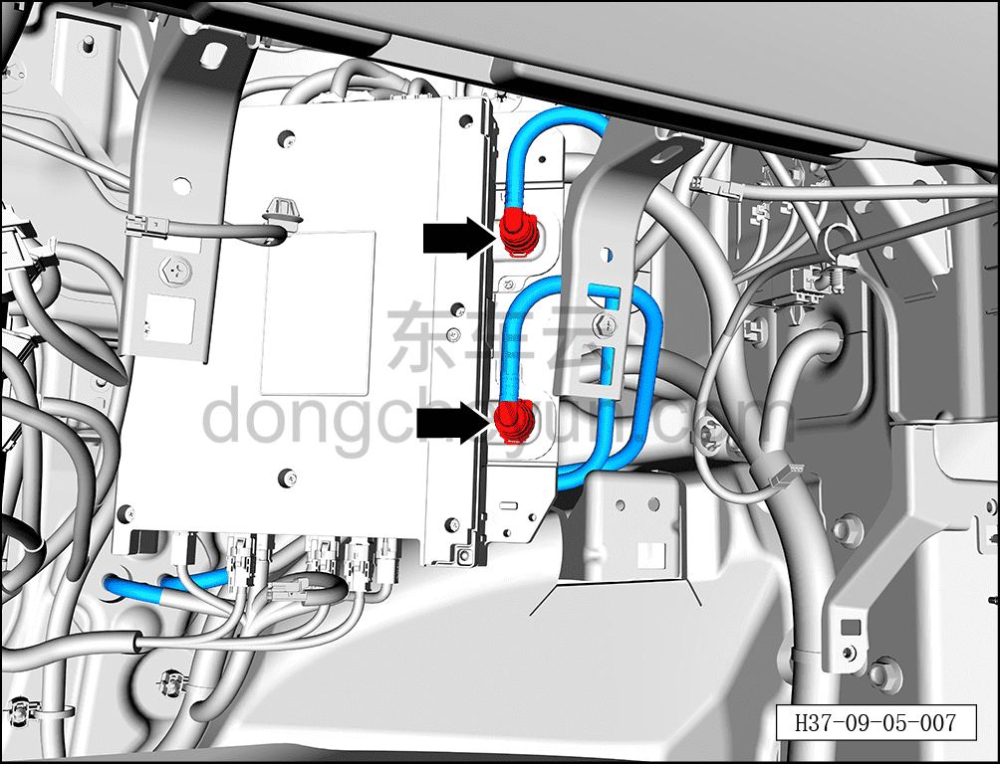
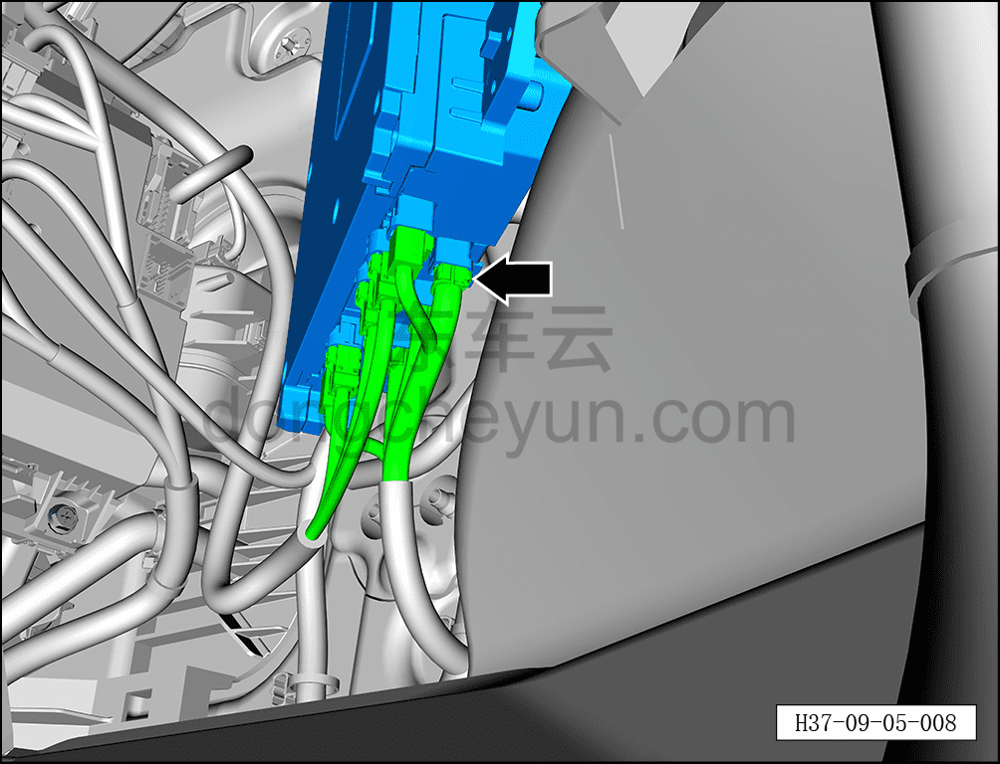
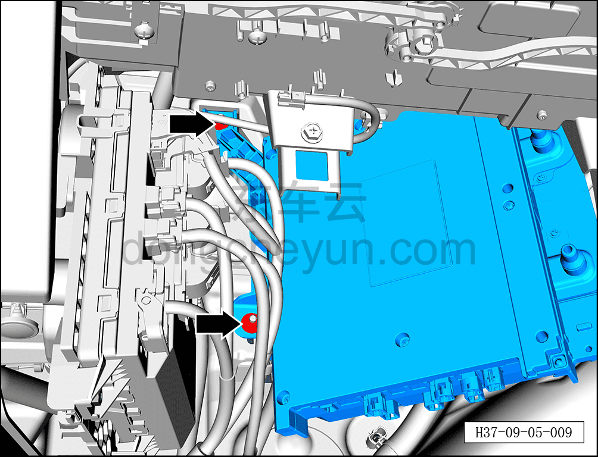
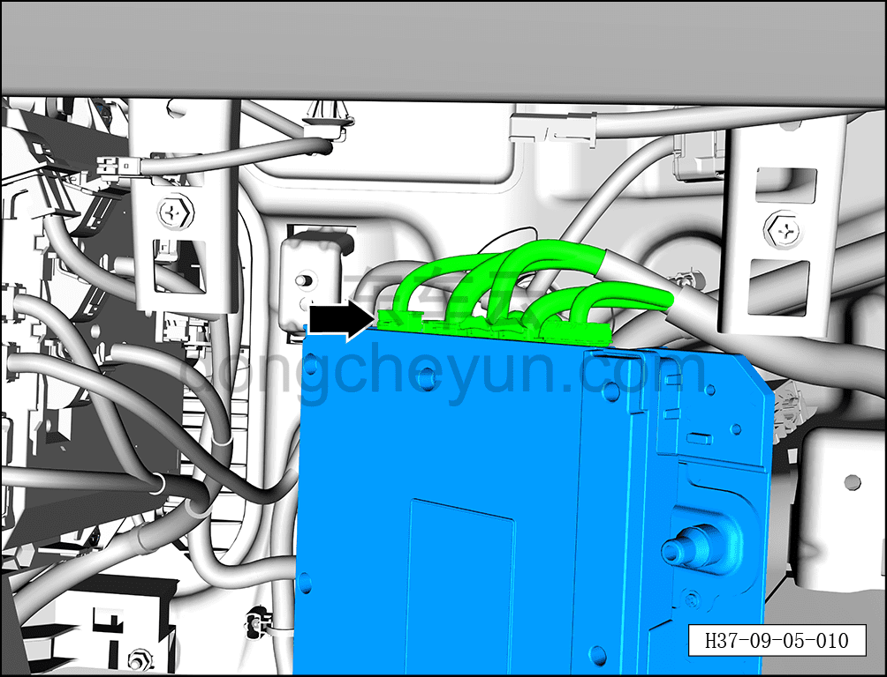
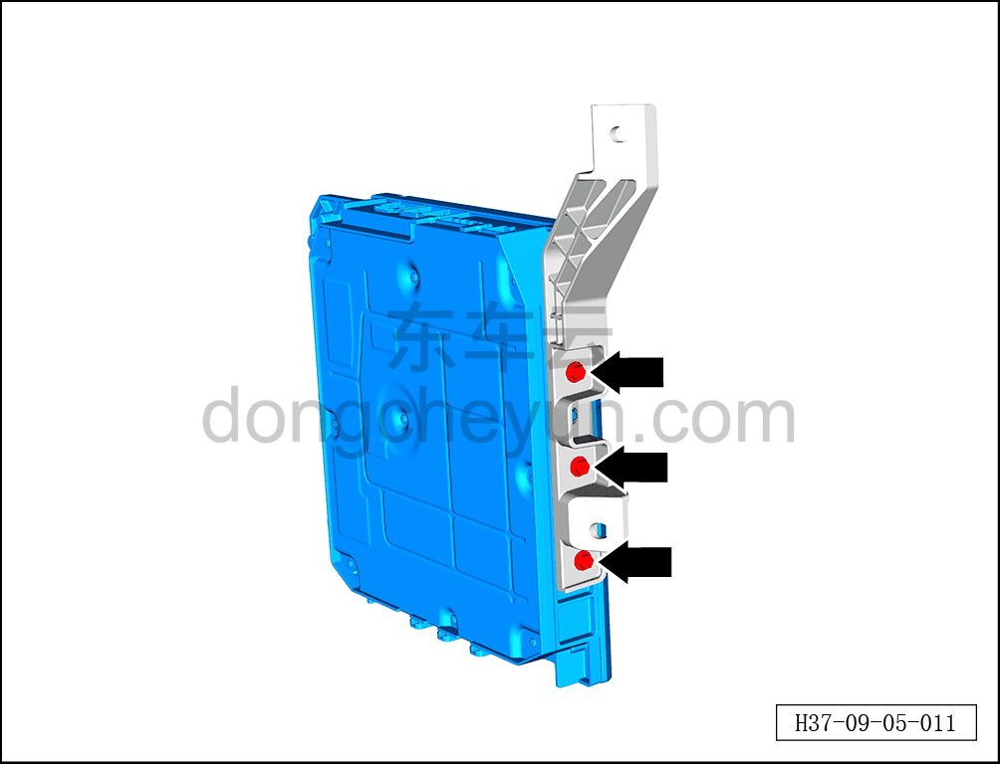

# Снятие и установка центрального контроллера

> Электрическая и электронная система › Система управления кузовом › Блок управления кузовом  
> Оригинал: `拆卸与安装中央控制器` · [dongcheyun 56746](https://dongcheyun.com/p/56746), страница `e657c64f581c42e2b43b02779891e8c5` · [оглавление](../README.md)

**Порядок снятия**

**Внимание:**

**- Снимайте и устанавливайте контроллер осторожно, избегая ударов и попадания влаги.**

**- В процессе снятия и установки не касайтесь руками контактов разъёмов и не пытайтесь силой открыть корпус, чтобы не повредить внутренние электрические компоненты.**

**- Перед ремонтом центрального контроллера, если по результатам диагностики неисправности подтверждается необходимость его замены, для обеспечения того, чтобы личные данные и другая конфиденциальная информация пользователя не были раскрыты, перед заменой центрального контроллера необходимо получить согласие клиента и выполнить сброс до заводских настроек. Порядок действий: на панели навигации центрального дисплея коснитесь значка "Настройки" или на экране всех приложений коснитесь значка "Настройки", войдите в экран системных настроек, выберите "Система", коснитесь "Сброс до заводских настроек" — это завершит удаление данных перед заменой центрального контроллера.**

1. Выключите все электроприборы, отключите питание.

2. Выполните обесточивание автомобиля для ремонта. См. [3.1.4.1 Обесточивание автомобиля](../03-техническое-обслуживание/005-обесточивание-автомобиля.md)

3. Слейте охлаждающую жидкость. См. [3.1.5.2 Замена охлаждающей жидкости HVAC](../03-техническое-обслуживание/007-замена-охлаждающей-жидкости-hvac.md)

4. Снимите верхний правый кронштейн центрального контроллера. См. [9.5.4.2 Снятие и установка верхнего правого кронштейна центрального контроллера](039-снятие-и-установка-верхнего-правого-кронштейна.md)

5. Снимите нижний правый кронштейн центрального контроллера. См. [9.5.4.3 Снятие и установка нижнего правого кронштейна центрального контроллера](040-снятие-и-установка-нижнего-правого-кронштейна.md)

6. Снимите центральный контроллер в сборе.

a. С помощью плоской отвёртки отогните 2 фиксирующих кольца впускной и выпускной водяных трубок OIB, отсоедините впускную и выпускную водяные трубки OIB в сборе.

b. Нажав на фиксатор разъёма, отсоедините 8 разъёмов центрального контроллера.

c. С помощью торцевой головки на 10 мм отверните 2 крепёжные гайки левого кронштейна центрального контроллера.

Момент затяжки гайки: 8±1 Н·м

d. Отсоедините 5 разъёмов центрального контроллера.

e. С помощью торцевой головки на 8 мм выверните 3 крепёжных болта центрального контроллера.

Момент затяжки болта: 5,3±0,2 Н·м

f. Извлеките центральный контроллер в сборе ①.

**Порядок установки**

Установка выполняется в обратном порядке.

**Примечание:**

**После завершения замены необходимо выполнить следующие операции с помощью диагностического сканера или удалённой диагностики:**

**- После завершения замены центрального контроллера необходимо выполнить прошивку с помощью диагностического сканера, см. [9.5.4.9 Порядок сопряжения центрального контроллера OIB](046-порядок-сопряжения-центрального-контроллера-oib.md);**

**- После успешного обновления программного обеспечения выполнить процедуру замены детали для контроллера.**

**- После завершения установки подключите диагностический сканер, проверьте автомобиль на наличие кодов неисправностей; если они есть, найдите причину и устраните коды неисправностей.**
