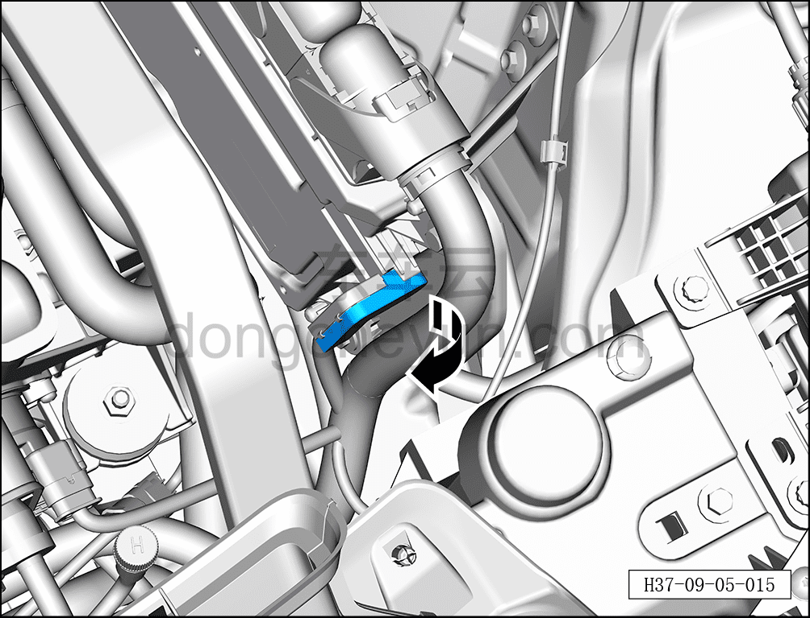
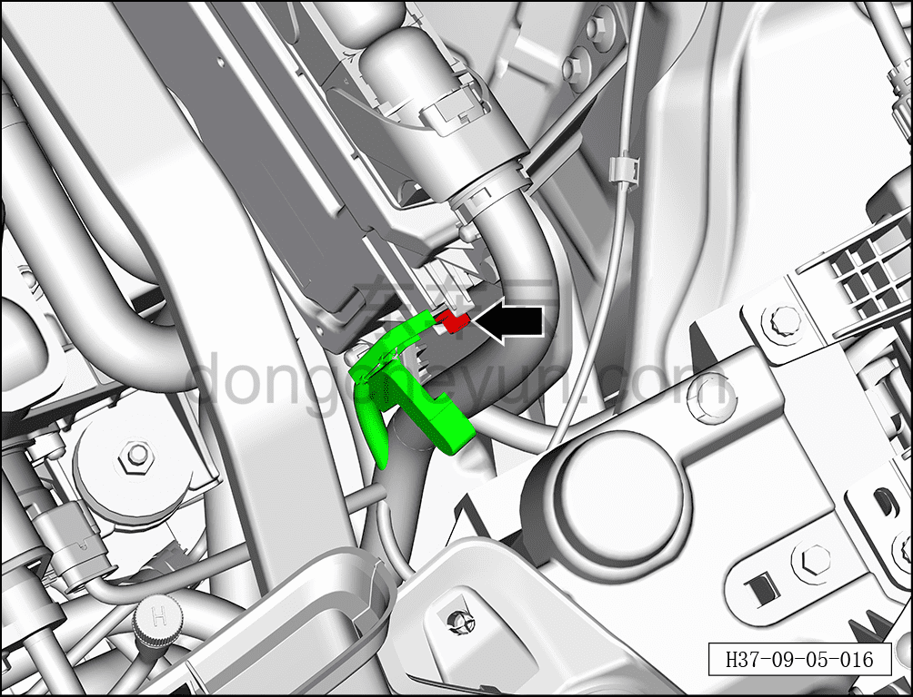
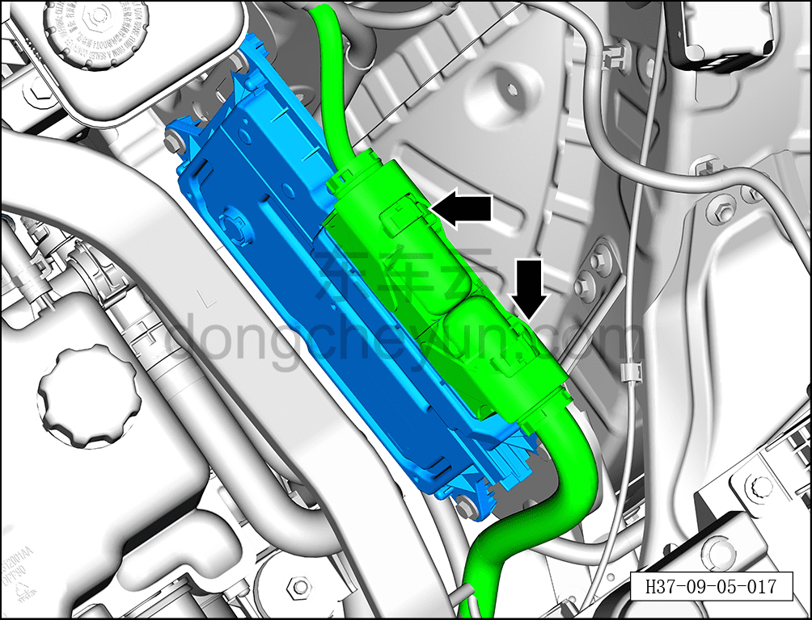
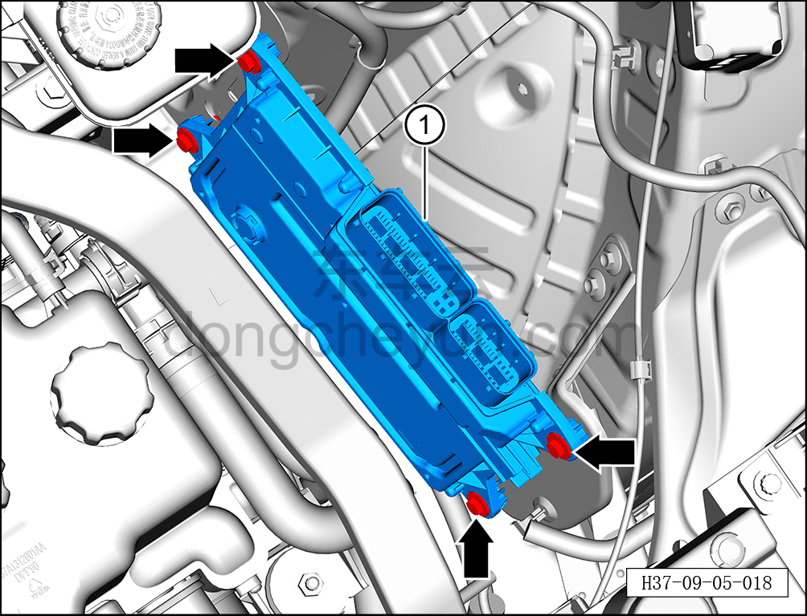

# Снятие и установка зонального контроллера моторного отсека

> Электрическая и электронная система › Система управления кузовом › Блок управления кузовом  
> Оригинал: `拆卸与安装前舱区域控制器` · [dongcheyun 56746](https://dongcheyun.com/p/56746), страница `ae4197e6aadf4afbb334bef1c8ed49e4` · [оглавление](../README.md)

**Порядок снятия**

**Внимание:**

**- Снимайте и устанавливайте контроллер осторожно, избегая ударов и попадания влаги.**

**- В процессе снятия и установки не касайтесь руками контактов разъёмов и не пытайтесь силой открыть корпус, чтобы не повредить внутренние электрические компоненты.**

1. Выключите все электроприборы, отключите питание.

2. Выполните обесточивание автомобиля для ремонта. См. [3.1.4.1 Обесточивание автомобиля](../03-техническое-обслуживание/005-обесточивание-автомобиля.md)

3. Снимите зональный контроллер моторного отсека.

a. Откройте крышку жгута проводов зонального контроллера моторного отсека в направлении стрелки.

b. С помощью торцевой головки на 10 мм выверните крепёжный болт жгута проводов зонального контроллера моторного отсека.

Момент затяжки болтов: 10±1 Н·м

c. Отсоедините 2 разъёма зонального контроллера моторного отсека.

d. С помощью торцевой головки на 10 мм выверните 4 крепёжных болта зонального контроллера моторного отсека.

Момент затяжки болтов: 10±1 Н·м

e. Снимите зональный контроллер моторного отсека ①.

**Порядок установки**

Установка выполняется в обратном порядке.

**Примечание:**

**После завершения замены необходимо выполнить следующие операции с помощью диагностического сканера или удалённой диагностики:**

**- Сначала прошить программное обеспечение до последней версии;**

**- После успешного обновления программного обеспечения выполнить процедуру замены детали для контроллера.**

**Внимание:**

**- После завершения установки подключите диагностический сканер и проверьте наличие кодов неисправностей; если таковые имеются, найдите причину и удалите коды неисправностей.**
