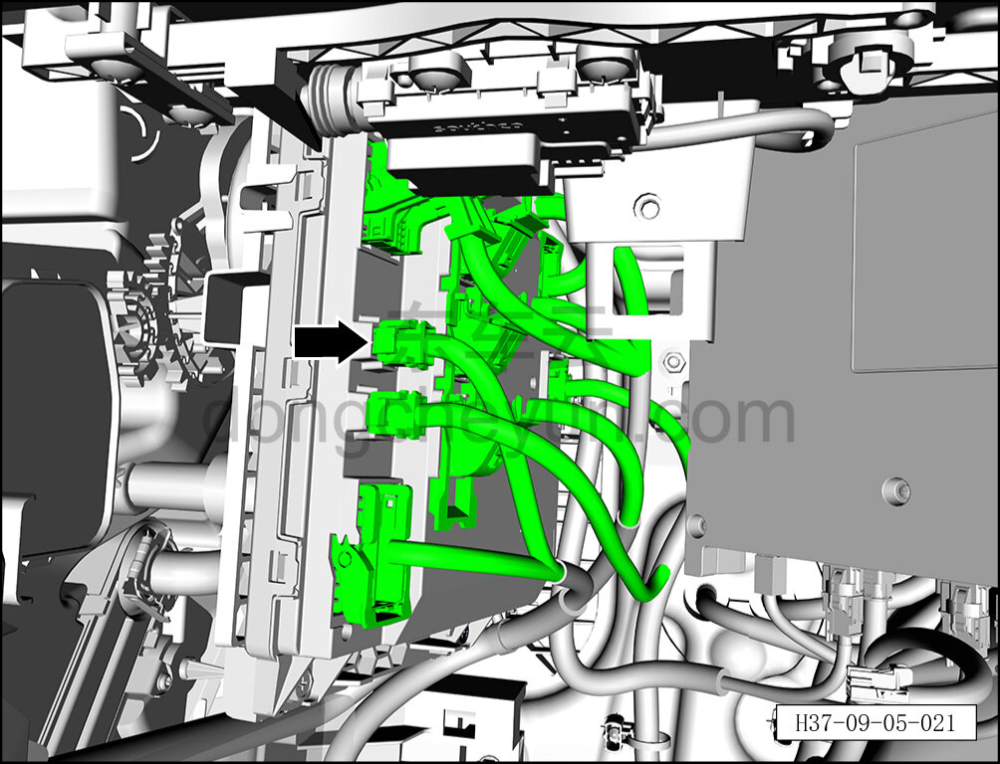
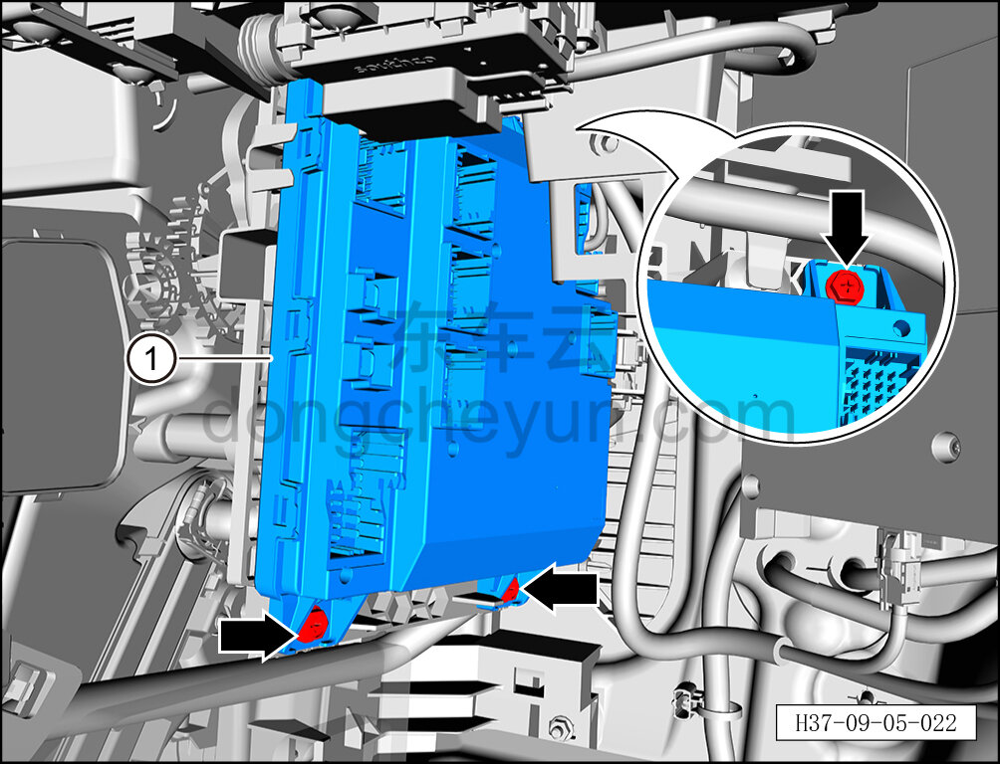

# Снятие и установка правого зонального контроллера салона

> Электрическая и электронная система › Система управления кузовом › Блок управления кузовом  
> Оригинал: `拆卸与安装座舱右区域控制器` · [dongcheyun 56746](https://dongcheyun.com/p/56746), страница `698e87f86a3d4fa788e65e85d6d1ae2f` · [оглавление](../README.md)

**Порядок снятия**

**Внимание:**

**- Снимайте и устанавливайте контроллер осторожно, избегая ударов и попадания влаги.**

**- В процессе снятия и установки не касайтесь руками контактов разъёмов и не пытайтесь силой открыть корпус, чтобы не повредить внутренние электрические компоненты.**

1. Выключите все электроприборы, отключите питание.

2. Выполните обесточивание автомобиля для ремонта. См. [3.1.4.1 Обесточивание автомобиля](../03-техническое-обслуживание/005-обесточивание-автомобиля.md)

3. Снимите правый воздуховод обдува ног. См. [8.2.4.26 Снятие и установка правого воздуховода обдува ног](../08-внутренняя-и-внешняя-отделка/079-снятие-и-установка-правого-воздуховода-обдува-ног.md)

4. Снимите правый зональный контроллер салона.

a. Отсоедините 9 разъёмов правого зонального контроллера салона.

**Внимание:**

**- При установке следите за разъёмами жгутов проводов, избегая помех и запутывания.**

b. С помощью крестовой отвёртки выверните 3 крепёжных болта правого зонального контроллера моторного отсека.

Момент затяжки болта: 4±1 Н·м

c. Снимите правый зональный контроллер салона ①.

**Порядок установки**

Установка выполняется в обратном порядке.

**Примечание:**

**После завершения замены необходимо выполнить следующие операции с помощью диагностического сканера или удалённой диагностики:**

**- Сначала прошить программное обеспечение до последней версии;**

**- После успешного обновления программного обеспечения выполнить процедуру замены детали для контроллера.**

**Внимание:**

**- После завершения установки подключите диагностический сканер и проверьте наличие кодов неисправностей; если таковые имеются, найдите причину и удалите коды неисправностей.**
