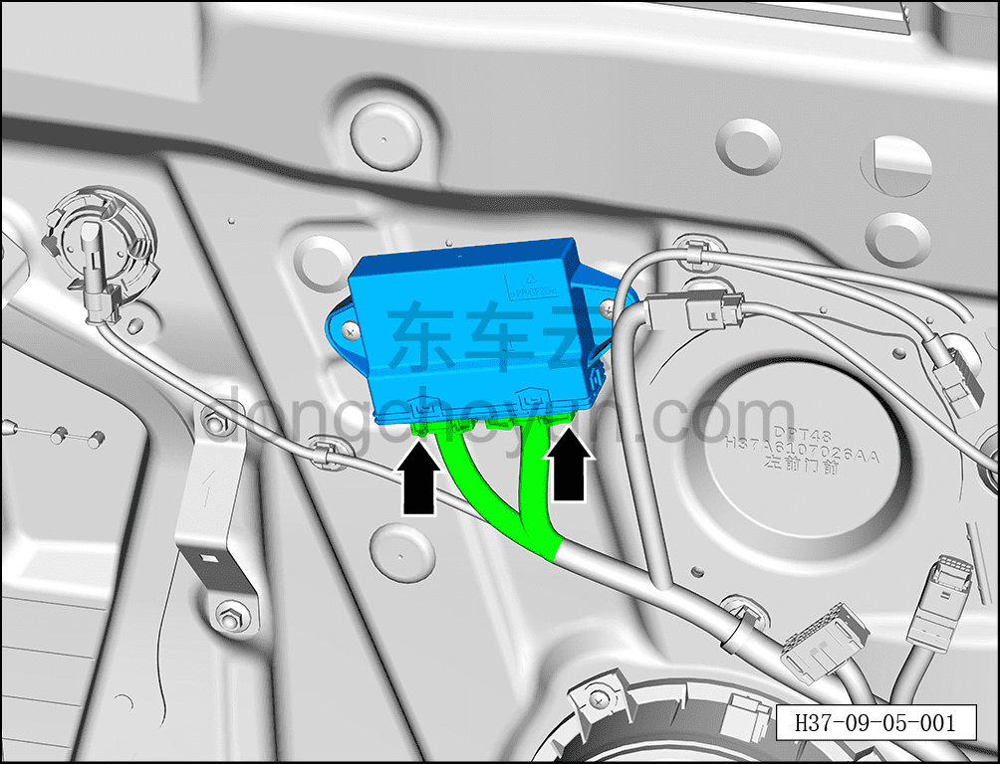
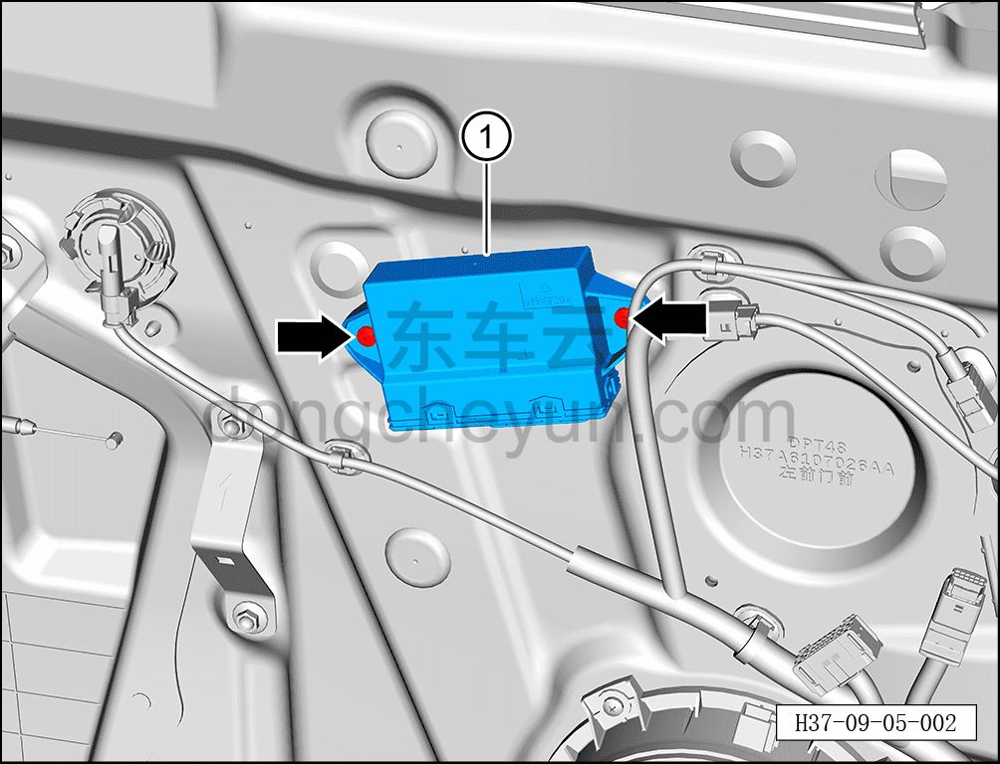

# Снятие и установка модуля передней двери

> Электрическая и электронная система › Система управления кузовом › Блок управления кузовом  
> Оригинал: `拆卸与安装前门模块` · [dongcheyun 56746](https://dongcheyun.com/p/56746), страница `983a1db4a5c34694a6a3cfe570e8134e` · [оглавление](../README.md)

**Порядок снятия**

**Внимание:**

**- Далее описаны снятие и установка модуля левой передней двери; для правой передней и задних дверей действия аналогичны левой передней.**

1. Выключите все электроприборы, отключите питание.

2. Выполните обесточивание автомобиля для ремонта. См. [3.1.4.1 Обесточивание автомобиля](../03-техническое-обслуживание/005-обесточивание-автомобиля.md)

3. Снимите внутреннюю обивку левой передней двери. См. [8.4.2.1 Снятие и установка внутренней обивки левой передней двери](../08-внутренняя-и-внешняя-отделка/117-снятие-и-установка-обивки-левой-передней-двери.md)

4. Снимите модуль левой передней двери.

a. Нажав на фиксатор разъёма, отсоедините 2 разъёма модуля левой передней двери.

b. С помощью крестовой отвёртки выверните 2 крепёжных винта модуля левой передней двери.

Момент затяжки винта: 2±0.5 Н·м

c. Снимите модуль левой передней двери ①.

**Порядок установки**

Установка выполняется в обратном порядке.

**Примечание:**

**После завершения замены необходимо выполнить следующие операции с помощью диагностического сканера или удалённой диагностики:**

**- Сначала прошить программное обеспечение до последней версии;**

**- После успешного обновления программного обеспечения выполнить процедуру замены детали для контроллера.**

**- После завершения установки подключите диагностический сканер, проверьте автомобиль на наличие кодов неисправностей; если они есть, найдите причину и устраните коды неисправностей.**
