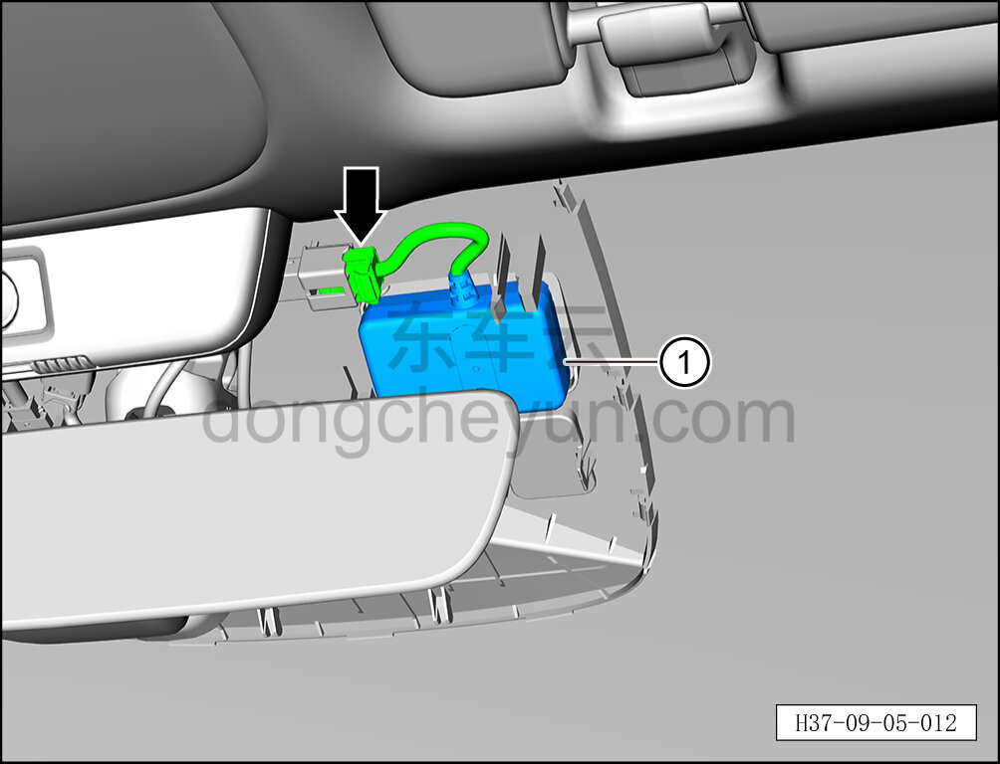

# Снятие и установка системы ETC

> Электрическая и электронная система › Система управления кузовом › Бортовой терминал системы оплаты проезда без остановки ETC  
> Оригинал: `拆卸与安装不停车收费系统` · [dongcheyun 56746](https://dongcheyun.com/p/56746), страница `a927055ab6cb45919e5187a07c3dc396` · [оглавление](../README.md)

**Порядок снятия**

1. Выключите все электроприборы, отключите питание.

2. Выполните обесточивание автомобиля для ремонта. См. [3.1.4.1 Обесточивание автомобиля](../03-техническое-обслуживание/005-обесточивание-автомобиля.md)

3. Снимите передний декоративный кожух внутреннего зеркала заднего вида. См. [8.6.8.7 Снятие и установка переднего декоративного кожуха внутреннего зеркала заднего вида](../08-внутренняя-и-внешняя-отделка/260-снятие-и-установка-переднего-декоративного-кожуха.md)

4. Снимите задний декоративный кожух внутреннего зеркала заднего вида. См. [8.6.8.8 Снятие и установка заднего декоративного кожуха внутреннего зеркала заднего вида](../08-внутренняя-и-внешняя-отделка/261-снятие-и-установка-заднего-декоративного-кожуха.md)

5. Снимите систему ETC.

a. Отсоедините разъём системы ETC.

b. Снимите систему ETC ①.

**Порядок установки**

Установка выполняется в обратном порядке.

**Примечание:**

**После завершения замены необходимо выполнить следующие операции с помощью диагностического сканера или удалённой диагностики:**

**- Сначала прошить программное обеспечение до последней версии;**

**- После успешного обновления программного обеспечения выполнить процедуру замены детали для контроллера.**

**Внимание:**

**- Перед установкой системы ETC снимите защитную плёнку, затем приклейте её на фиксированное место на автомобиле; после наклеивания прижимайте в течение 30 с для плотного прилегания.**
