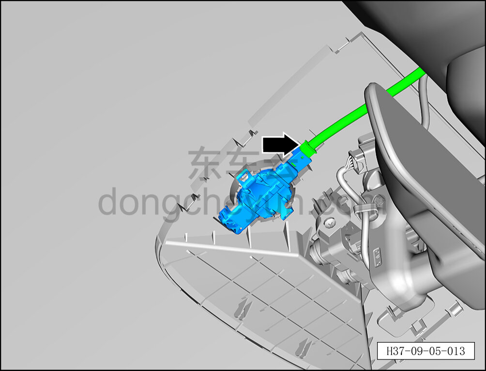
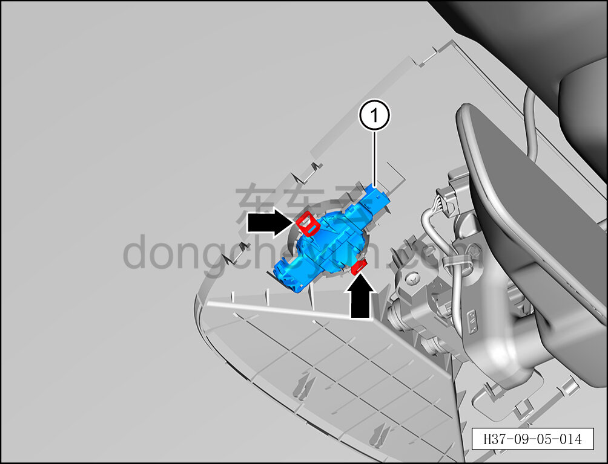

# Снятие и установка датчика дождя и освещённости

> Электрическая и электронная система › Система управления кузовом › Устройство датчика дождя и освещённости  
> Оригинал: `拆卸与安装雨量光照传感器` · [dongcheyun 56746](https://dongcheyun.com/p/56746), страница `44dc1e2aad7148b8a724ae75d232dd2d` · [оглавление](../README.md)

**Порядок снятия**

1. Выключите все электроприборы, отключите питание.

2. Выполните обесточивание автомобиля для ремонта. См. [3.1.4.1 Обесточивание автомобиля](../03-техническое-обслуживание/005-обесточивание-автомобиля.md)

3. Снимите передний декоративный кожух внутреннего зеркала заднего вида. См. [8.6.8.7 Снятие и установка переднего декоративного кожуха внутреннего зеркала заднего вида](../08-внутренняя-и-внешняя-отделка/260-снятие-и-установка-переднего-декоративного-кожуха.md)

4. Снимите задний декоративный кожух внутреннего зеркала заднего вида. См. [8.6.8.8 Снятие и установка заднего декоративного кожуха внутреннего зеркала заднего вида](../08-внутренняя-и-внешняя-отделка/261-снятие-и-установка-заднего-декоративного-кожуха.md)

5. Снимите датчик дождя и освещённости.

a. Нажав на фиксатор разъёма, отсоедините разъём датчика дождя и освещённости

b. Отсоедините 2 фиксирующие клипсы датчика дождя и освещённости. c. Извлеките датчик дождя и освещённости ①.

**Внимание:**

**- Действуйте осторожно, чтобы не повредить покрытие.**

**- Удалите металлической щёткой остатки клея с установочной площадки внутреннего зеркала заднего вида.**

**- Удалите скребком для стекла остатки клея с ветрового стекла, обнажив покрытие.**

**- Очистите склеиваемую поверхность моющим средством.**

**Порядок установки**

Установка выполняется в обратном порядке.

**Примечание:**

**- После завершения установки подключите диагностический сканер, проверьте автомобиль на наличие кодов неисправностей; если они есть, найдите причину и устраните коды неисправностей.**
