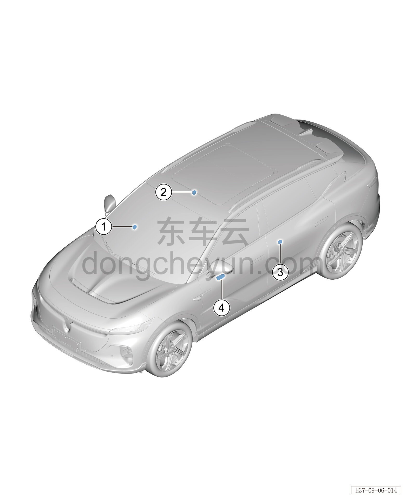

# Расположение компонентов

> Электрическая и электронная система › Система электрического управления › Устройство управления стеклоподъёмниками  
> Оригинал: `部件位置图` · [dongcheyun 56746](https://dongcheyun.com/p/56746), страница `493e3bab6bfc450e8749a80508d696b8` · [оглавление](../README.md)

| № | Наименование детали | Кол-во на автомобиль | Примечание |
|---|---|---|---|
| 1 | Выключатель стеклоподъёмника правой передней двери | 1 | Расположен на подлокотнике обивки двери |
| 2 | Выключатель стеклоподъёмника правой задней двери | 1 | Расположен на подлокотнике обивки двери |
| 3 | Выключатель стеклоподъёмника левой задней двери | 1 | Расположен на подлокотнике обивки двери |
| 4 | Выключатель стеклоподъёмника левой передней двери | 1 | Расположен на подлокотнике обивки двери |
