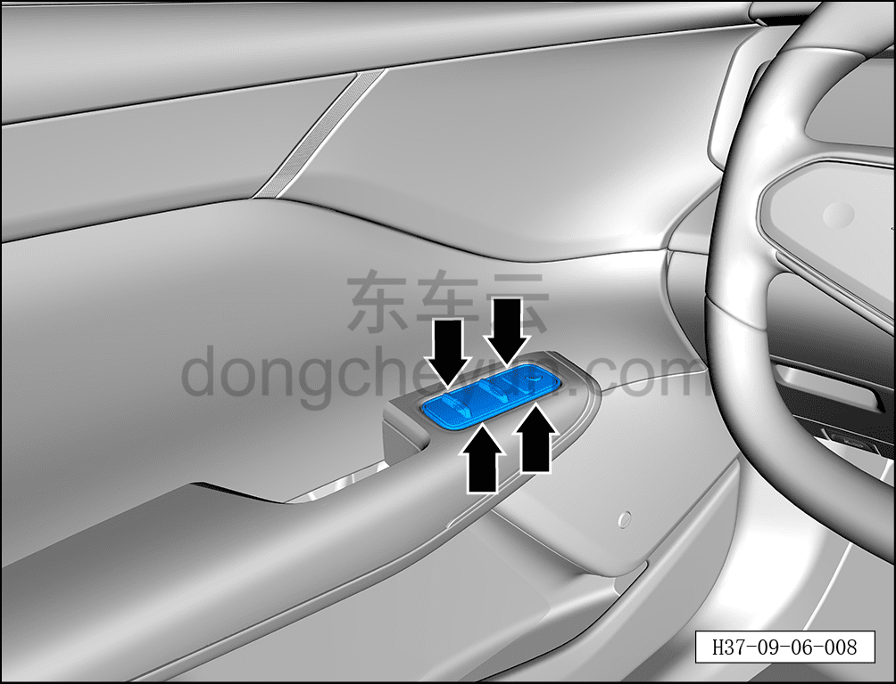
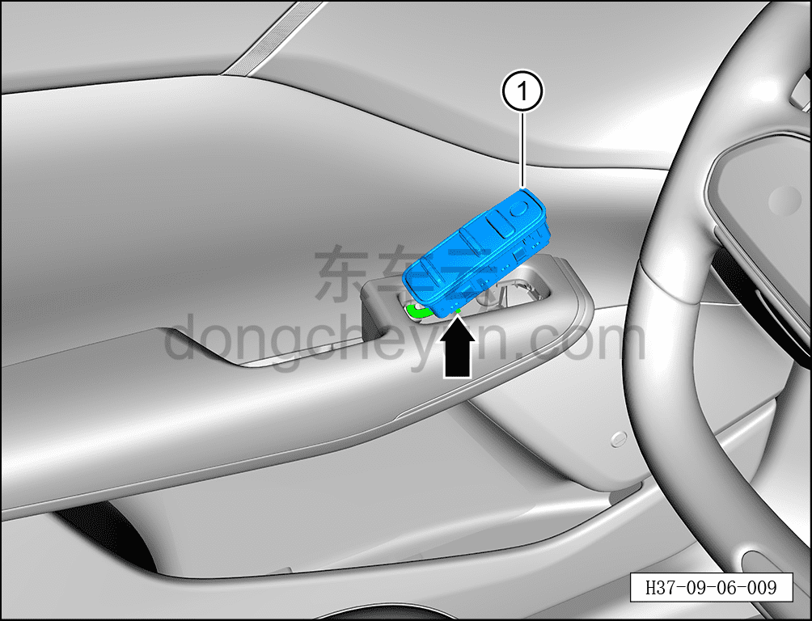

# Снятие и установка выключателя стеклоподъёмника левой передней двери

> Электрическая и электронная система › Система электрического управления › Устройство управления стеклоподъёмниками  
> Оригинал: `拆卸与安装左前门车窗开关` · [dongcheyun 56746](https://dongcheyun.com/p/56746), страница `743aa2ff6b6442d1b5c34a0153e12609` · [оглавление](../README.md)

**Порядок снятия**

1. Выключите все электроприборы, отключите питание.

2. Выполните обесточивание автомобиля для ремонта. См. [3.1.4.1 Обесточивание автомобиля](../03-техническое-обслуживание/005-обесточивание-автомобиля.md)

3. Снимите выключатель стеклоподъёмника левой передней двери.

a. С помощью съёмника обивки отогните 4 фиксирующие клипсы выключателя стеклоподъёмника левой передней двери.

**Примечание:**

**- При использовании инструмента для снятия обивки можно подложить под него чистый нетканый материал, чтобы не повредить обивку двери в процессе работы.**

b. Нажав на фиксатор разъёма, отсоедините разъём выключателя стеклоподъёмника левой передней двери.

c. Извлеките выключатель стеклоподъёмника левой передней двери ①.

**Порядок установки**

Установка выполняется в обратном порядке.

**Примечание:**

**- После завершения установки подключите диагностический сканер, проверьте автомобиль на наличие кодов неисправностей; если они есть, найдите причину и устраните коды неисправностей.**

**- После завершения установки проверьте нормальную работу выключателя стеклоподъёмника левой передней двери.**
