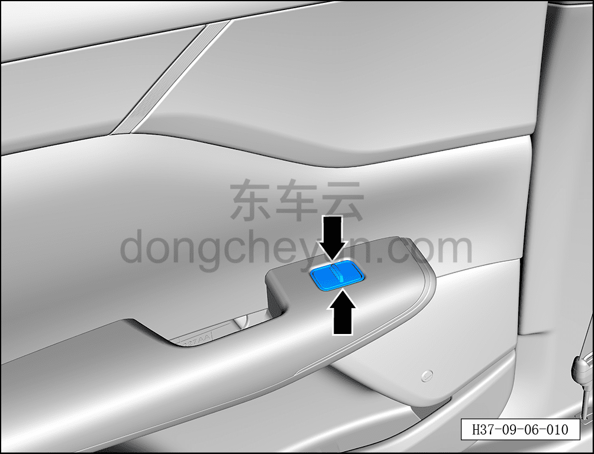
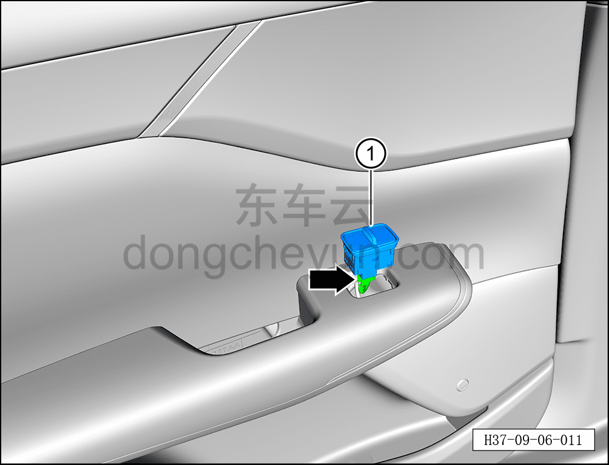

# Снятие и установка выключателя стеклоподъёмника левой задней двери

> Электрическая и электронная система › Система электрического управления › Устройство управления стеклоподъёмниками  
> Оригинал: `拆卸与安装左后玻璃升降器开关` · [dongcheyun 56746](https://dongcheyun.com/p/56746), страница `96dc6d48c307404b892a7cac2d7f8428` · [оглавление](../README.md)

**Порядок снятия**

**Примечание:**

**- Далее описаны снятие и установка выключателя стеклоподъёмника левой задней двери; для правой передней и задней дверей действия аналогичны левой задней.**

1. Выключите все электроприборы, отключите питание.

2. Выполните обесточивание автомобиля для ремонта. См. [3.1.4.1 Обесточивание автомобиля](../03-техническое-обслуживание/005-обесточивание-автомобиля.md)

3. Снимите выключатель стеклоподъёмника левой задней двери.

a. С помощью съёмника обивки отогните 2 фиксирующие клипсы выключателя стеклоподъёмника левой задней двери.

**Примечание:**

**- При использовании инструмента для снятия обивки можно подложить под него чистый нетканый материал, чтобы не повредить обивку двери в процессе работы.**

b. Нажав на фиксатор разъёма, отсоедините разъём выключателя стеклоподъёмника левой задней двери.

c. Извлеките выключатель стеклоподъёмника левой задней двери ①.

**Порядок установки**

Установка выполняется в обратном порядке.

**Примечание:**

**- После завершения установки подключите диагностический сканер, проверьте автомобиль на наличие кодов неисправностей; если они есть, найдите причину и устраните коды неисправностей.**

**- После завершения установки проверьте нормальную работу выключателя стеклоподъёмника левой задней двери.**
