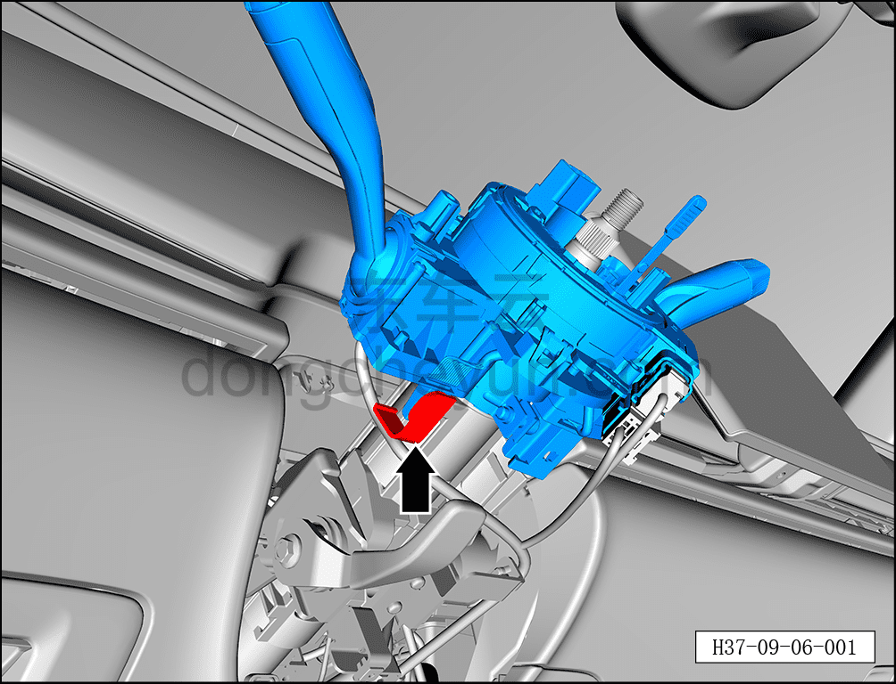
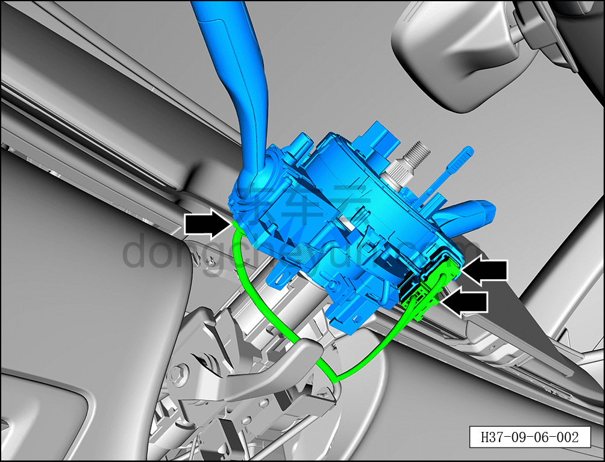
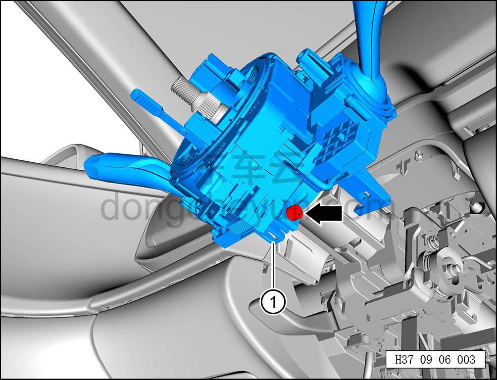

# Снятие и установка переключателя рулевой колонки

> Электрическая и электронная система › Система электрического управления › Многофункциональный комбинированный переключатель  
> Оригинал: `拆卸与安装转向柱开关` · [dongcheyun 56746](https://dongcheyun.com/p/56746), страница `d027a4c1a71645aeadba857b58e938c1` · [оглавление](../README.md)

**Порядок снятия**

**Внимание:**

**- При снятии переключателя рулевой колонки сначала зафиксируйте контактную спираль стяжкой, не поворачивайте её произвольно, чтобы не повредить контактную спираль.**

1. Выключите все электроприборы, отключите питание.

2. Выполните обесточивание автомобиля для ремонта. См. [3.1.4.1 Обесточивание автомобиля](../03-техническое-обслуживание/005-обесточивание-автомобиля.md)

3. Снимите рулевое колесо. См. [11.1.4.1 Снятие и установка рулевого колеса](../11-система-безопасности/004-снятие-и-установка-рулевого-колеса.md)

4. Снимите верхний кожух рулевой колонки. См. [8.2.4.23 Снятие и установка верхнего кожуха рулевой колонки](../08-внутренняя-и-внешняя-отделка/076-снятие-и-установка-верхнего-кожуха-рулевой-колонки.md)

5. Снимите нижний защитный кожух рулевой колонки. См. [8.2.4.24 Снятие и установка нижнего защитного кожуха рулевой колонки](../08-внутренняя-и-внешняя-отделка/077-снятие-и-установка-нижнего-кожуха-рулевой-колонки.md)

6. Снимите переключатель рулевой колонки.

a. С помощью съёмника обивки отсоедините фиксирующую клипсу жгута проводов.

b. Нажав на фиксатор разъёма, отсоедините 3 разъёма переключателя рулевой колонки.

c. С помощью торцевой головки на 6 мм ослабьте крепёжный болт переключателя рулевой колонки.

d. Снимите переключатель рулевой колонки ① движением вверх.

**Порядок установки**

Установка выполняется в обратном порядке.

**Примечание:**

**- При установке переключателя рулевой колонки следите, чтобы жгут проводов не запутывался и не мешал.**

**- После завершения установки проверьте нормальную работу переключателя рулевой колонки.**

**- После завершения установки подключите диагностический сканер, проверьте автомобиль на наличие кодов неисправностей; если они есть, найдите причину и устраните коды неисправностей.**
