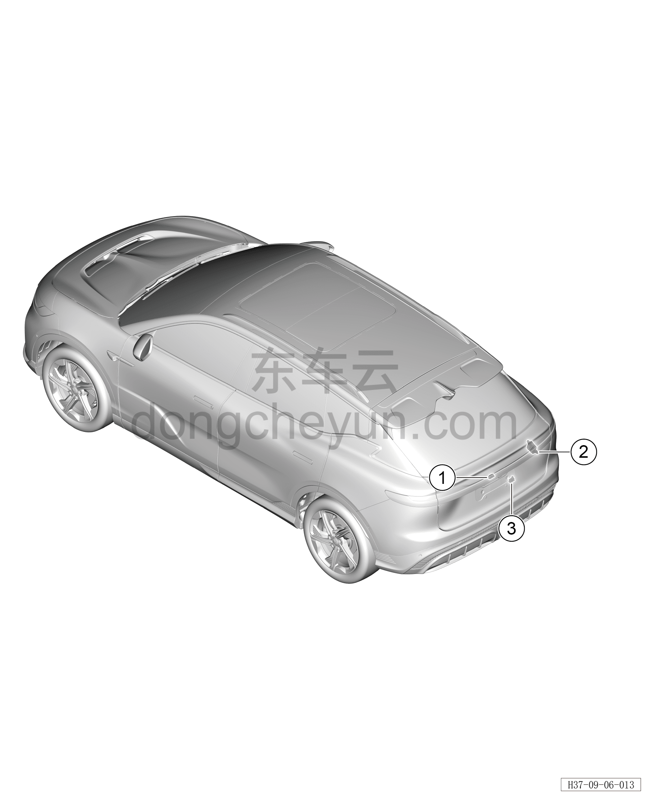

# Расположение компонентов

> Электрическая и электронная система › Система электрического управления › Устройство управления открытием/закрытием двери багажника  
> Оригинал: `部件位置图` · [dongcheyun 56746](https://dongcheyun.com/p/56746), страница `e94f99ca724940a7a4ea6396ea032f8e` · [оглавление](../README.md)

| № | Наименование детали | Кол-во на автомобиль | Примечание |
|---|---|---|---|
| 1 | Выключатель открытия двери багажника | 1 | Расположен в нижней части подвижной стороны заднего комбинированного фонаря |
| 2 | Контроллер электропривода двери багажника | 1 | Расположен с внутренней стороны правой задней боковой обивки |
| 3 | Выключатель открытия/закрытия двери багажника | 1 | Расположен в нижней части нижней декоративной накладки двери багажника |
