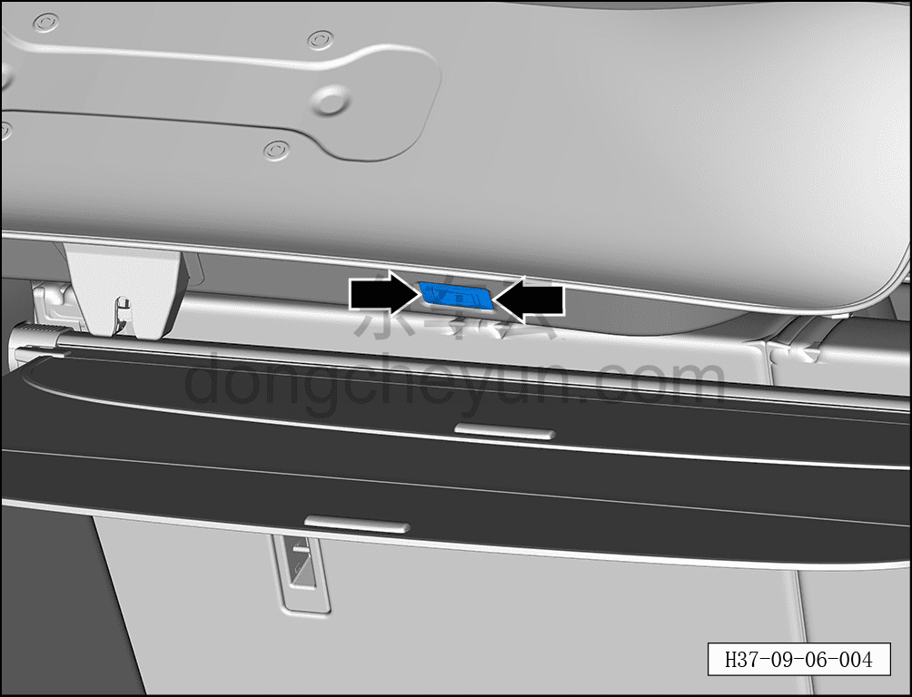
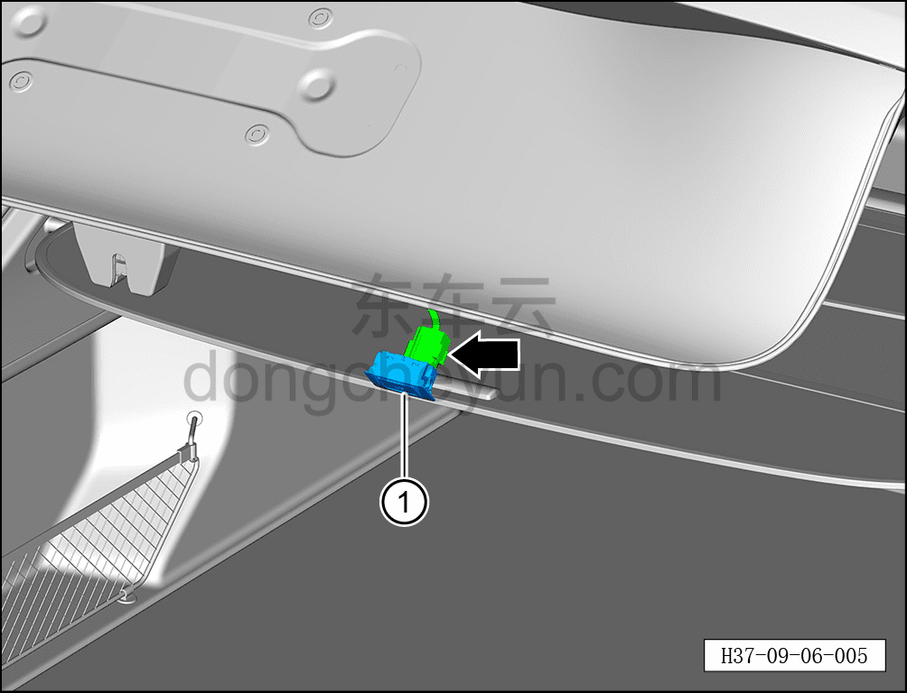

# Снятие и установка выключателя закрытия двери багажника

> Электрическая и электронная система › Система электрического управления › Устройство управления открытием/закрытием двери багажника  
> Оригинал: `拆卸与安装后背门关闭开关` · [dongcheyun 56746](https://dongcheyun.com/p/56746), страница `39555c8d4aa84239b75b2236e388876b` · [оглавление](../README.md)

**Порядок снятия**

1. Выключите все электроприборы, отключите питание.

2. Выполните обесточивание автомобиля для ремонта. См. [3.1.4.1 Обесточивание автомобиля](../03-техническое-обслуживание/005-обесточивание-автомобиля.md)

3. Снимите выключатель закрытия двери багажника.

a. С помощью инструмента для снятия обивки отсоедините 2 фиксирующие клипсы выключателя закрытия двери багажника.

**Примечание:**

**- При использовании инструмента для снятия обивки можно подложить под него чистый нетканый материал, чтобы не повредить обивку двери в процессе работы.**

**Внимание:**

**- К выключателю закрытия двери багажника с тыльной стороны подключён жгут проводов; после снятия не тяните его с усилием, чтобы не повредить жгут проводов.**

b. Нажав на фиксатор разъёма, отсоедините разъём выключателя закрытия двери багажника.

c. Извлеките выключатель закрытия двери багажника ①.

**Порядок установки**

Установка выполняется в обратном порядке.

**Примечание:**

**- После завершения установки подключите диагностический сканер, проверьте автомобиль на наличие кодов неисправностей; если они есть, найдите причину и устраните коды неисправностей.**

**- После завершения установки проверьте нормальную работу выключателя закрытия электропривода двери багажника.**
