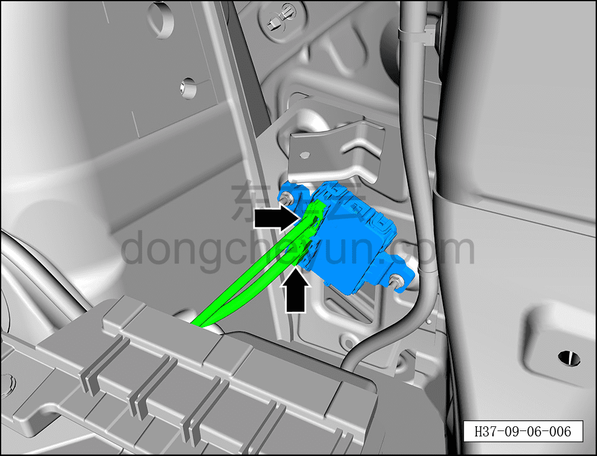
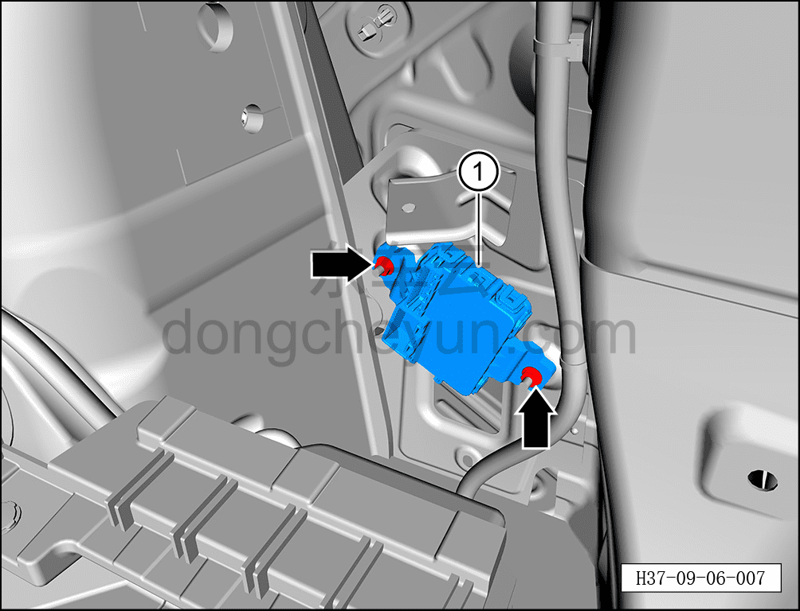

# Снятие и установка контроллера электропривода двери багажника

> Электрическая и электронная система › Система электрического управления › Устройство управления открытием/закрытием двери багажника  
> Оригинал: `拆卸与安装电动背门控制器` · [dongcheyun 56746](https://dongcheyun.com/p/56746), страница `33b6d7cac3da46b5abbf2c3538198be9` · [оглавление](../README.md)

**Порядок снятия**

1. Выключите все электроприборы, отключите питание.

2. Выполните обесточивание автомобиля для ремонта. См. [3.1.4.1 Обесточивание автомобиля](../03-техническое-обслуживание/005-обесточивание-автомобиля.md)

3. Снимите правую заднюю боковую обивку в сборе. См. [8.5.5.6 Снятие и установка левой задней боковой обивки](../08-внутренняя-и-внешняя-отделка/136-снятие-и-установка-левой-обивки-задней-боковины.md)

4. Снимите контроллер электропривода двери багажника.

a. Нажав на фиксатор разъёма, отсоедините 2 разъёма контроллера электропривода двери багажника.

b. С помощью торцевой головки на 10 мм отверните 2 крепёжные гайки контроллера электропривода двери багажника.

Момент затяжки гайки: 6±1 Н·м

c. Извлеките контроллер электропривода двери багажника ①.

**Порядок установки**

Установка выполняется в обратном порядке.

**Примечание:**

**После завершения замены необходимо выполнить следующие операции с помощью диагностического сканера или удалённой диагностики:**

**- Сначала прошить программное обеспечение до последней версии;**

**- После успешного обновления программного обеспечения выполнить процедуру замены детали для контроллера.**

**Внимание:**

**- После завершения установки подключите диагностический сканер и проверьте наличие кодов неисправностей; если таковые имеются, найдите причину и удалите коды неисправностей.**
