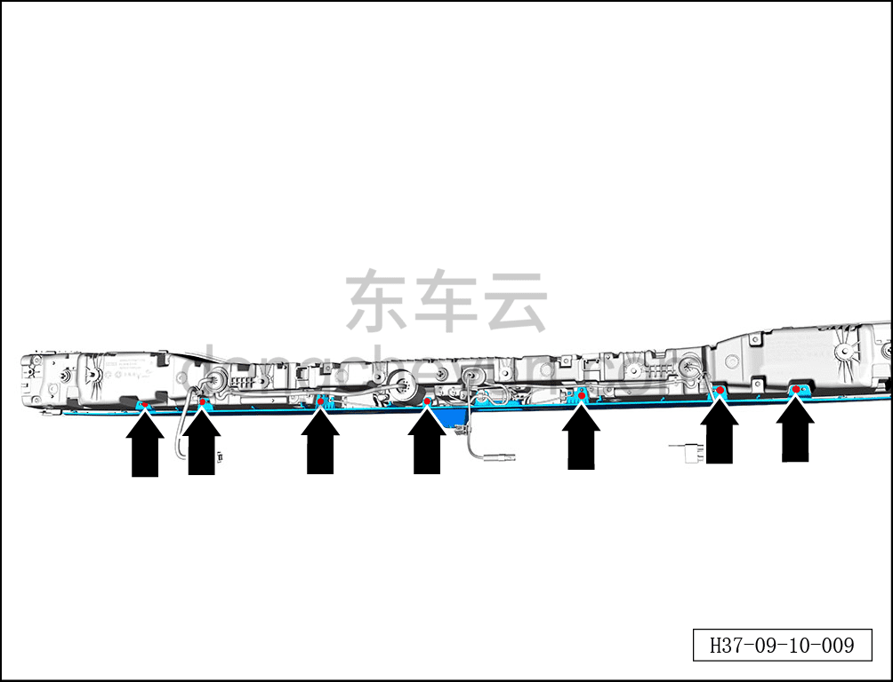
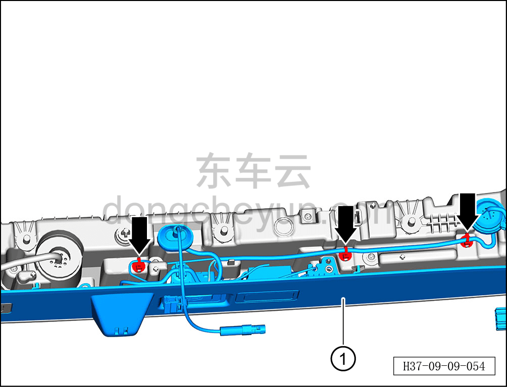
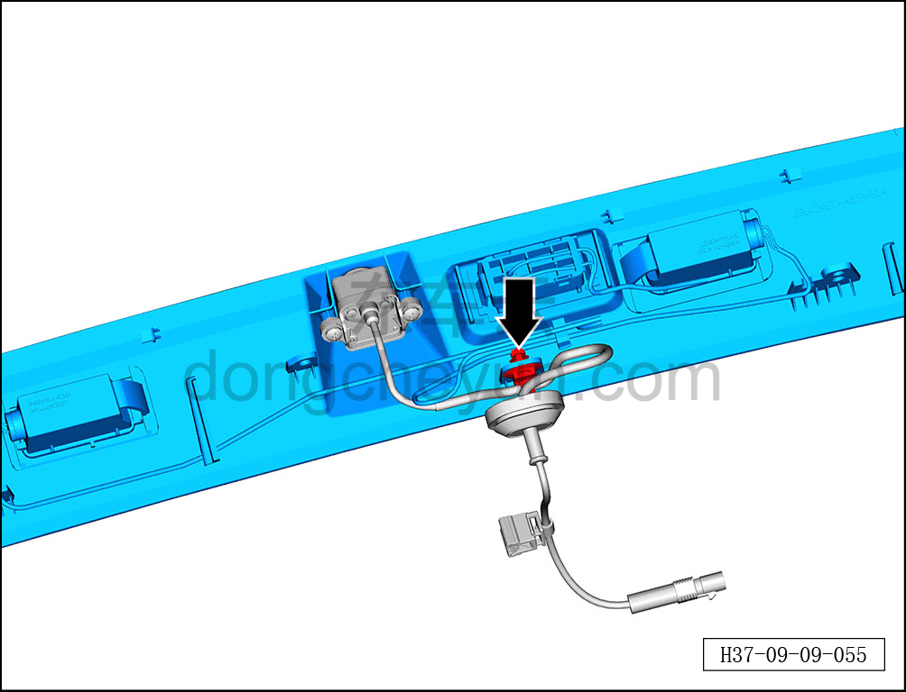
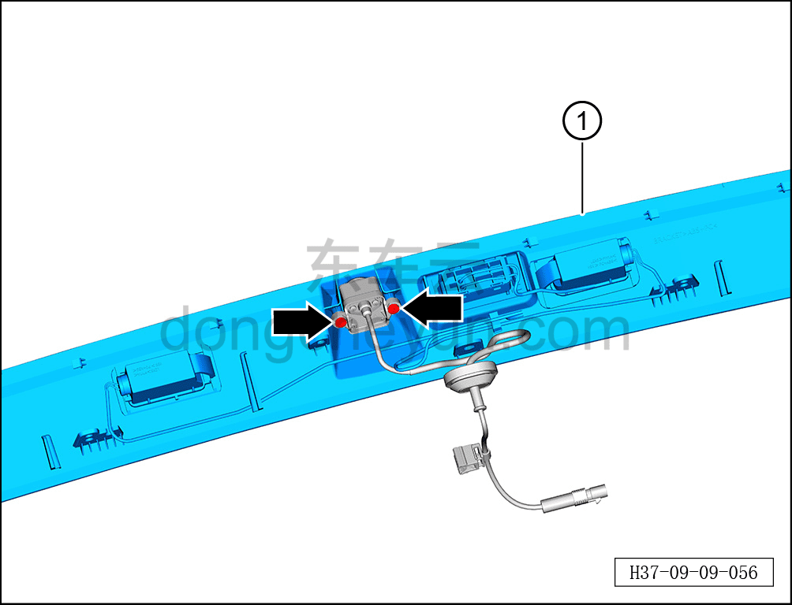

# Снятие и установка выключателя открытия двери багажника (с фонарём подсветки номера)

> Электрическая и электронная система › Система электрического управления › Устройство управления открытием/закрытием двери багажника  
> Оригинал: `拆卸与安装后背门开启开关（带牌照灯）` · [dongcheyun 56746](https://dongcheyun.com/p/56746), страница `0207e5ccc1dd40e08b9c34860ad5a92b` · [оглавление](../README.md)

**Порядок снятия**

1. Выключите все электроприборы, отключите питание.

2. Выполните обесточивание автомобиля для ремонта. См. [3.1.4.1 Обесточивание автомобиля](../03-техническое-обслуживание/005-обесточивание-автомобиля.md)

3. Снимите подвижную сторону заднего комбинированного фонаря. См. [9.9.4.4 Снятие и установка подвижной стороны заднего комбинированного фонаря](081-снятие-и-установка-подвижной-стороны-заднего.md)

4. Снимите выключатель открытия двери багажника (с фонарём подсветки номера).

a. С помощью биты T15 выверните 7 крепёжных винтов декоративной накладки подвижной стороны заднего комбинированного фонаря.

Момент затяжки винта: 3,5±0,5 Н·м

b. Отсоедините 3 фиксирующие клипсы жгута проводов.

c. Извлеките декоративную накладку подвижной стороны заднего комбинированного фонаря в сборе ①.

d. Отсоедините фиксирующую клипсу жгута проводов камеры заднего вида.

e. С помощью крестовой отвёртки выверните 2 крепёжных винта камеры заднего вида.

Момент затяжки винта: 0,65±0,05 Н·м

f. Извлеките выключатель открытия двери багажника (с фонарём подсветки номера) ①.

**Порядок установки**

Установка выполняется в обратном порядке.

**Примечание:**

**- После завершения установки проверьте нормальную работу фонаря подсветки номера.**

**- После завершения установки проверьте нормальную работу выключателя открытия двери багажника.**
