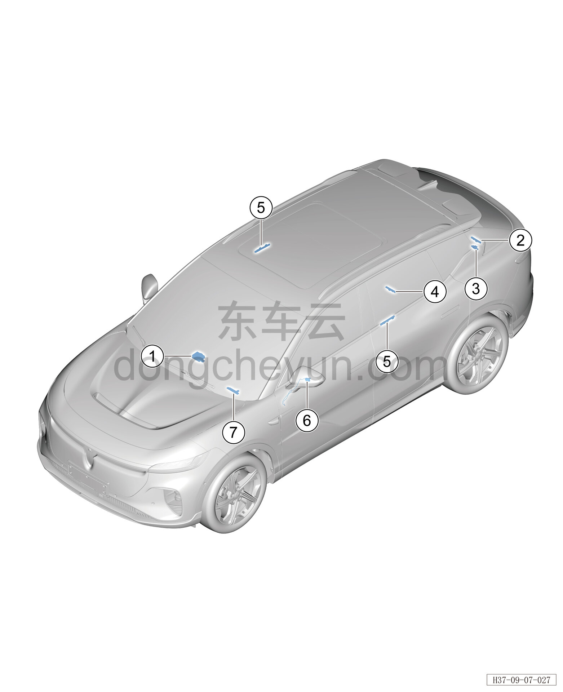

# Расположение компонентов

> Электрическая и электронная система › Система доступа и запуска  
> Оригинал: `部件位置图` · [dongcheyun 56746](https://dongcheyun.com/p/56746), страница `d3d84c7647914236a4f459cc16139335` · [оглавление](../README.md)

| № | Наименование детали | Кол-во на автомобиль | Примечание |
|---|---|---|---|
| 1 | Основной модуль Bluetooth | 1 | Расположен с внутренней стороны верхней крышки панели приборов |
| 2 | Задняя антенна PS | 1 | Расположен с внутренней стороны заднего бампера |
| 3 | Вспомогательный модуль Bluetooth заднего бампера | 1 | Расположен с внутренней стороны заднего бампера |
| 4 | Задняя антенна PS | 1 | Расположен в верхней части пола багажника |
| 5 | Антенна бесключевого доступа | 2 | Расположена внутри кузовной панели задней двери |
| 6 | Вспомогательный модуль Bluetooth | 1 | Расположен внутри наружного зеркала заднего вида |
| 7 | Передняя антенна PS | 1 | Расположена в нижней части центральной консоли |
