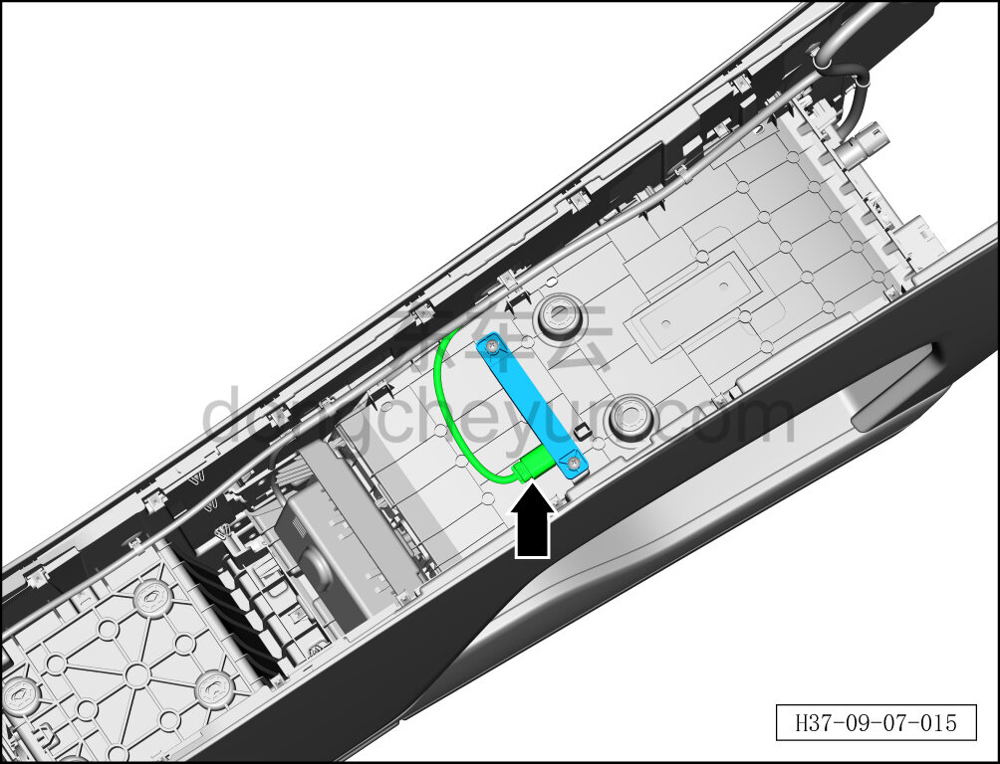
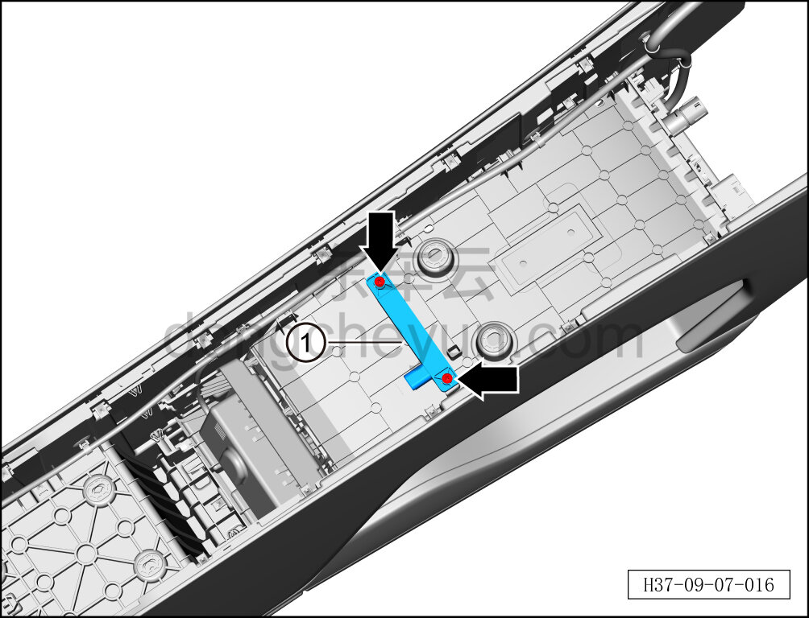

# Снятие и установка передней антенны PS

> Электрическая и электронная система › Система доступа и запуска › Антенна бесключевого доступа  
> Оригинал: `拆卸与安装前部PS天线` · [dongcheyun 56746](https://dongcheyun.com/p/56746), страница `a5097a0a0bd74c5496de98e2638564eb` · [оглавление](../README.md)

**Порядок снятия**

1. Выключите все электроприборы, отключите питание.

2. Выполните обесточивание автомобиля для ремонта. См. [3.1.4.1 Обесточивание автомобиля](../03-техническое-обслуживание/005-обесточивание-автомобиля.md)

3. Снимите центральную консоль в сборе. См. [8.3.4.8 Снятие и установка центральной консоли в сборе](../08-внутренняя-и-внешняя-отделка/098-снятие-и-установка-центральной-консоли-в-сборе.md)

4. Снимите переднюю антенну PS.

a. Отсоедините разъём передней антенны PS.

b. С помощью крестовой отвёртки выверните 2 крепёжных винта передней антенны PS.

Момент затяжки винта: 0,5±0,1 Н·м

c. Извлеките переднюю антенну PS ①.

**Порядок установки**

Установка выполняется в обратном порядке.

**Примечание:**

**- После завершения установки проверьте нормальную работу передней антенны PS.**
