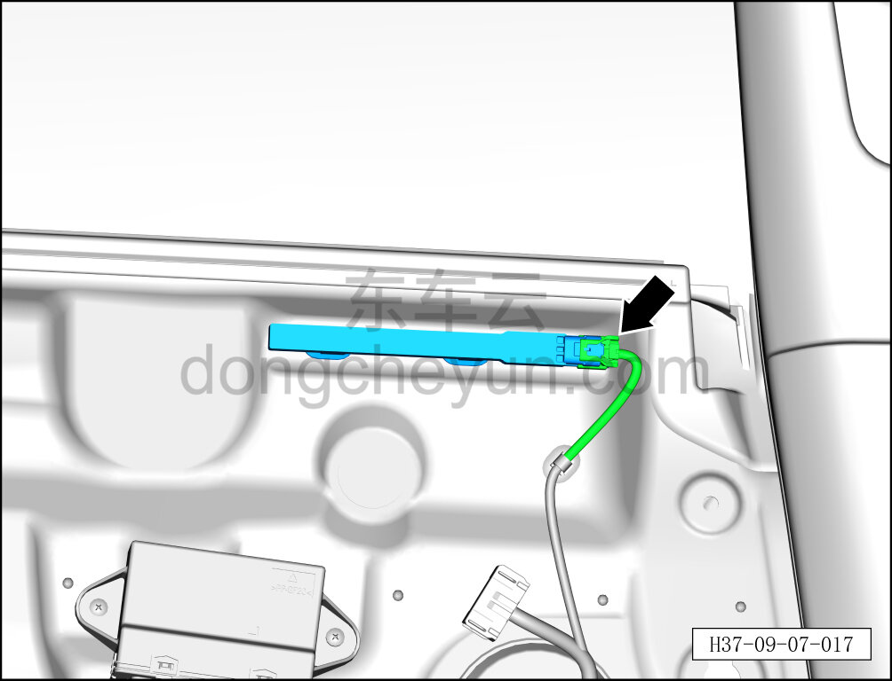
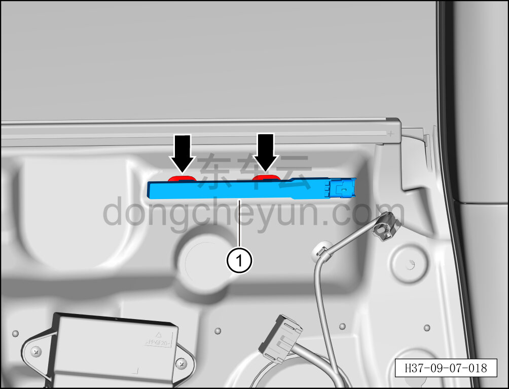

# Снятие и установка антенны бесключевого доступа

> Электрическая и электронная система › Система доступа и запуска › Антенна бесключевого доступа  
> Оригинал: `拆卸与安装智能进入天线` · [dongcheyun 56746](https://dongcheyun.com/p/56746), страница `4805be057ea643589ec110f68aa68c09` · [оглавление](../README.md)

**Порядок снятия**

1. Выключите все электроприборы, отключите питание.

2. Выполните обесточивание автомобиля для ремонта. См. [3.1.4.1 Обесточивание автомобиля](../03-техническое-обслуживание/005-обесточивание-автомобиля.md)

3. Снимите внутреннюю обивку левой задней двери. См. [8.4.3.1 Снятие и установка внутренней обивки левой задней двери](../08-внутренняя-и-внешняя-отделка/119-снятие-и-установка-обивки-левой-задней-двери.md)

4. Снимите антенну бесключевого доступа.

a. Отсоедините разъём антенны бесключевого доступа.

b. Отсоедините фиксирующую клипсу антенны бесключевого доступа.

c. Извлеките антенну бесключевого доступа ①.

**Порядок установки**

Установка выполняется в обратном порядке.

**Примечание:**

**- После завершения установки проверьте нормальную работу антенны бесключевого доступа.**
