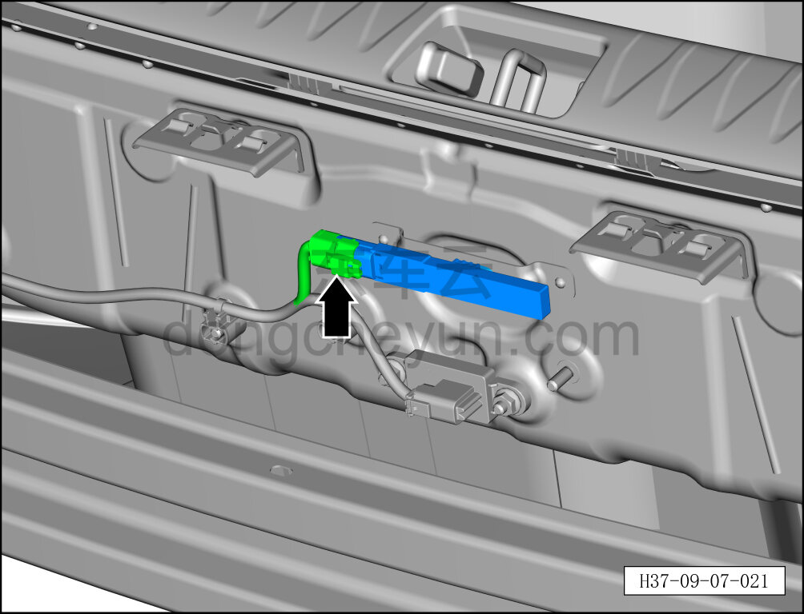
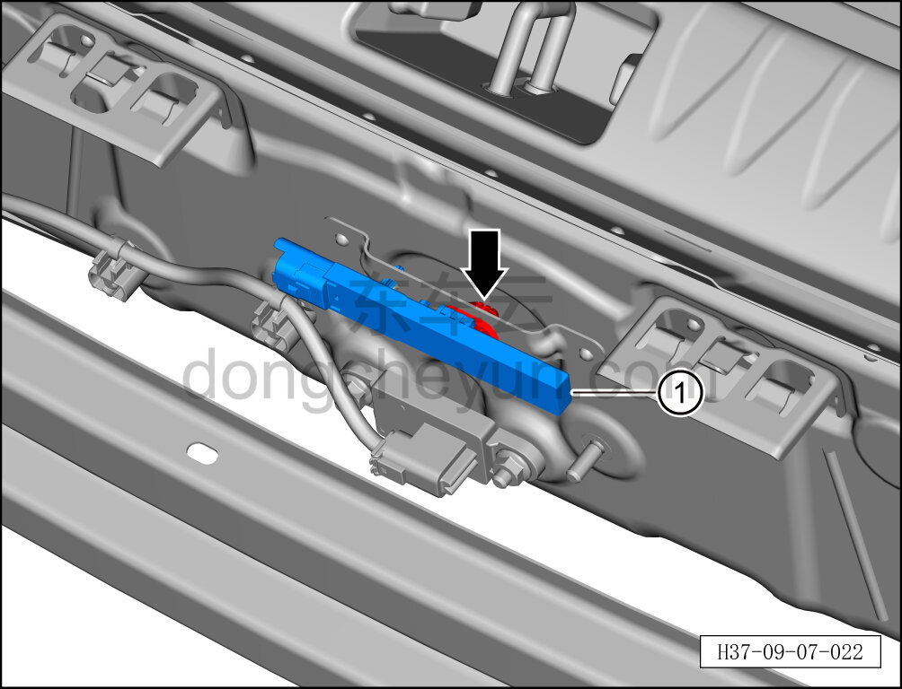

# Снятие и установка задней антенны PS (задняя панель)

> Электрическая и электронная система › Система доступа и запуска › Антенна бесключевого доступа  
> Оригинал: `拆卸与安装后部 PS 天线（后围）` · [dongcheyun 56746](https://dongcheyun.com/p/56746), страница `1bc7eef5ec8344129d5a8dfc0a002058` · [оглавление](../README.md)

**Порядок снятия**

1. Выключите все электроприборы, отключите питание.

2. Выполните обесточивание автомобиля для ремонта. См. [3.1.4.1 Обесточивание автомобиля](../03-техническое-обслуживание/005-обесточивание-автомобиля.md)

3. Снимите задний бампер в сборе. См. [8.6.3.26 Снятие и установка заднего бампера в сборе](../08-внутренняя-и-внешняя-отделка/186-снятие-и-установка-заднего-бампера-в-сборе.md)

4. Снимите заднюю антенну PS.

a. Отсоедините разъём задней антенны PS.

b. Отсоедините фиксирующую клипсу задней антенны PS.

c. Извлеките заднюю антенну PS ①.

**Порядок установки**

Установка выполняется в обратном порядке.

**Примечание:**

**- После завершения установки проверьте нормальную работу задней антенны PS.**
