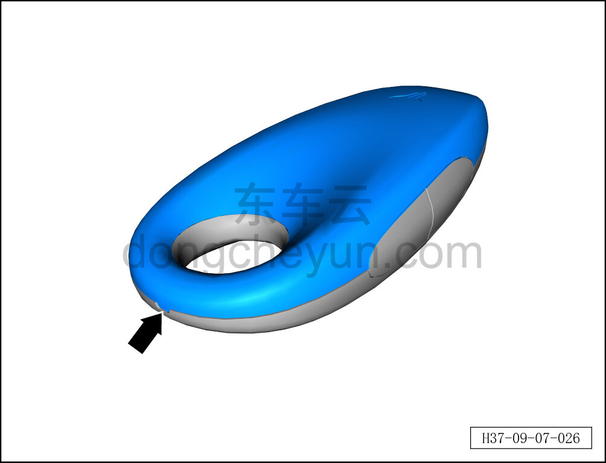
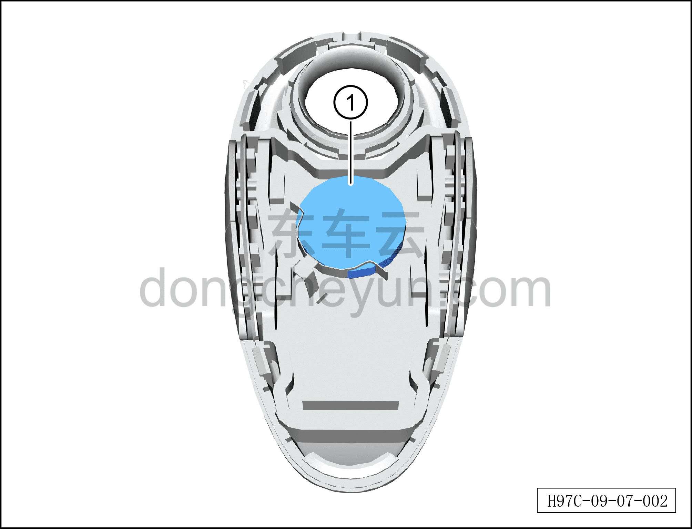

# Снятие и установка смарт-ключа дистанционного управления

> Электрическая и электронная система › Система доступа и запуска › Смарт-ключ дистанционного управления  
> Оригинал: `拆卸与安装智能遥控钥匙` · [dongcheyun 56746](https://dongcheyun.com/p/56746), страница `9356a6aa85eb44558da9c7f1afb0f526` · [оглавление](../README.md)

**Порядок снятия**

1. Снимите батарейку смарт-ключа дистанционного управления

a. В направлении стрелки отогните фиксирующую клипсу корпуса смарт-ключа дистанционного управления, снимите корпус смарт-ключа дистанционного управления.

b. Извлеките батарейку смарт-ключа дистанционного управления ①.

**Примечание:**

**- При необходимости замены батарейки смарт-ключа дистанционного управления используйте батарейку того же типа.**

**Порядок установки**

Установка выполняется в обратном порядке.

**Примечание:**

**- После завершения установки проверьте нормальную работу смарт-ключа дистанционного управления.**

**- Если устанавливается новый ключ дистанционного управления, необходимо подключить диагностический сканер и выполнить процедуру сопряжения ключа. См. [9.7.4.2 Порядок сопряжения смарт-ключа дистанционного управления](066-порядок-сопряжения-смарт-ключа-дистанционного.md)**
