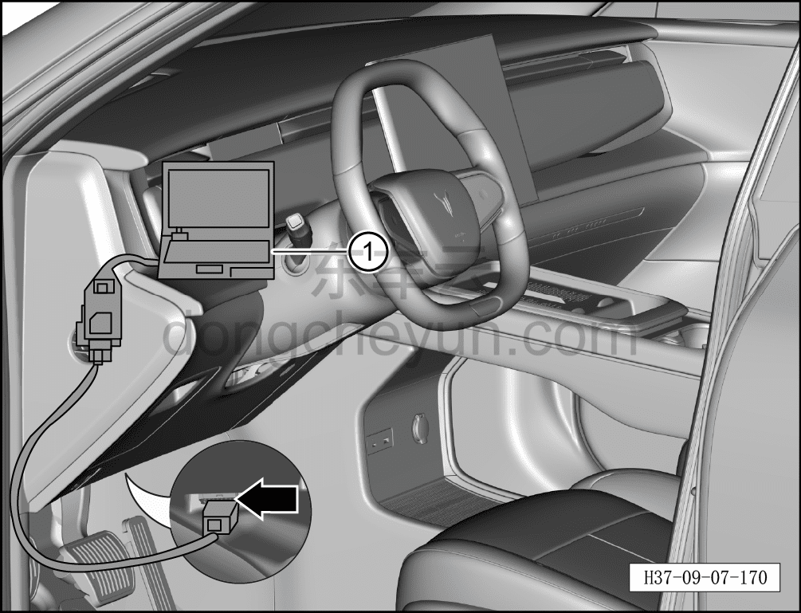
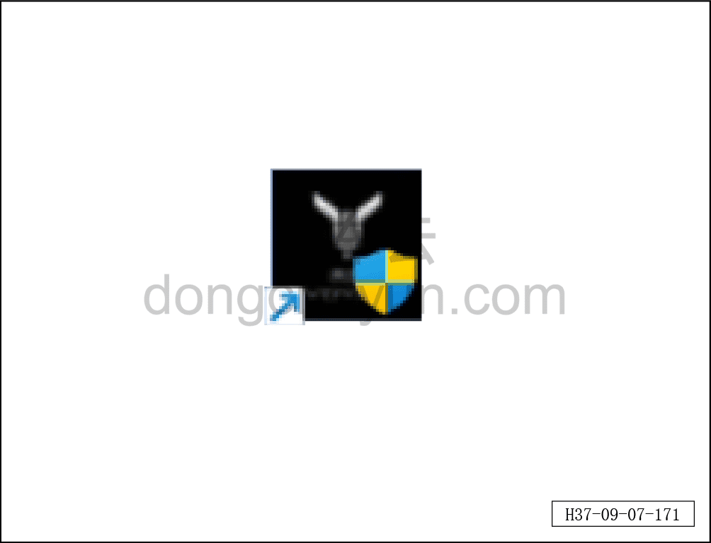
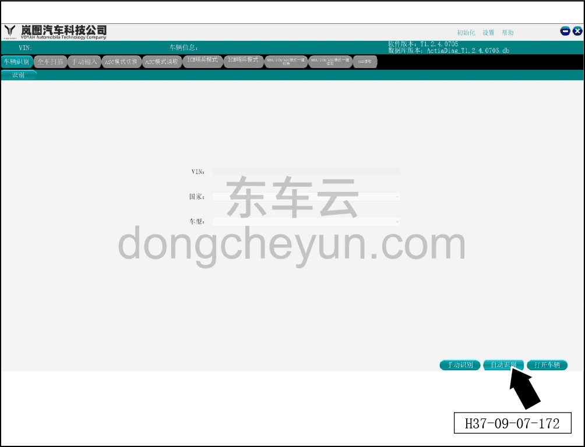
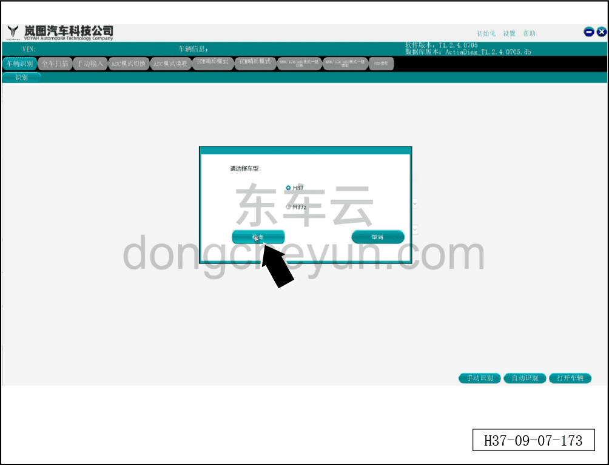
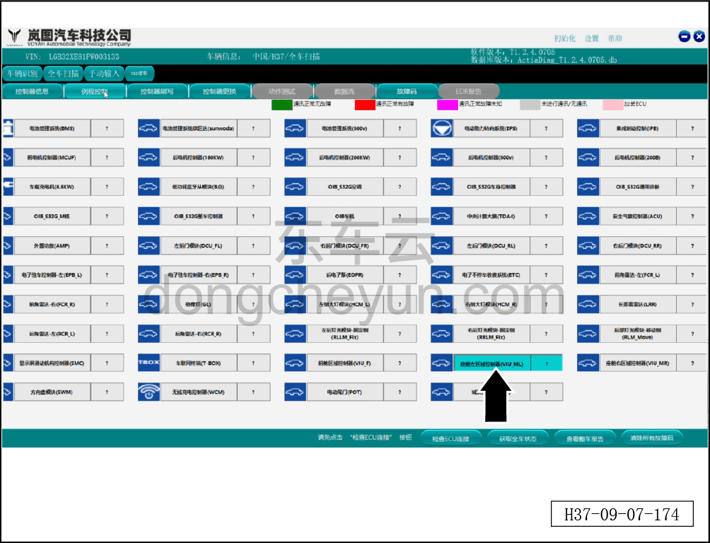
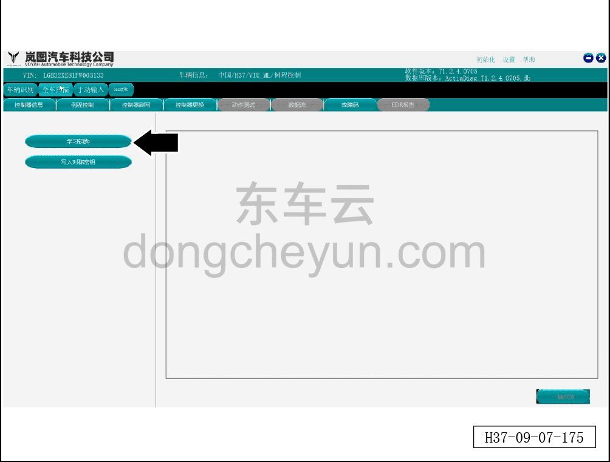
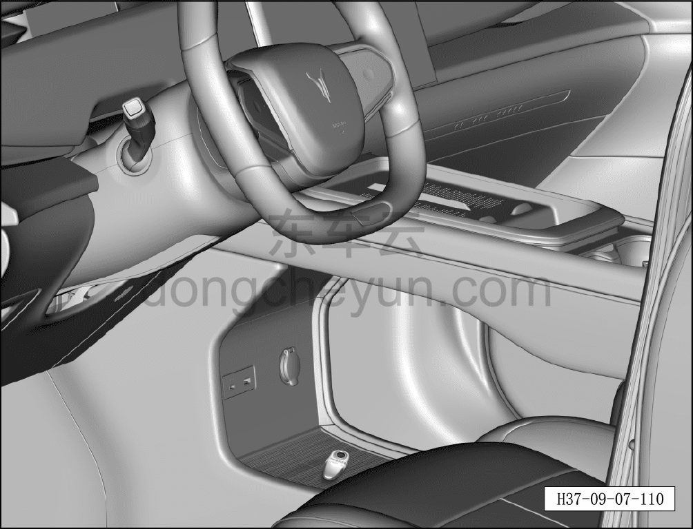
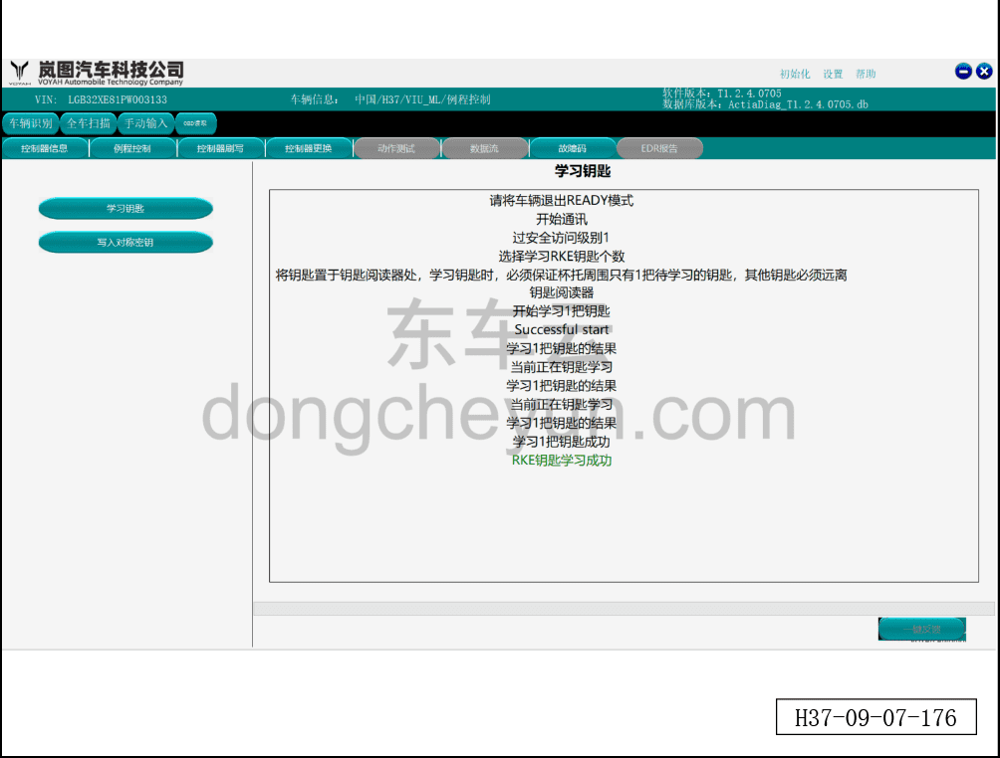

# Порядок сопряжения смарт-ключа дистанционного управления

> Электрическая и электронная система › Система доступа и запуска › Смарт-ключ дистанционного управления  
> Оригинал: `智能遥控钥匙匹配流程` · [dongcheyun 56746](https://dongcheyun.com/p/56746), страница `4e6dd168eab14426adea22e5aeda634b` · [оглавление](../README.md)

**Порядок сопряжения**

**Примечание:**

**- Поддерживается сопряжение только двух ключей.**

a. Подключите послепродажный диагностический сканер Voyah.

b. Включите питание автомобиля, приборная панель загорится.

c. Откройте диагностическое программное обеспечение Voyah.

d. Нажмите "Автоматическое распознавание".

e. Выберите модель "H37", нажмите "Подтвердить", нажмите "Открыть автомобиль".

f. Войдите в систему, нажмите "Левый зональный контроллер салона", нажмите "Управление процедурами".

g. Нажмите "Обучение ключа".

h. Поместите первый ключ в зону индукции (ключ должен находиться в центре зоны индукции).

i. Выполните действия согласно порядку диагностического сканера; появление сообщения, как на рисунке, означает завершение сопряжения ключа.

**Примечание:**

**- После завершения установки проверьте нормальную работу смарт-ключа дистанционного управления.**

**- Если устанавливается новый смарт-ключ дистанционного управления, необходимо выполнить повторное обучение и сопряжение. См. [9.7.4.2 Порядок сопряжения смарт-ключа дистанционного управления](066-порядок-сопряжения-смарт-ключа-дистанционного.md)**
