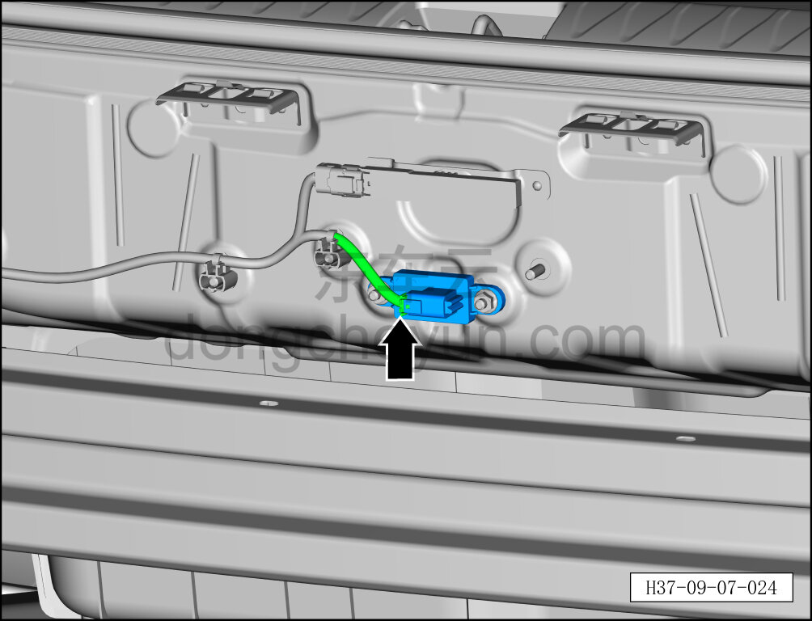
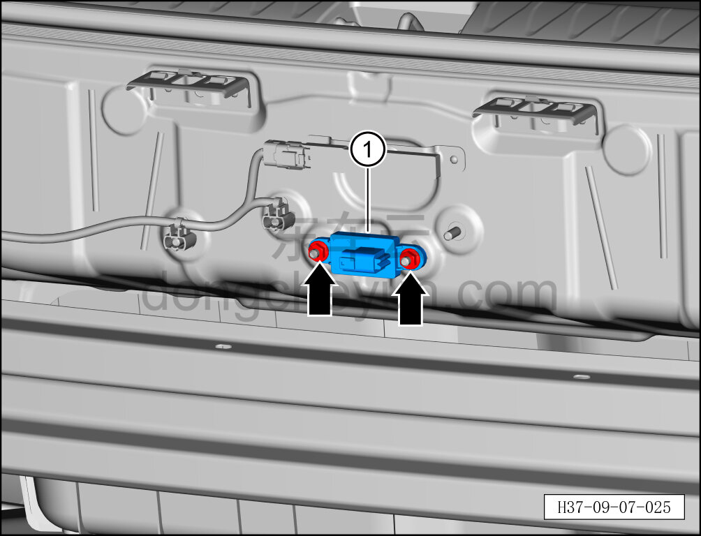

# Снятие и установка вспомогательного модуля Bluetooth заднего бампера

> Электрическая и электронная система › Система доступа и запуска › Bluetooth-модуль цифрового ключа  
> Оригинал: `拆卸与安装后保蓝牙辅模块` · [dongcheyun 56746](https://dongcheyun.com/p/56746), страница `ad9a95ad6a134fc69de8eadc279d8944` · [оглавление](../README.md)

**Порядок снятия**

1. Выключите все электроприборы, отключите питание.

2. Выполните обесточивание автомобиля для ремонта. См. [3.1.4.1 Обесточивание автомобиля](../03-техническое-обслуживание/005-обесточивание-автомобиля.md)

3. Снимите задний бампер в сборе. См. [8.6.3.21 Снятие и установка заднего бампера в сборе](../08-внутренняя-и-внешняя-отделка/186-снятие-и-установка-заднего-бампера-в-сборе.md)

4. Снимите вспомогательный модуль Bluetooth заднего бампера.

a. Нажав на фиксатор разъёма, отсоедините разъём вспомогательного модуля Bluetooth заднего бампера.

b. С помощью торцевой головки на 10 мм отверните 2 крепёжные гайки вспомогательного модуля Bluetooth заднего бампера.

Момент затяжки гайки: 6±1 Н·м

c. Извлеките вспомогательный модуль Bluetooth заднего бампера ①.

**Порядок установки**

Установка выполняется в обратном порядке.

**Примечание:**

**- После завершения замены вспомогательного модуля Bluetooth низкого энергопотребления необходимо выполнить прошивку с помощью диагностического сканера.**
