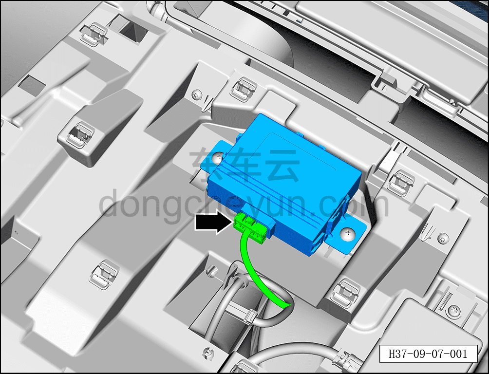
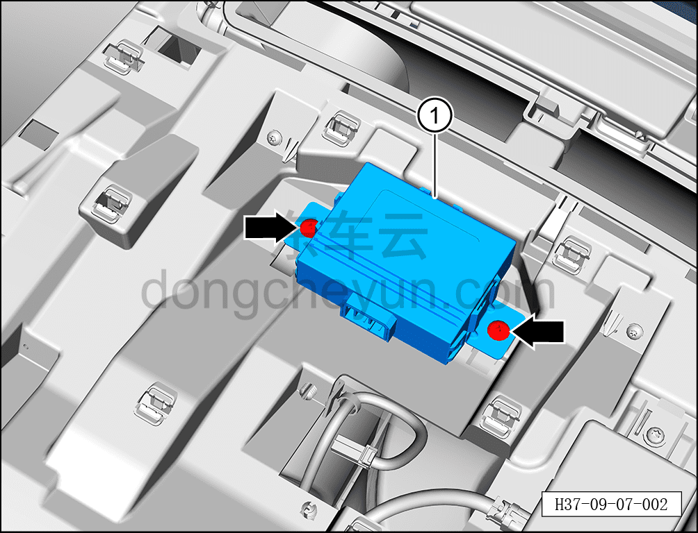

# Снятие и установка основного модуля Bluetooth

> Электрическая и электронная система › Система доступа и запуска › Bluetooth-модуль цифрового ключа  
> Оригинал: `拆卸与安装蓝牙主模块` · [dongcheyun 56746](https://dongcheyun.com/p/56746), страница `0411eb8e50bc45eea89e3cfe2742d6dd` · [оглавление](../README.md)

**Порядок снятия**

1. Выключите все электроприборы, отключите питание.

2. Выполните обесточивание автомобиля для ремонта. См. [3.1.4.1 Обесточивание автомобиля](../03-техническое-обслуживание/005-обесточивание-автомобиля.md)

3. Снимите верхнюю крышку панели приборов в сборе. См. [8.2.4.10 Снятие и установка верхней крышки панели приборов](../08-внутренняя-и-внешняя-отделка/063-снятие-и-установка-верхней-крышки-панели-приборов.md)

4. Снимите основной модуль Bluetooth.

a. Нажав на фиксатор разъёма, отсоедините разъём основного модуля Bluetooth.

b. С помощью крестовой отвёртки выверните 2 крепёжных винта основного модуля Bluetooth.

Момент затяжки винта: 1.5±0.5 Н·м

c. Извлеките основной модуль Bluetooth ①.

**Порядок установки**

Установка выполняется в обратном порядке.

**Примечание:**

**После завершения замены необходимо выполнить следующие операции с помощью диагностического сканера или удалённой диагностики:**

**- Сначала прошить программное обеспечение до последней версии;**

**- После успешного обновления программного обеспечения выполнить процедуру замены детали для контроллера.**

**Внимание:**

**- После завершения установки подключите диагностический сканер и проверьте наличие кодов неисправностей; если таковые имеются, найдите причину и удалите коды неисправностей.**
