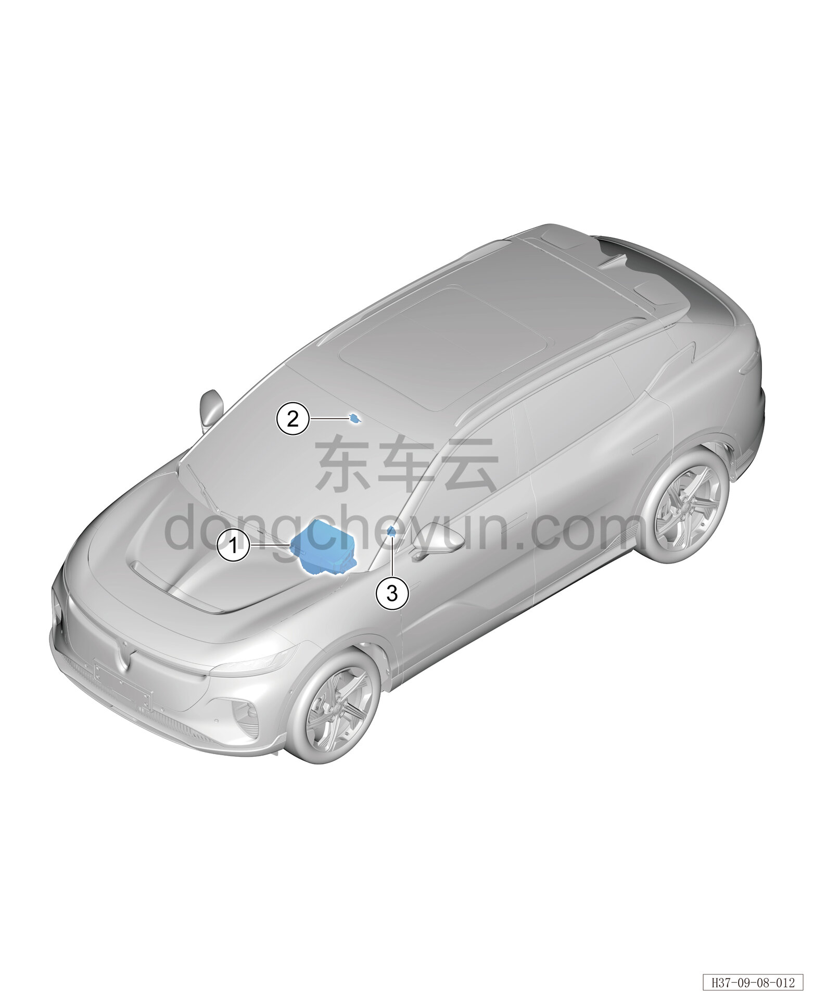

# Расположение компонентов

> Электрическая и электронная система › Система мониторинга водителя и сигнальной индикации  
> Оригинал: `部件位置图` · [dongcheyun 56746](https://dongcheyun.com/p/56746), страница `d591db18204149c086de97b3ad40593b` · [оглавление](../README.md)

| № | Наименование детали | Кол-во на автомобиль | Примечание |
|---|---|---|---|
| 1 | Контроллер проекционного дисплея (HUD) | 1 | Расположен с внутренней стороны панели приборов со стороны водителя |
| 2 | Камера мониторинга пассажиров | 1 | Расположена в передней части переднего потолочного светильника |
| 3 | Камера мониторинга водителя (стойка A) | 1 | Расположена внутри верхней декоративной накладки стойки A |
