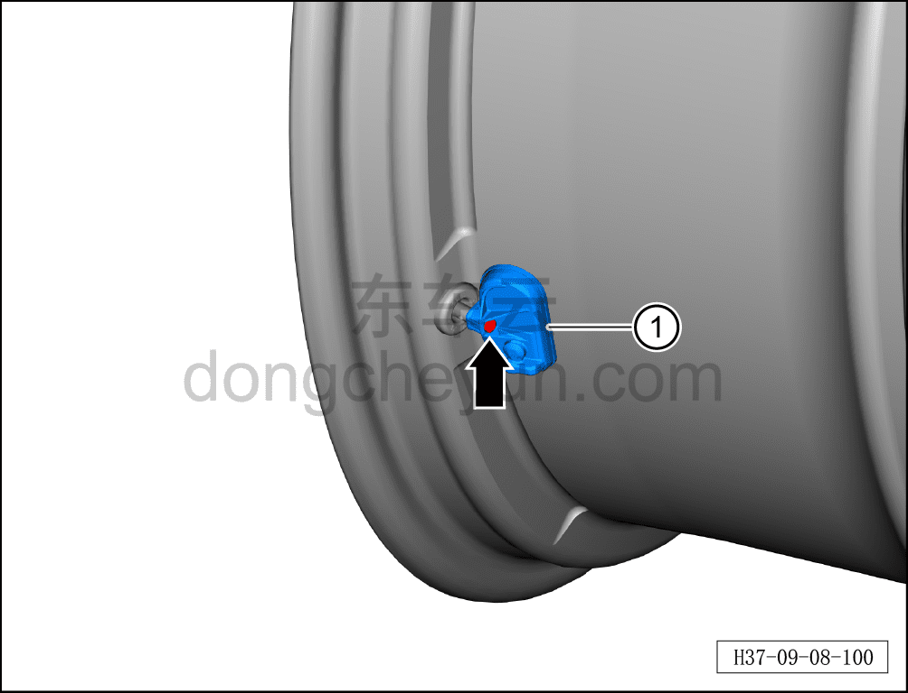
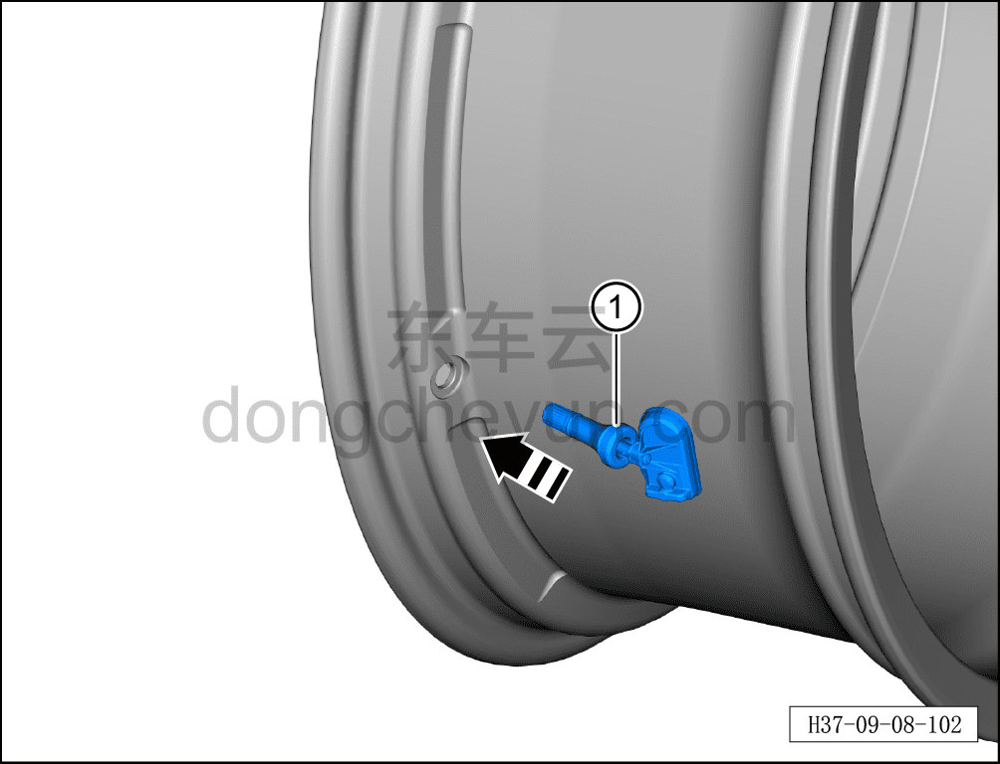

# Снятие и установка датчика давления в шине

> Электрическая и электронная система › Система мониторинга водителя и сигнальной индикации › Контроль давления в шинах  
> Оригинал: `拆卸与安装胎压传感器` · [dongcheyun 56746](https://dongcheyun.com/p/56746), страница `73d9e6e3783146b6ad1680dc192a10c0` · [оглавление](../README.md)

**Порядок снятия**

**Примечание:**

**- Далее описаны снятие и установка датчика давления в левой передней шине; для других колёс действия аналогичны левому переднему.**

1. Выключите все электроприборы, отключите питание.

2. Выполните обесточивание автомобиля для ремонта. См. [3.1.4.1 Обесточивание автомобиля](../03-техническое-обслуживание/005-обесточивание-автомобиля.md)

3. Снимите левое переднее колесо в сборе. См. [6.5.8.1 Снятие и установка колеса](../06-система-шасси/064-снятие-и-установка-колеса.md)

4. Снимите левую переднюю шину. См. [6.5.9.1 Снятие и установка шины](../06-система-шасси/068-снятие-и-установка-шины.md)

5. Снимите датчик давления левой передней шины.

a. Выверните крепёжный винт датчика давления в шине.

b. Извлеките датчик давления в шине ①.

c. В направлении стрелки извлеките из обода колпачок вентиля ①.

**Внимание:**

**- Датчик давления в шине и колпачок вентиля являются одноразовыми деталями и не подлежат повторному использованию.**

**Порядок установки**

a. В направлении стрелки установите датчик давления в шине в сборе ① в фиксирующее положение на обод.

b. С помощью инструмента установите датчик давления в шине в сборе ① на место.

**Внимание:**

**- При установке инструментом не прилагайте чрезмерное усилие, чтобы не повредить датчик давления в шине в сборе.**

**- Проверьте надёжность установки.**

**- После завершения установки проверьте нормальную работу датчика давления в шине.**

**Примечание:**

**- После замены датчика давления в шине автомобиль должен выполнить самообучение. Порядок самообучения: после того как автомобиль заблокирован и находится в режиме сна более 20 мин, ведите автомобиль непрерывно в течение 20 мин, поддерживая скорость выше 35 км/ч; полное отображение давления во всех четырёх шинах означает успешное завершение самообучения давления в шинах.**
