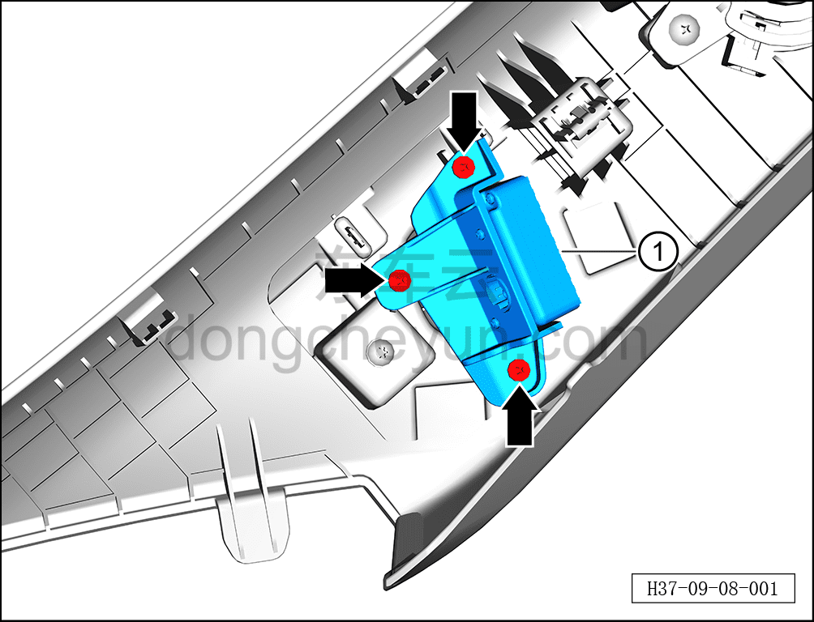

# Снятие и установка камеры мониторинга водителя (стойка A)

> Электрическая и электронная система › Система мониторинга водителя и сигнальной индикации › Камера мониторинга водителя  
> Оригинал: `拆卸与安装（A柱）驾驶监控摄像头` · [dongcheyun 56746](https://dongcheyun.com/p/56746), страница `75e226b5d9b249418721efe3f1fcceae` · [оглавление](../README.md)

**Порядок снятия**

1. Выключите все электроприборы, отключите питание.

2. Выполните обесточивание автомобиля для ремонта. См. [3.1.4.1 Обесточивание автомобиля](../03-техническое-обслуживание/005-обесточивание-автомобиля.md)

3. Снимите верхнюю накладку левой стойки A в сборе. См. [8.5.5.1 Снятие и установка верхней накладки левой стойки A](../08-внутренняя-и-внешняя-отделка/131-снятие-и-установка-левой-верхней-накладки-стойки-a.md)

4. Снимите камеру мониторинга водителя (стойки A).

a. С помощью крестовой отвёртки выверните 3 крепёжных винта камеры мониторинга водителя (стойки A).

Момент затяжки винта: 1±0,1 Н·м

b. Извлеките камеру мониторинга водителя (стойки A) ①.

**Порядок установки**

Установка выполняется в обратном порядке.

**Примечание:**

**- После завершения установки проверьте нормальную работу камеры мониторинга водителя.**
