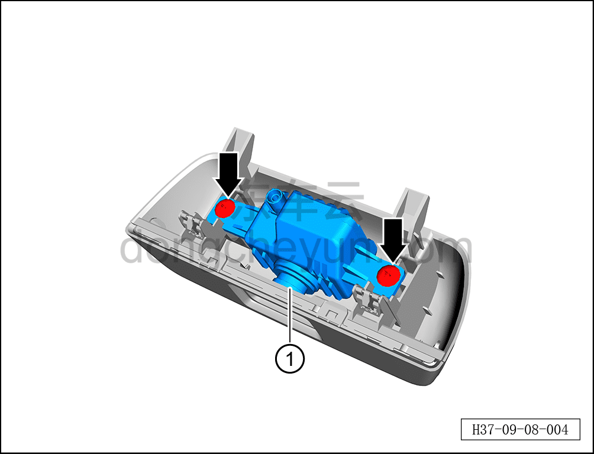

# Снятие и установка камеры мониторинга пассажиров

> Электрическая и электронная система › Система мониторинга водителя и сигнальной индикации › Камера мониторинга водителя  
> Оригинал: `拆卸与安装乘客监控摄像头` · [dongcheyun 56746](https://dongcheyun.com/p/56746), страница `67a3df7fd24340a6be23f952e94f9220` · [оглавление](../README.md)

**Порядок снятия**

1. Выключите все электроприборы, отключите питание.

2. Выполните обесточивание автомобиля для ремонта. См. [3.1.4.1 Обесточивание автомобиля](../03-техническое-обслуживание/005-обесточивание-автомобиля.md)

3. Снимите декоративную крышку камеры мониторинга заднего ряда сидений в сборе. См. [8.5.5.10 Снятие и установка декоративной крышки камеры мониторинга заднего ряда сидений](../08-внутренняя-и-внешняя-отделка/140-снятие-и-установка-декоративной-крышки-камеры.md)

4. Снимите камеру мониторинга пассажиров.

a. С помощью крестовой отвёртки выверните 2 крепёжных винта камеры обнаружения пассажиров.

Момент затяжки винта: 0,7±0,1 Н·м

b. Извлеките камеру мониторинга пассажиров ①.

**Порядок установки**

Установка выполняется в обратном порядке.

**Примечание:**

**- После завершения установки проверьте нормальную работу камеры мониторинга пассажиров.**
