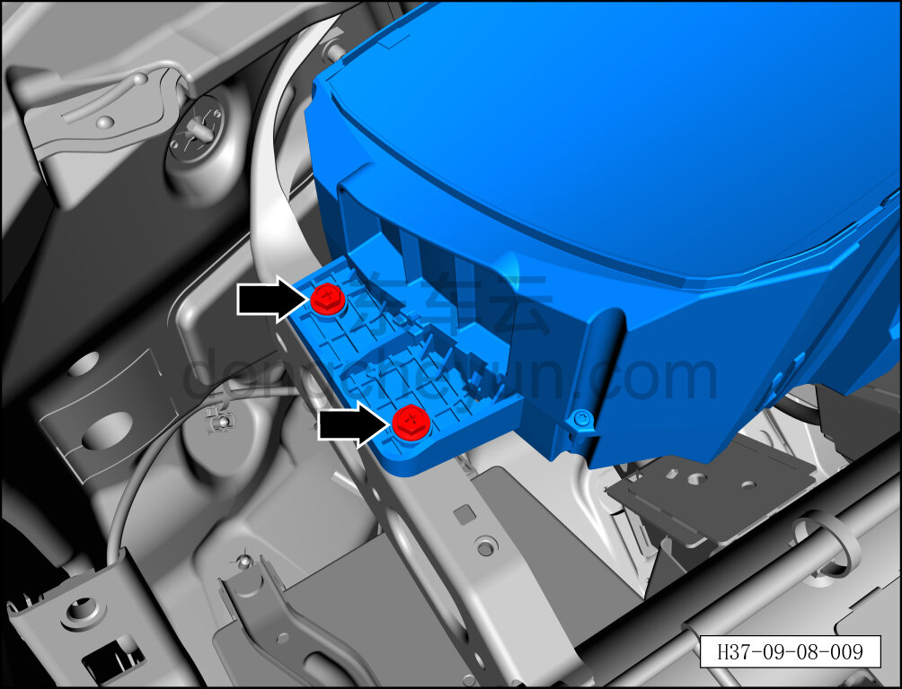
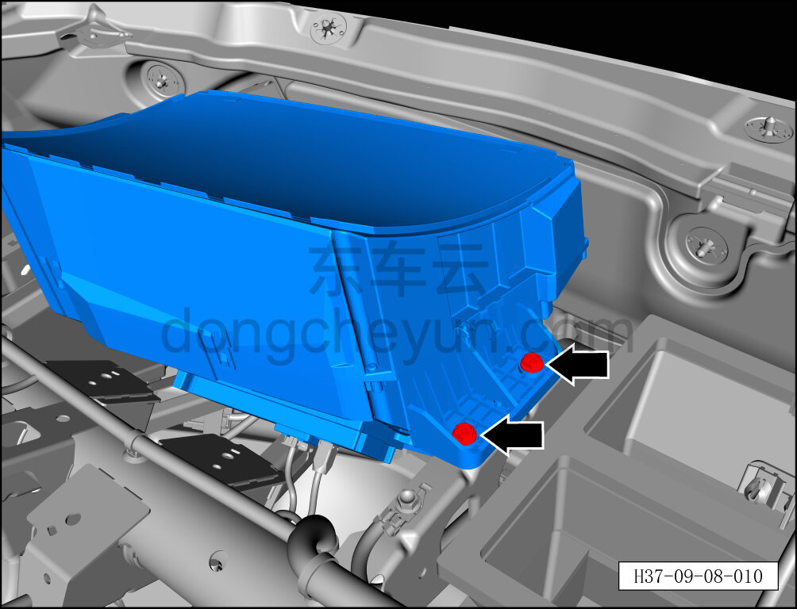
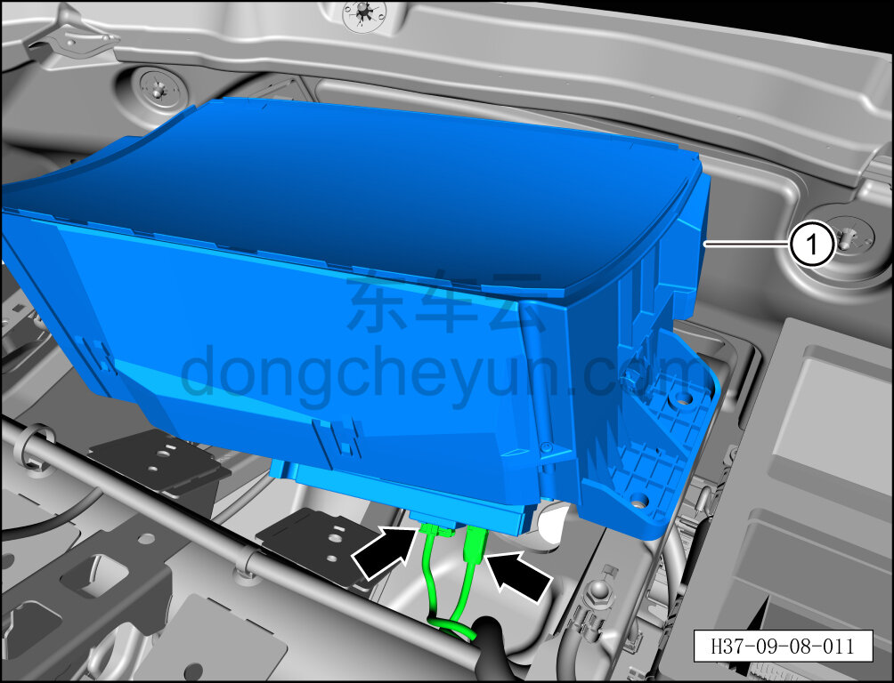

# Снятие и установка контроллера проекционного дисплея (HUD)

> Электрическая и электронная система › Система мониторинга водителя и сигнальной индикации › Камера мониторинга водителя  
> Оригинал: `拆卸与安装抬头显示控制器` · [dongcheyun 56746](https://dongcheyun.com/p/56746), страница `cd107635c91f4bb2aa1499d6e4c11526` · [оглавление](../README.md)

**Порядок снятия**

1. Выключите все электроприборы, отключите питание.

2. Выполните обесточивание автомобиля для ремонта. См. [3.1.4.1 Обесточивание автомобиля](../03-техническое-обслуживание/005-обесточивание-автомобиля.md)

3. Снимите панель приборов в сборе. См. [8.2.4.27 Снятие и установка панели приборов в сборе](../08-внутренняя-и-внешняя-отделка/080-снятие-и-установка-панели-приборов-в-сборе.md)

4. Снимите контроллер проекционного дисплея (HUD).

a. С помощью крестовой отвёртки выверните 2 крепёжных болта контроллера проекционного дисплея (HUD).

Момент затяжки болта: 4±1 Н·м

b. С помощью крестовой отвёртки выверните 2 крепёжных болта контроллера проекционного дисплея (HUD).

Момент затяжки болта: 4±1 Н·м

c. Отсоедините 2 разъёма контроллера проекционного дисплея (HUD).

d. Извлеките контроллер проекционного дисплея (HUD) ①.

**Порядок установки**

Установка выполняется в обратном порядке.

**Примечание:**

**После завершения замены необходимо выполнить следующие операции с помощью диагностического сканера или удалённой диагностики:**

**- Сначала прошить программное обеспечение до последней версии;**

**- После успешного обновления программного обеспечения выполнить процедуру замены детали для контроллера.**

**- После завершения установки проверьте нормальную работу контроллера проекционного дисплея (HUD).**
