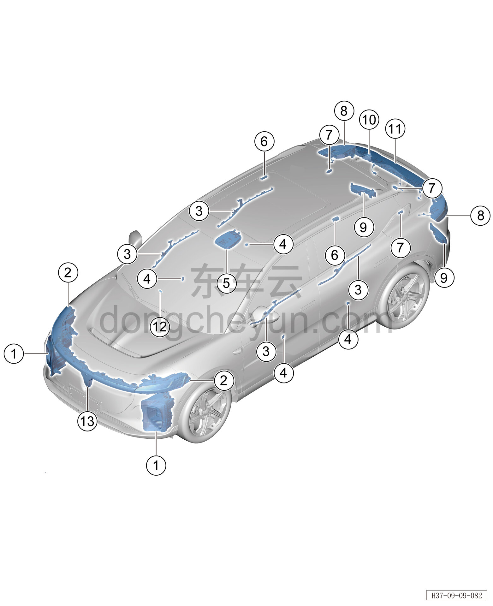

# Расположение компонентов

> Электрическая и электронная система › Система световой сигнализации  
> Оригинал: `部件位置图` · [dongcheyun 56746](https://dongcheyun.com/p/56746), страница `6a4b55496e1346b0a3dede1afc227511` · [оглавление](../README.md)

| № | Наименование детали | Кол-во на автомобиль | Примечание |
|---|---|---|---|
| 1 | Фара | 2 |   |
| 2 | Передний комбинированный сигнальный фонарь | 2 |   |
| 3 | Подсветка салона в двери | 4 | Расположен с внутренней стороны обивки двери |
| 4 | Подсветка салона в кармане двери | 2 | Расположена внутри кармана внутренней обивки задней двери |
| 5 | Передний потолочный светильник | 1 |   |
| 6 | Задний потолочный светильник | 2 | Расположен у поручня безопасности заднего ряда сидений |
| 7 | Освещение багажника | 3 | Расположен на задней боковой обивке |
| 8 | Неподвижная сторона заднего комбинированного фонаря | 1 |   |
| 9 | Задний противотуманный фонарь | 2 | Расположен с внутренней стороны заднего бампера |
| 10 | Дополнительный стоп-сигнал | 1 | Расположен внутри заднего спойлера |
| 11 | Подвижная сторона заднего комбинированного фонаря | 1 |   |
| 12 | Точечный источник света | 1 | Расположен внутри перчаточного ящика |
| 13 | Передний габаритный огонь | 1 |   |
