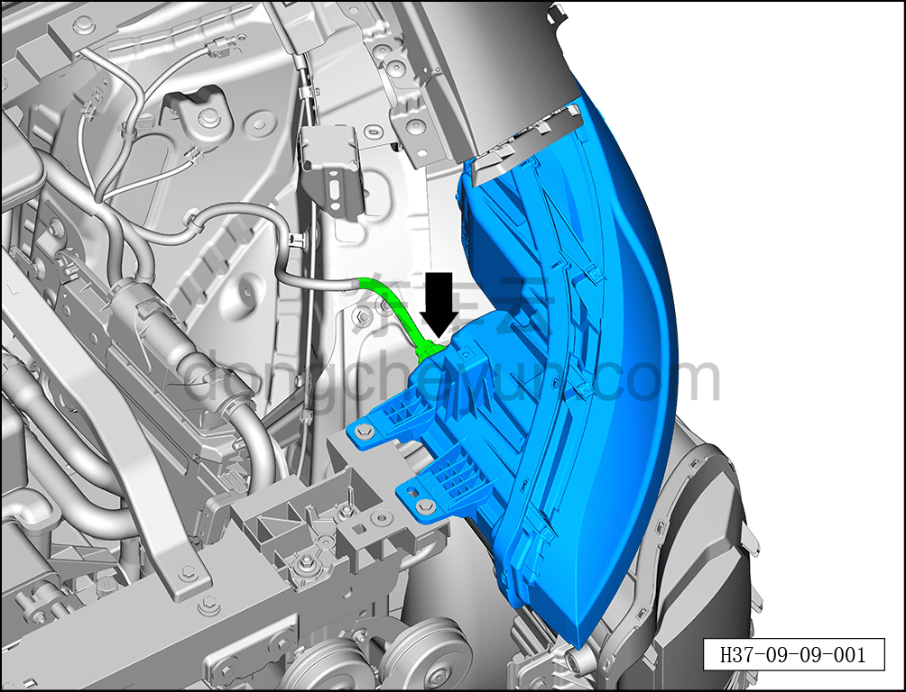
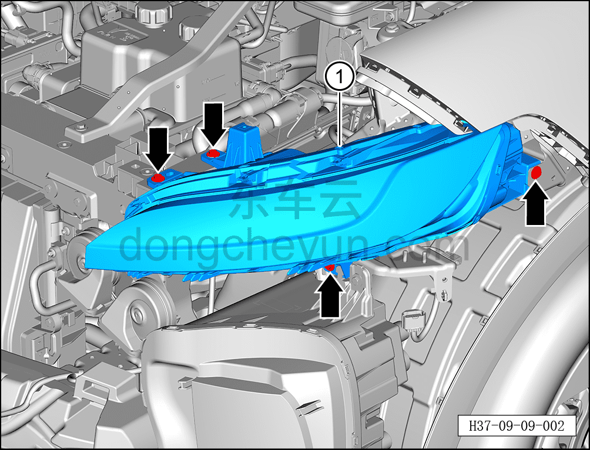

# Снятие и установка левого переднего комбинированного сигнального фонаря

> Электрическая и электронная система › Система световой сигнализации › Фара  
> Оригинал: `拆卸与安装左前信号组合灯` · [dongcheyun 56746](https://dongcheyun.com/p/56746), страница `889b515167d049cc97cb5943fc5c5373` · [оглавление](../README.md)

**Порядок снятия**

**Примечание:**

**- Далее описаны снятие и установка левого переднего комбинированного сигнального фонаря, для правого переднего действия аналогичны левому.**

1. Выключите все электроприборы, отключите питание.

2. Выполните обесточивание автомобиля для ремонта. См. [3.1.4.1 Обесточивание автомобиля](../03-техническое-обслуживание/005-обесточивание-автомобиля.md)

3. Снимите передний бампер в сборе. См. [8.6.3.3 Снятие и установка переднего бампера в сборе](../08-внутренняя-и-внешняя-отделка/163-снятие-и-установка-переднего-бампера-в-сборе.md)

4. Снимите левый передний комбинированный сигнальный фонарь.

a. Нажав на фиксатор разъёма, отсоедините разъём левого переднего комбинированного сигнального фонаря.

b. С помощью торцевой головки на 10 мм выверните 4 крепёжных болта левого переднего комбинированного сигнального фонаря.

Момент затяжки болта: 4±0,5 Н·м

c. Извлеките левый передний комбинированный сигнальный фонарь ①.

**Порядок установки**

Установка выполняется в обратном порядке.

**Примечание:**

**- После завершения замены комбинированного сигнального фонаря проверьте нормальную работу всех функций комбинированного фонаря.**
