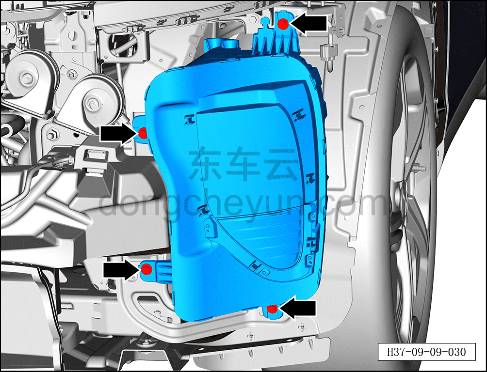
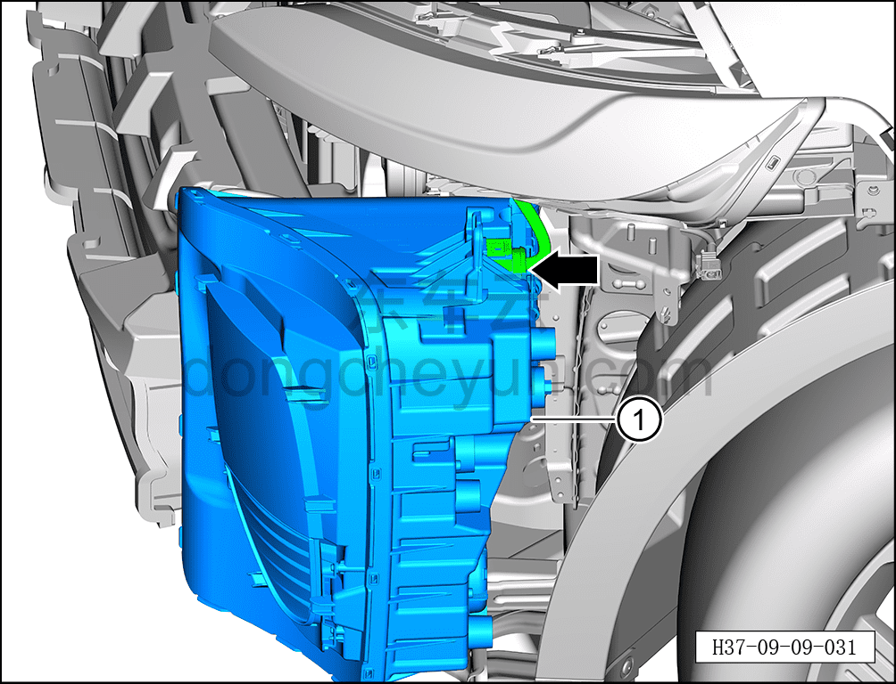

# Снятие и установка фары (левой)

> Электрическая и электронная система › Система световой сигнализации › Фара  
> Оригинал: `拆卸与安装前照灯（左）` · [dongcheyun 56746](https://dongcheyun.com/p/56746), страница `2dc0f0ae45dc472dad600b3972d7bfbb` · [оглавление](../README.md)

**Порядок снятия**

**Примечание:**

**- Далее описаны снятие и установка левой фары, для правой действия аналогичны левой.**

1. Выключите все электроприборы, отключите питание.

2. Выполните обесточивание автомобиля для ремонта. См. [3.1.4.1 Обесточивание автомобиля](../03-техническое-обслуживание/005-обесточивание-автомобиля.md)

3. Снимите передний бампер в сборе. См. [8.6.3.3 Снятие и установка переднего бампера в сборе](../08-внутренняя-и-внешняя-отделка/163-снятие-и-установка-переднего-бампера-в-сборе.md)

4. Снимите фару (левую).

a. С помощью торцевой головки на 10 мм выверните 4 крепёжных болта левой фары.

Момент затяжки болта: 4±0,5 Н·м

b. Нажав на фиксатор разъёма, отсоедините разъём левой фары.

c. Извлеките левую фару ①.

**Порядок установки**

Установка выполняется в обратном порядке.

**Примечание:**

**- После завершения замены фары проверьте её нормальную работу.**
