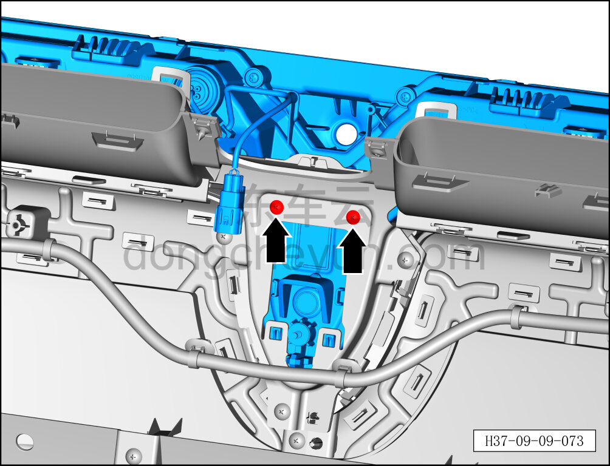
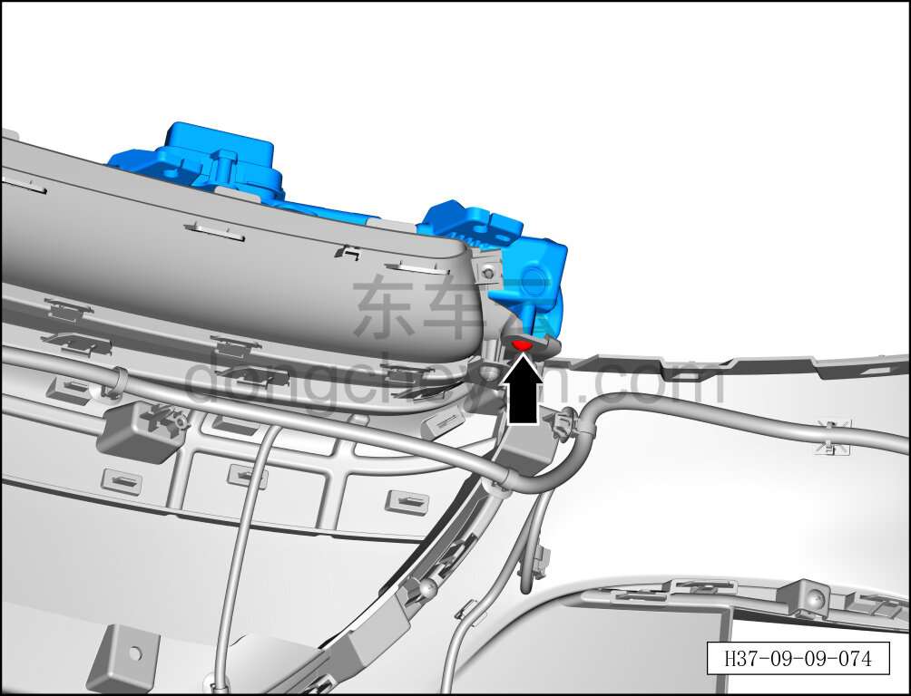
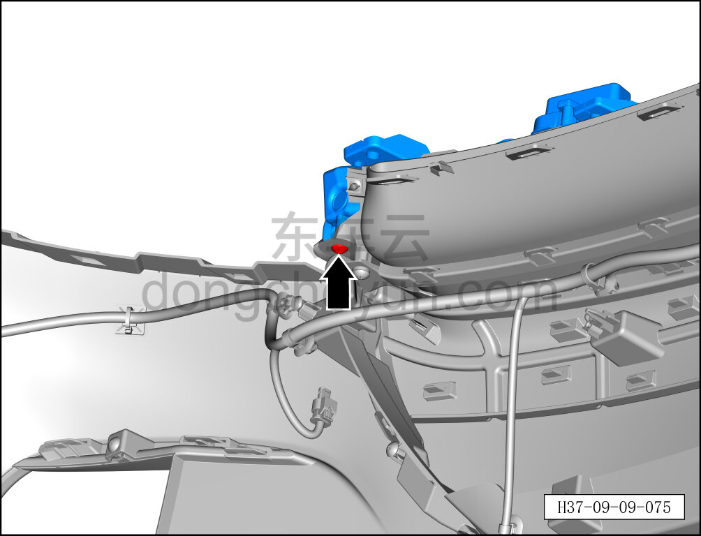
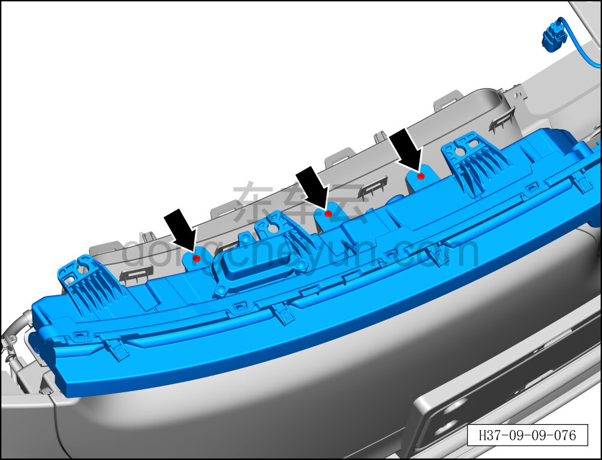
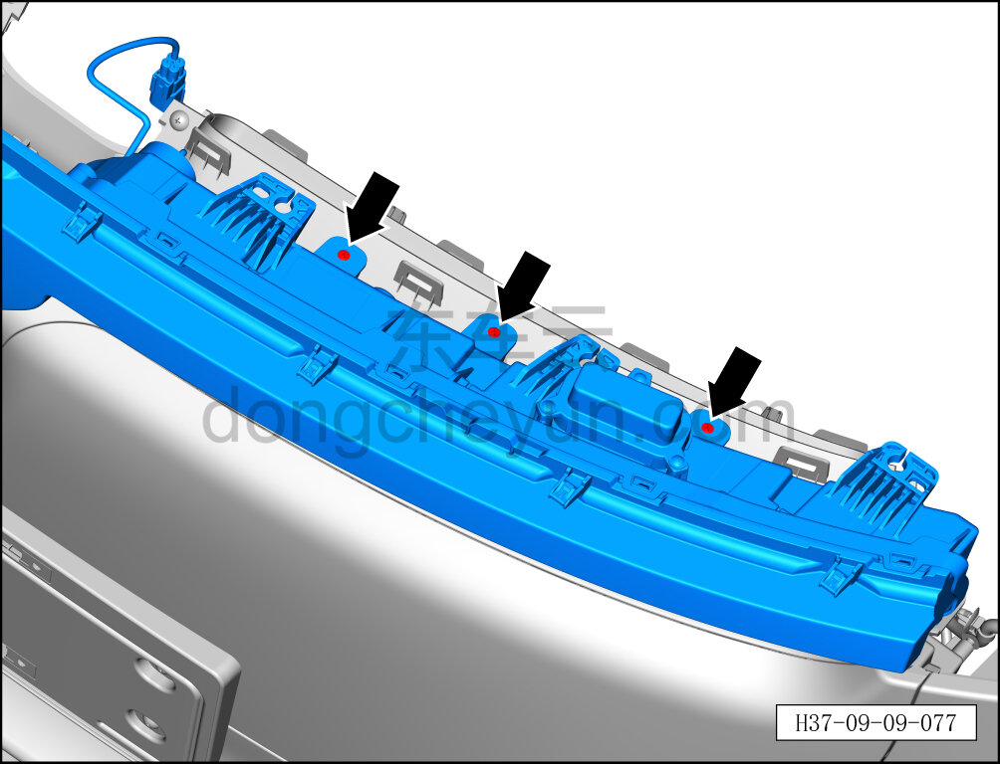
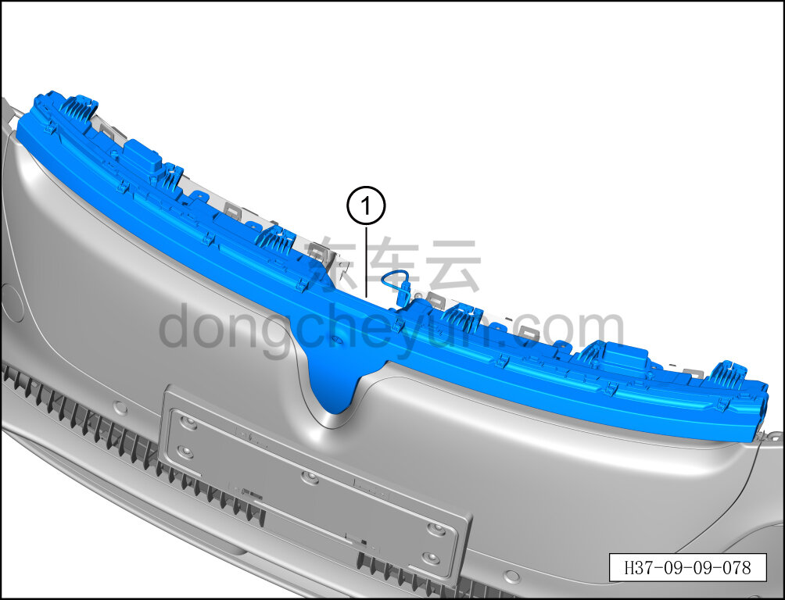

# Снятие и установка переднего габаритного огня

> Электрическая и электронная система › Система световой сигнализации › Фара  
> Оригинал: `拆卸与安装前位置灯` · [dongcheyun 56746](https://dongcheyun.com/p/56746), страница `d278dd5492c042c599c81757954e3ecf` · [оглавление](../README.md)

**Порядок снятия**

1. Выключите все электроприборы, отключите питание.

2. Выполните обесточивание автомобиля для ремонта. См. [3.1.4.1 Обесточивание автомобиля](../03-техническое-обслуживание/005-обесточивание-автомобиля.md)

3. Снимите передний бампер в сборе. См. [8.6.3.3 Снятие и установка переднего бампера в сборе](../08-внутренняя-и-внешняя-отделка/163-снятие-и-установка-переднего-бампера-в-сборе.md)

4. Снимите камеру переднего вида. См. [9.10.4.1 Снятие и установка камеры переднего вида](103-снятие-и-установка-передней-камеры-кругового-обзора.md)

5. Снимите среднюю опорную панель переднего бампера (без светящейся решётки). См. [8.6.3.6 Снятие и установка средней опорной панели переднего бампера (без светящейся решётки)](../08-внутренняя-и-внешняя-отделка/166-снятие-и-установка-центральной-опорной-панели.md)

6. Снимите передний габаритный огонь.

a. С помощью крестовой отвёртки выверните крепёжный винт переднего габаритного огня.

Момент затяжки винта: 1.5±0.5 Н·м

b. С помощью крестовой отвёртки выверните крепёжный винт переднего габаритного огня.

Момент затяжки винта: 1.5±0.5 Н·м

c. С помощью крестовой отвёртки выверните крепёжный винт переднего габаритного огня.

Момент затяжки винта: 1.5±0.5 Н·м

d. С помощью крестовой отвёртки выверните 3 крепёжных винта переднего габаритного огня.

Момент затяжки винта: 1.5±0.5 Н·м

e. С помощью крестовой отвёртки выверните 3 крепёжных винта переднего габаритного огня.

Момент затяжки винта: 1,5±0,5 Н

f. Снимите передний габаритный огонь ①.

**Порядок установки**

Установка выполняется в обратном порядке.

**Примечание:**

**- После завершения установки проверьте нормальную работу переднего габаритного огня.**
