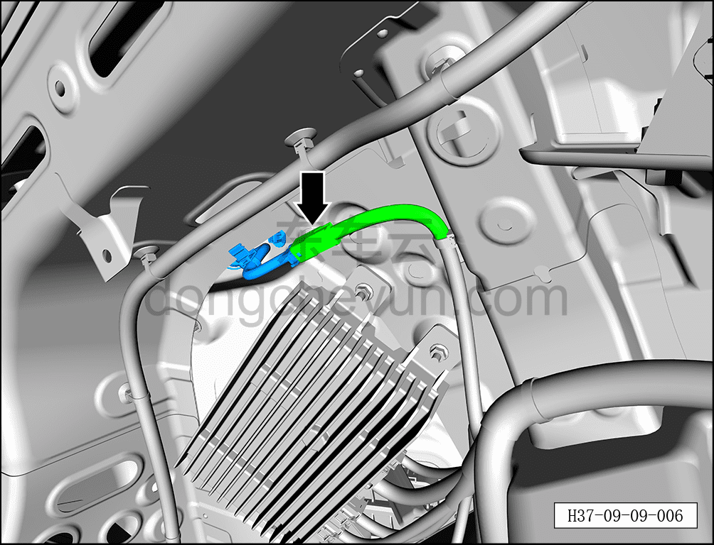
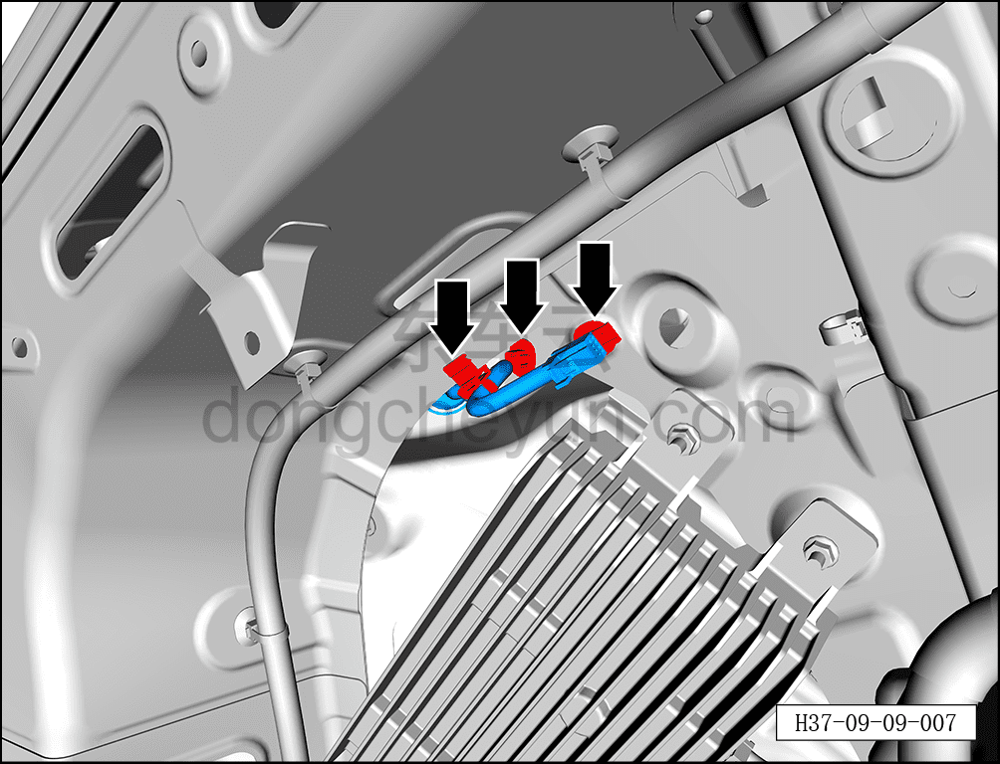
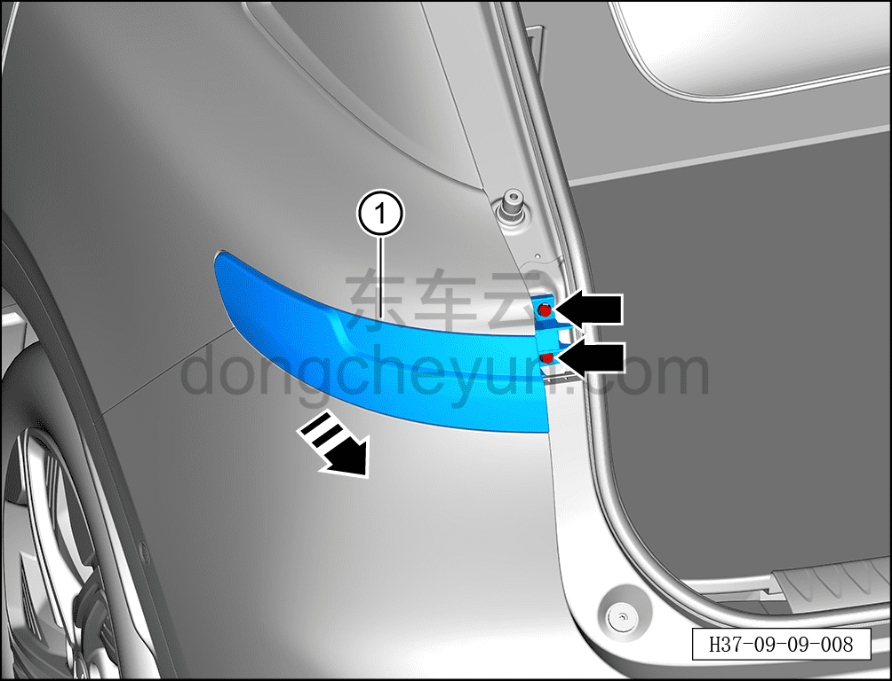

# Снятие и установка неподвижной стороны левого заднего комбинированного фонаря

> Электрическая и электронная система › Система световой сигнализации › Задний комбинированный фонарь  
> Оригинал: `拆卸与安装左后组合灯固定侧` · [dongcheyun 56746](https://dongcheyun.com/p/56746), страница `364e6bb94d1a48d2a43b1704706b3362` · [оглавление](../README.md)

**Порядок снятия**

**Примечание:**

**- Далее описаны снятие и установка неподвижной стороны левого заднего комбинированного фонаря, для правого заднего действия аналогичны левому.**

1. Выключите все электроприборы, отключите питание.

2. Выполните обесточивание автомобиля для ремонта. См. [3.1.4.1 Обесточивание автомобиля](../03-техническое-обслуживание/005-обесточивание-автомобиля.md)

3. Снимите неподвижную боковую панель левого заднего комбинированного фонаря. См. [8.6.6.17 Снятие и установка неподвижной боковой панели левого заднего комбинированного фонаря](../08-внутренняя-и-внешняя-отделка/230-снятие-и-установка-неподвижной-боковой-панели-левого.md)

4. Снимите левую заднюю боковую обивку в сборе. См. [8.5.5.6 Снятие и установка левой задней боковой обивки](../08-внутренняя-и-внешняя-отделка/136-снятие-и-установка-левой-обивки-задней-боковины.md)

5. Снимите неподвижную сторону левого заднего комбинированного фонаря.

a. Нажав на фиксатор разъёма, отсоедините разъём неподвижной стороны левого заднего комбинированного фонаря.

b. С помощью съёмника обивки отсоедините 3 клипсы неподвижной стороны левого заднего комбинированного фонаря.

c. С помощью торцевой головки на 10 мм выверните 2 крепёжных болта неподвижной стороны левого заднего комбинированного фонаря.

Момент затяжки болта: 4±0,5 Н·м

d. В направлении стрелки снимите неподвижную сторону левого заднего комбинированного фонаря ①.

**Порядок установки**

Установка выполняется в обратном порядке.

**Внимание:**

**- При установке гофры жгута проводов неподвижной стороны левого заднего комбинированного фонаря уложите гофру так, чтобы она плотно и надёжно фиксировалась в отверстии кузова, исключая риск попадания воды.**

**- После завершения установки проверьте нормальную работу неподвижной стороны заднего комбинированного фонаря.**
