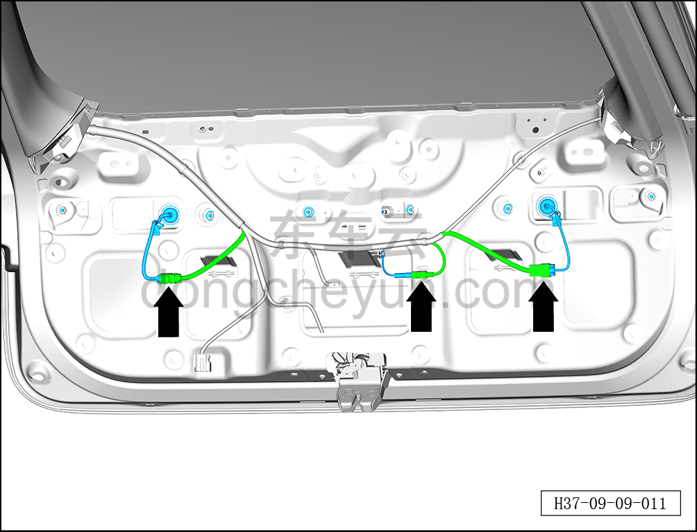
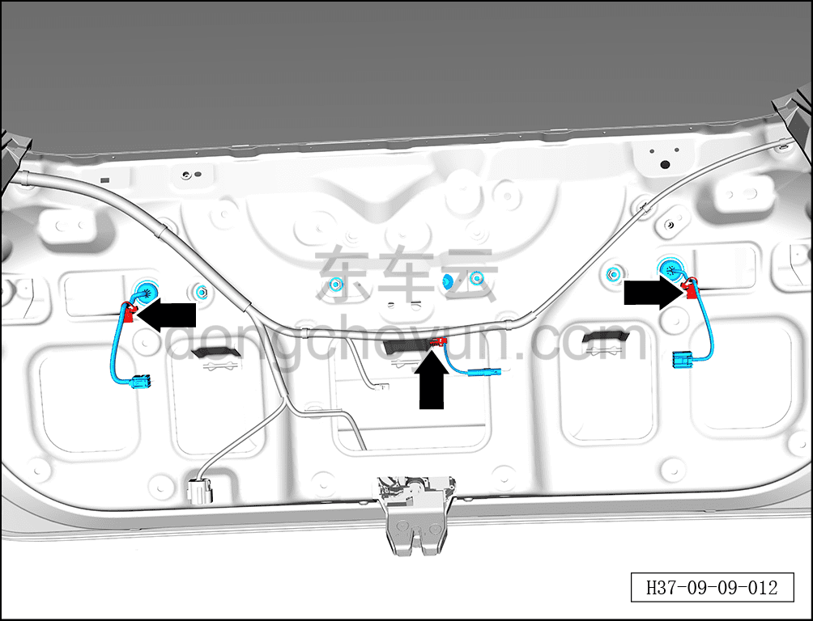
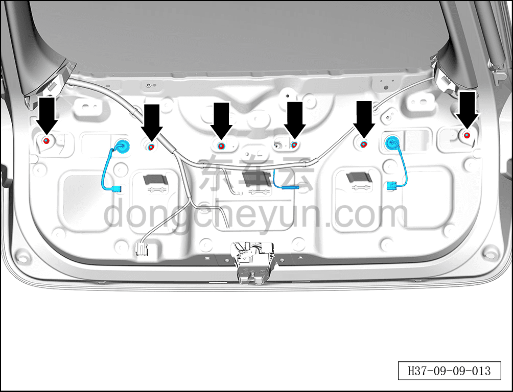
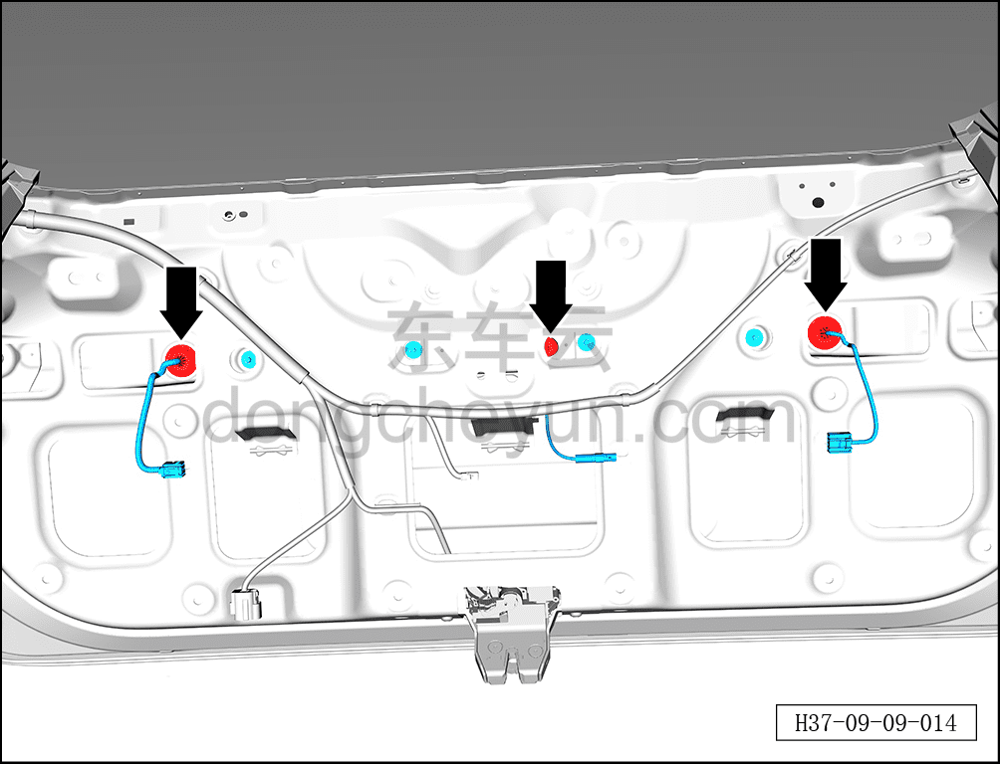
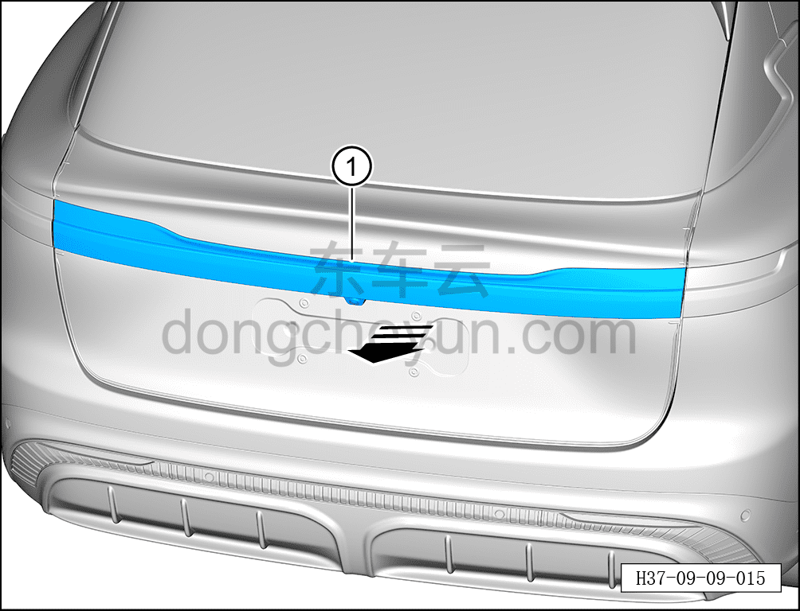

# Снятие и установка подвижной стороны заднего комбинированного фонаря

> Электрическая и электронная система › Система световой сигнализации › Задний комбинированный фонарь  
> Оригинал: `拆卸与安装移动侧后组合灯` · [dongcheyun 56746](https://dongcheyun.com/p/56746), страница `5288bf402e0a4ebdb85c35507ee59a48` · [оглавление](../README.md)

**Порядок снятия**

1. Выключите все электроприборы, отключите питание.

2. Выполните обесточивание автомобиля для ремонта. См. [3.1.4.1 Обесточивание автомобиля](../03-техническое-обслуживание/005-обесточивание-автомобиля.md)

3. Снимите левую и правую боковые панели подвижной стороны заднего комбинированного фонаря. См. [8.6.6.18 Снятие и установка боковой панели подвижной стороны левого заднего комбинированного фонаря](../08-внутренняя-и-внешняя-отделка/231-снятие-и-установка-подвижной-боковой-панели-левого.md)

4. Снимите нижнюю декоративную накладку двери багажника. См. [8.4.4.2 Снятие и установка нижней декоративной накладки двери багажника](../08-внутренняя-и-внешняя-отделка/122-снятие-и-установка-нижней-накладки-двери-багажника.md)

5. Снимите подвижную сторону заднего комбинированного фонаря.

a. Отсоедините 3 разъёма подвижной стороны заднего комбинированного фонаря.

b. С помощью съёмника обивки отсоедините 3 фиксирующие клипсы жгута проводов подвижной стороны заднего комбинированного фонаря.

c. С помощью торцевой головки на 10 мм отверните 6 крепёжных гаек подвижной стороны заднего комбинированного фонаря.

Момент затяжки гайки: 2±0,5 Н·м

d. Отсоедините 3 гофры жгута проводов подвижной стороны заднего комбинированного фонаря.

e. В направлении стрелки снимите подвижную сторону заднего комбинированного фонаря ①.

**Порядок установки**

Установка выполняется в обратном порядке.

**Примечание:**

**- После завершения установки проверьте нормальную работу подвижной стороны заднего комбинированного фонаря.**
