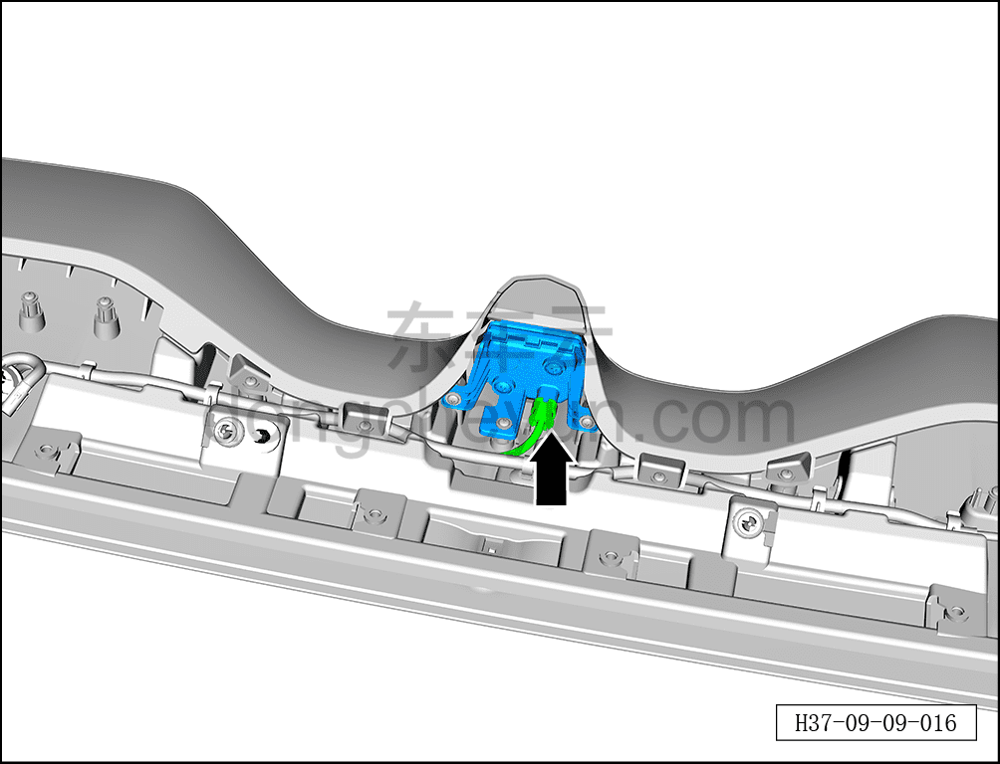
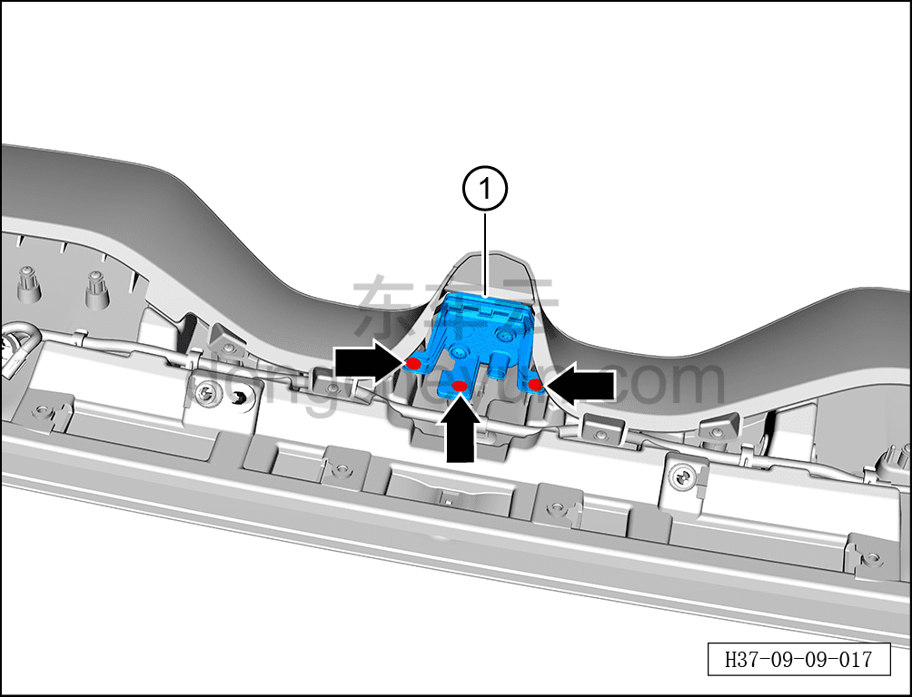

# Снятие и установка дополнительного стоп-сигнала

> Электрическая и электронная система › Система световой сигнализации › Дополнительный стоп-сигнал  
> Оригинал: `拆卸与安装高位制动灯` · [dongcheyun 56746](https://dongcheyun.com/p/56746), страница `c84476e346ee4c4ca8ee6de29cc897b4` · [оглавление](../README.md)

**Порядок снятия**

1. Выключите все электроприборы, отключите питание.

2. Выполните обесточивание автомобиля для ремонта. См. [3.1.4.1 Обесточивание низковольтной сети автомобиля](##)

3. Снимите задний спойлер. См. [8.6.6.8 Снятие и установка спойлера](../08-внутренняя-и-внешняя-отделка/221-снятие-и-установка-спойлера.md)

4. Снимите дополнительный стоп-сигнал.

a. Нажав на фиксатор разъёма, отсоедините разъём дополнительного стоп-сигнала.

b. С помощью крестовой отвёртки выверните 3 крепёжных винта дополнительного стоп-сигнала.

Момент затяжки винта: 4.5±0.5 Н·м

c. Извлеките дополнительный стоп-сигнал ①.

**Порядок установки**

Установка выполняется в обратном порядке.

**Примечание:**

**- После завершения установки проверьте нормальную работу дополнительного стоп-сигнала.**
