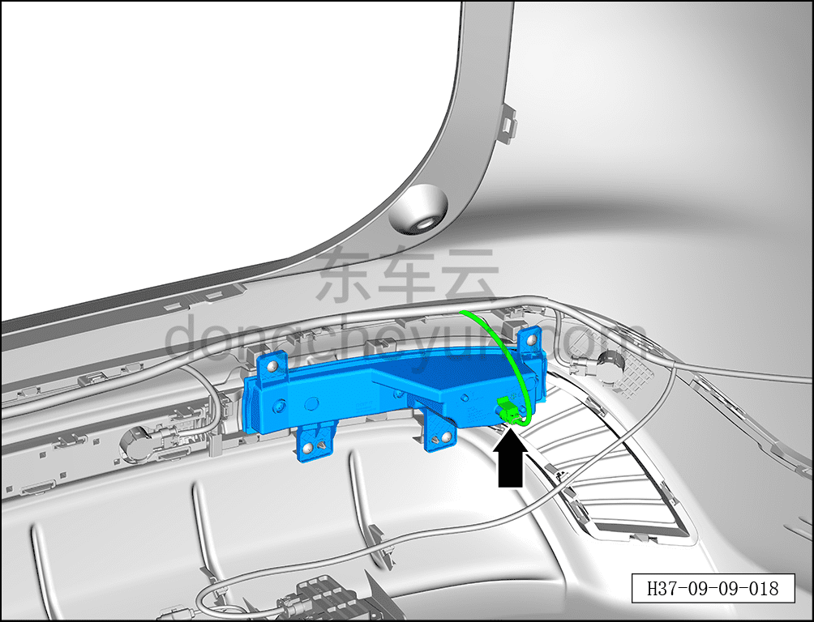
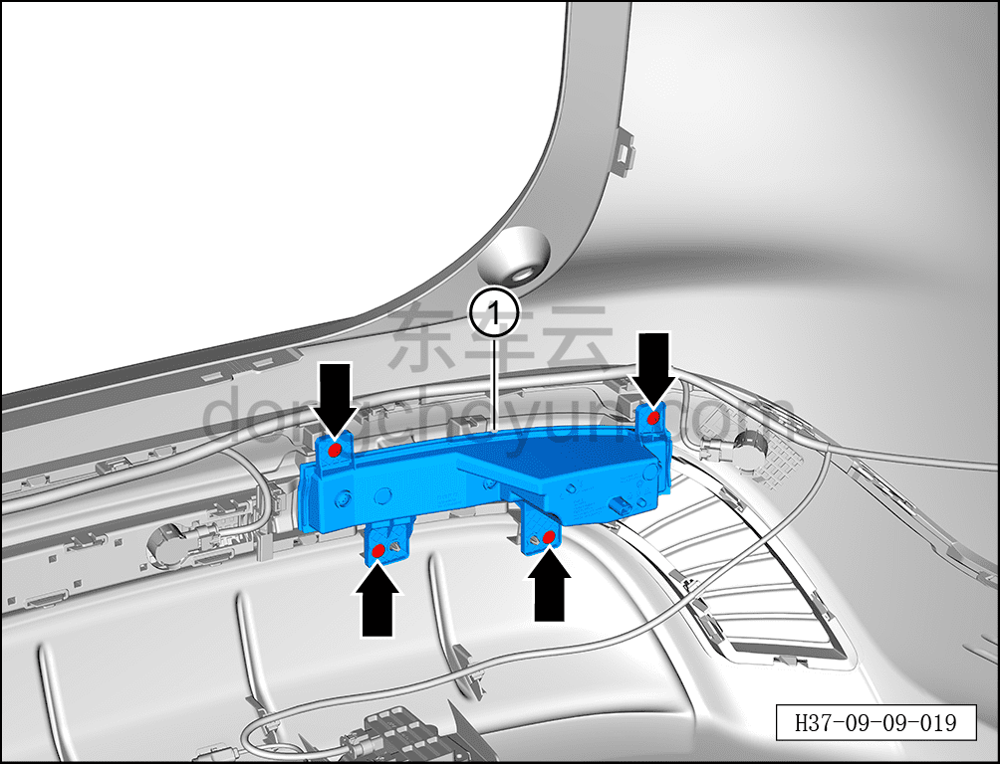

# Снятие и установка левого заднего противотуманного фонаря

> Электрическая и электронная система › Система световой сигнализации › Задний противотуманный фонарь  
> Оригинал: `拆卸与安装左后雾灯` · [dongcheyun 56746](https://dongcheyun.com/p/56746), страница `df9fa57bb808470195c44fa388dab93c` · [оглавление](../README.md)

**Порядок снятия**

**Примечание:**

**- Далее описаны снятие и установка левого заднего противотуманного фонаря, для правого заднего действия аналогичны левому.**

1. Выключите все электроприборы, отключите питание.

2. Выполните обесточивание автомобиля для ремонта. См. [3.1.4.1 Обесточивание автомобиля](../03-техническое-обслуживание/005-обесточивание-автомобиля.md)

3. Снимите задний бампер в сборе. См. [8.6.3.26 Снятие и установка заднего бампера в сборе](../08-внутренняя-и-внешняя-отделка/186-снятие-и-установка-заднего-бампера-в-сборе.md)

4. Снимите левый задний противотуманный фонарь.

a. Нажав на фиксатор разъёма, отсоедините разъём левого заднего противотуманного фонаря.

b. С помощью крестовой отвёртки выверните 4 крепёжных винта левого заднего противотуманного фонаря.

Момент затяжки винта: 1.5±0.5 Н·м

c. Извлеките левый задний противотуманный фонарь ①.

**Порядок установки**

Установка выполняется в обратном порядке.

**Примечание:**

**- После завершения установки проверьте нормальную работу заднего противотуманного фонаря.**
