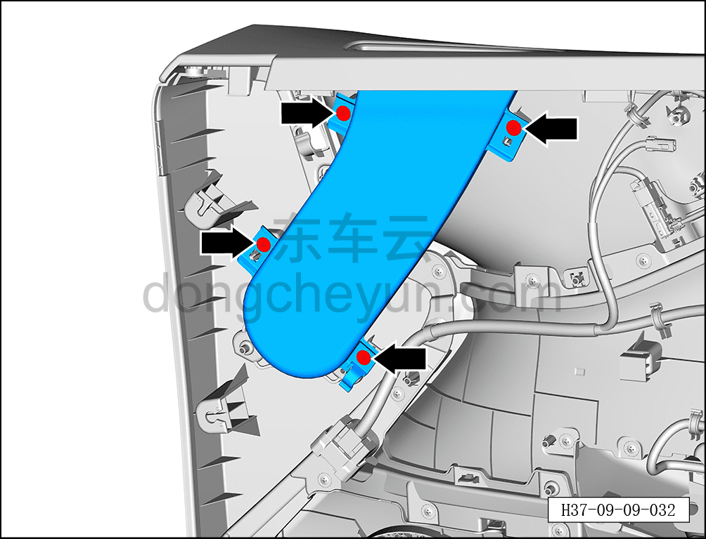
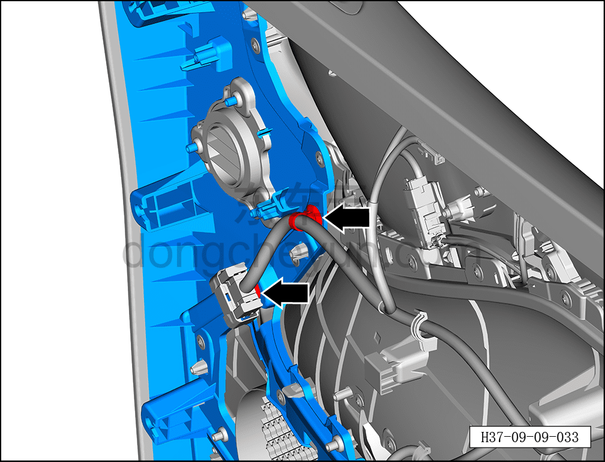
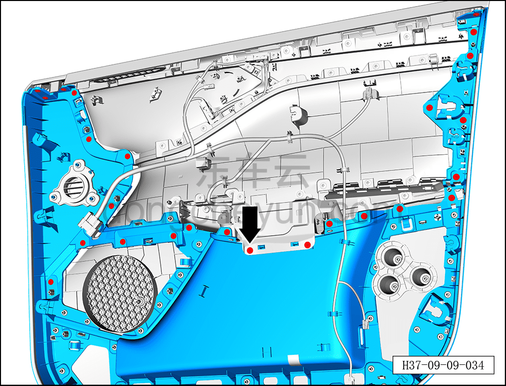
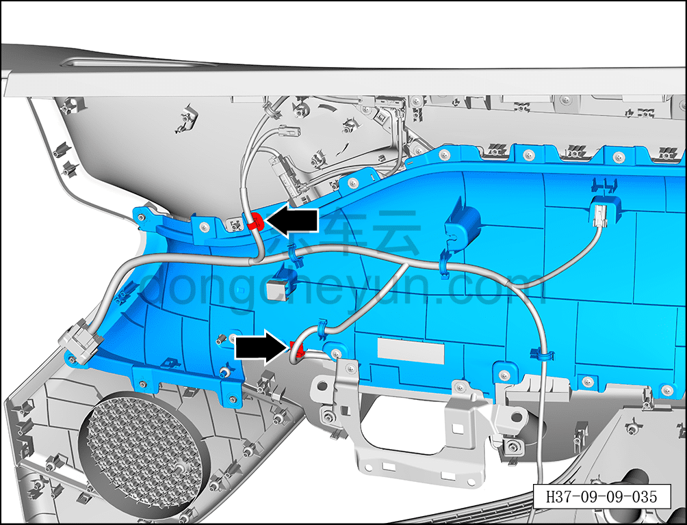
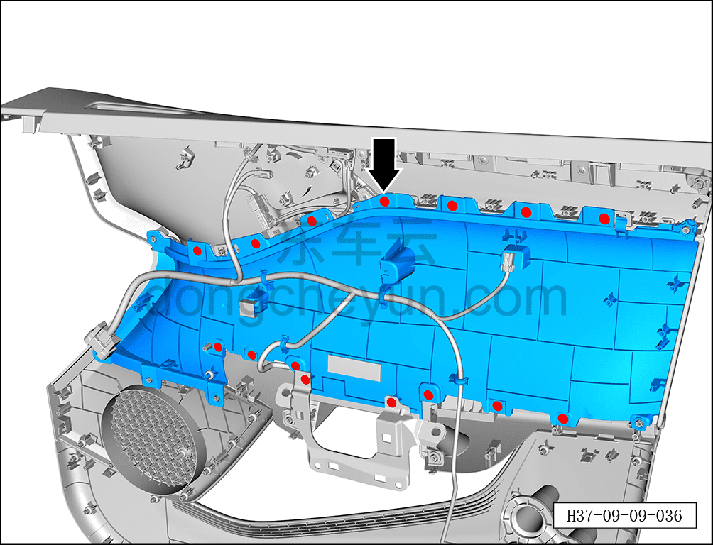
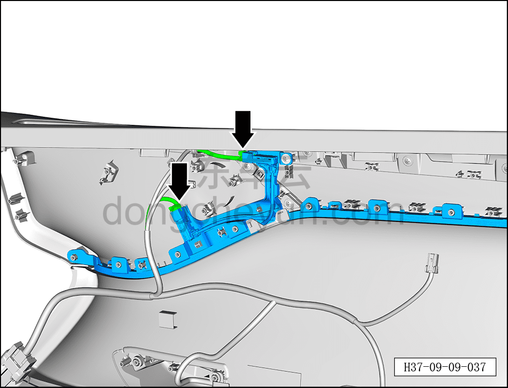
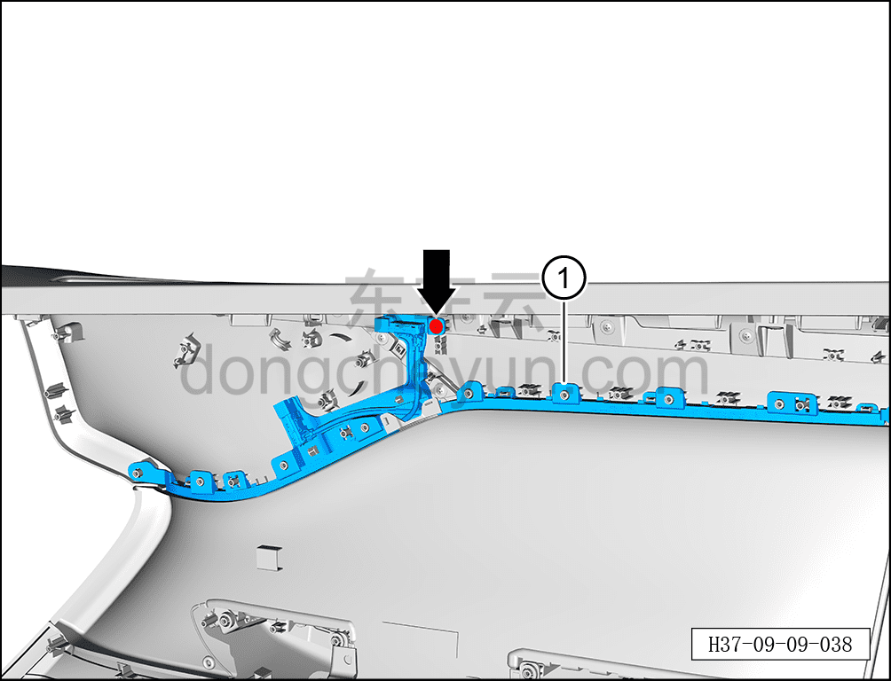

# Снятие и установка подсветки салона левой передней двери

> Электрическая и электронная система › Система световой сигнализации › Подсветка салона (ambient)  
> Оригинал: `拆卸与安装左前门氛围灯` · [dongcheyun 56746](https://dongcheyun.com/p/56746), страница `5e7280aa180f41a2bd1d4ffc5184c23a` · [оглавление](../README.md)

**Порядок снятия**

**Примечание:**

**- Далее описаны снятие и установка подсветки салона левой передней двери, для правой передней двери действия аналогичны левой.**

1. Выключите все электроприборы, отключите питание.

2. Выполните обесточивание автомобиля для ремонта. См. [3.1.4.1 Обесточивание автомобиля](../03-техническое-обслуживание/005-обесточивание-автомобиля.md)

3. Снимите внутреннюю обивку левой передней двери. См. [8.4.2.1 Снятие и установка внутренней обивки левой передней двери](../08-внутренняя-и-внешняя-отделка/117-снятие-и-установка-обивки-левой-передней-двери.md)

4. Снимите подсветку салона левой передней двери.

a. С помощью крестовой отвёртки выверните 4 винта накладки левой передней двери.

Момент затяжки винта: 2,5 Н·м

b. Отсоедините 2 фиксирующие клипсы жгута проводов левой передней двери.

c. С помощью крестовой отвёртки выверните 25 винтов накладки левой передней двери.

Момент затяжки винта: 2,5 Н·м

d. Отсоедините 2 фиксирующие клипсы жгута проводов левой передней двери.

e. С помощью крестовой отвёртки выверните 15 винтов накладки левой передней двери.

Момент затяжки винта: 2,5 Н·м

f. Отсоедините 2 разъёма подсветки салона левой передней двери.

g. С помощью крестовой отвёртки выверните крепёжный винт подсветки салона левой передней двери.

h. Извлеките подсветку салона левой передней двери ①.

Момент затяжки винта: 2,5 Н·м

**Порядок установки**

Установка выполняется в обратном порядке.

**Примечание:**

**- После завершения установки проверьте нормальную работу подсветки салона.**
