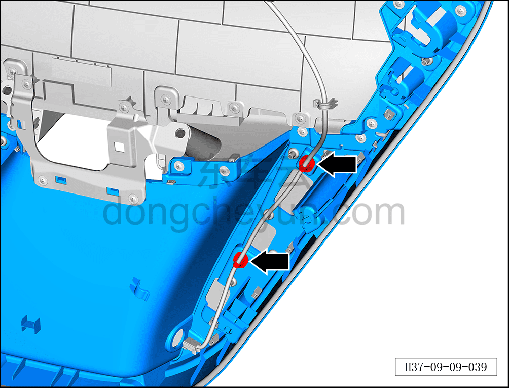
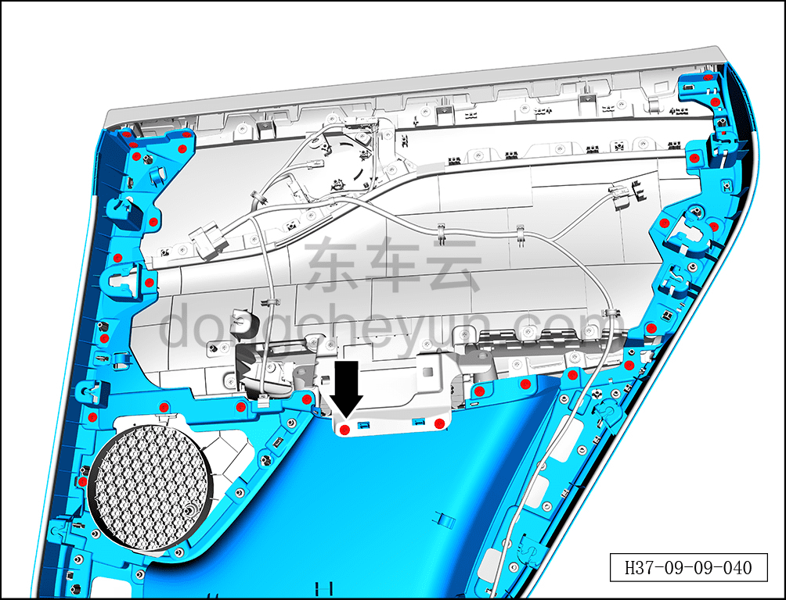
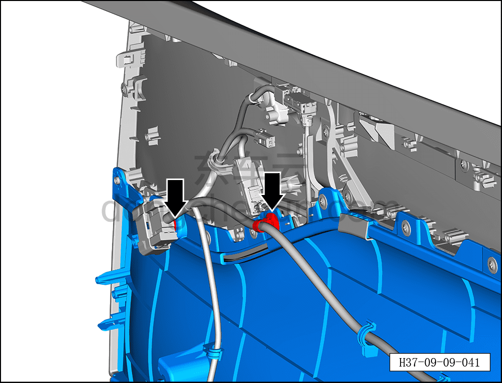
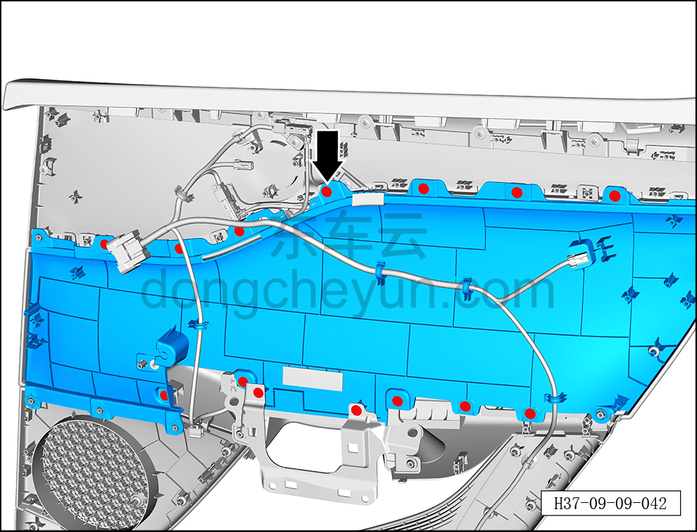
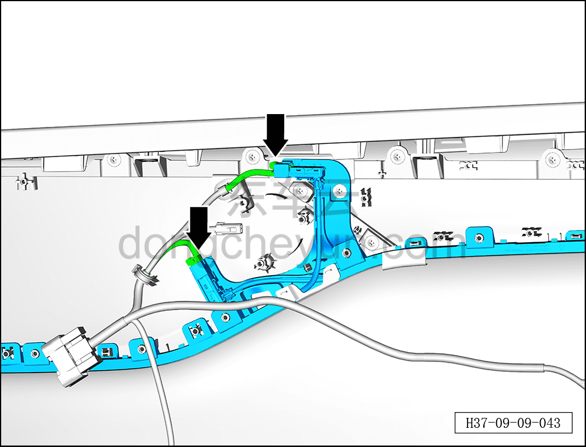
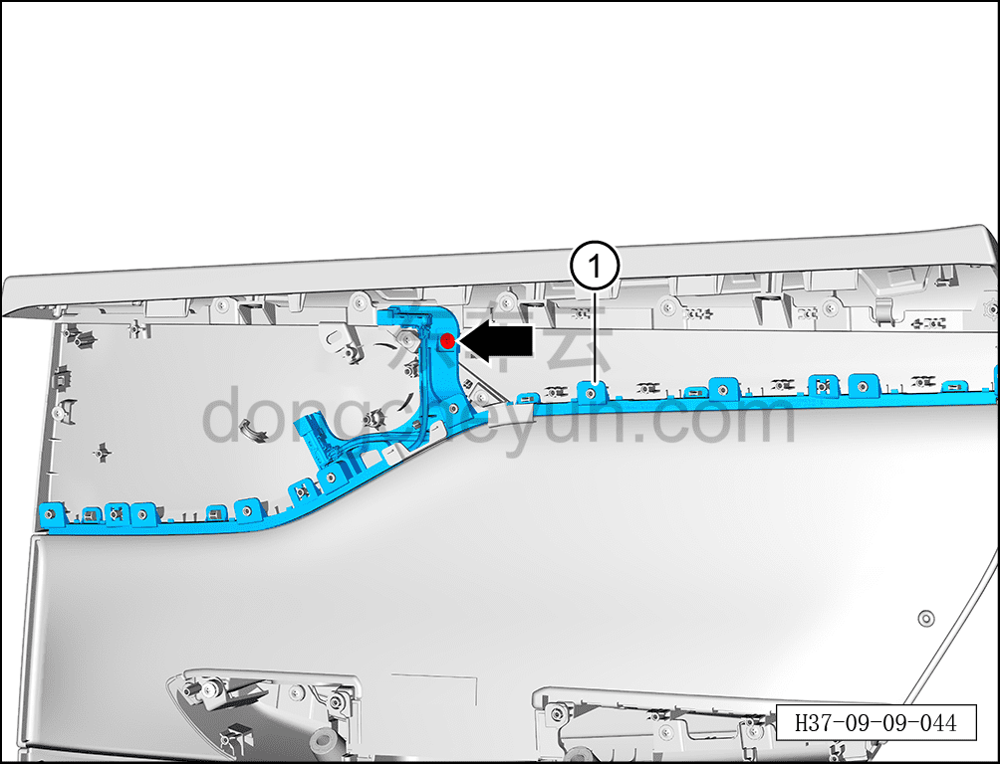

# Снятие и установка подсветки (ambient) левой задней двери

> Электрическая и электронная система › Система световой сигнализации › Подсветка салона (ambient)  
> Оригинал: `拆卸与安装左后门氛围灯` · [dongcheyun 56746](https://dongcheyun.com/p/56746), страница `b73b849ff46047858884cabfef5e07bd` · [оглавление](../README.md)

**Порядок снятия**

**Примечание:**

**-Далее описаны снятие и установка подсветки (ambient) левой задней двери, для правой задней двери см. по аналогии с левой задней дверью.**

1. Выключите все электроприборы, отключите питание.

2. Выполните обесточивание автомобиля для ремонта. См. [3.1.4.1 Обесточивание автомобиля](../03-техническое-обслуживание/005-обесточивание-автомобиля.md)

3. Снимите внутреннюю обивку левой задней двери. См. [8.4.3.1 Снятие и установка внутренней обивки левой задней двери](../08-внутренняя-и-внешняя-отделка/119-снятие-и-установка-обивки-левой-задней-двери.md)

4. Снятие подсветки (ambient) левой задней двери.

a. С помощью съёмника обивки отсоедините 2 фиксатора жгута проводов левой задней двери.

b. Крестовой отвёрткой выверните 27 винтов накладки левой задней двери.

Момент затяжки винта: 2,5 Н·м

c. Отсоедините 2 фиксатора жгута проводов левой задней двери.

d. Крестовой отвёрткой выверните 14 винтов накладки левой задней двери.

Момент затяжки винта: 2,5 Н·м

e. Удерживая фиксатор разъёма, отсоедините 2 разъёма подсветки (ambient) левой задней двери.

f. Крестовой отвёрткой выверните крепёжный винт подсветки (ambient) левой задней двери.

g. Извлеките подсветку (ambient) левой задней двери ①.

Момент затяжки винта: 2,5 Н·м

**Порядок установки**

Установка выполняется в обратном порядке.

**Примечание:**

**- После завершения установки проверьте нормальную работу подсветки салона.**
