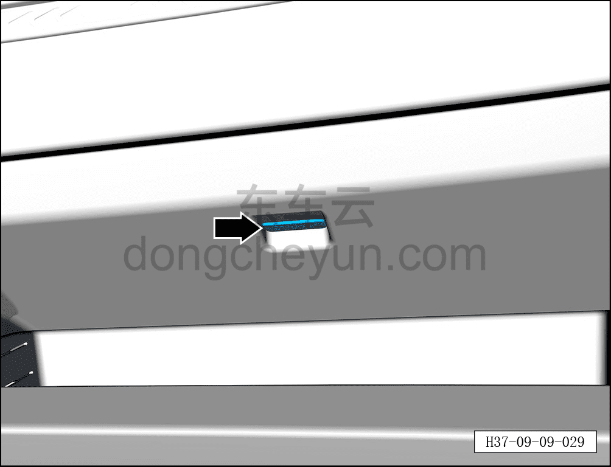
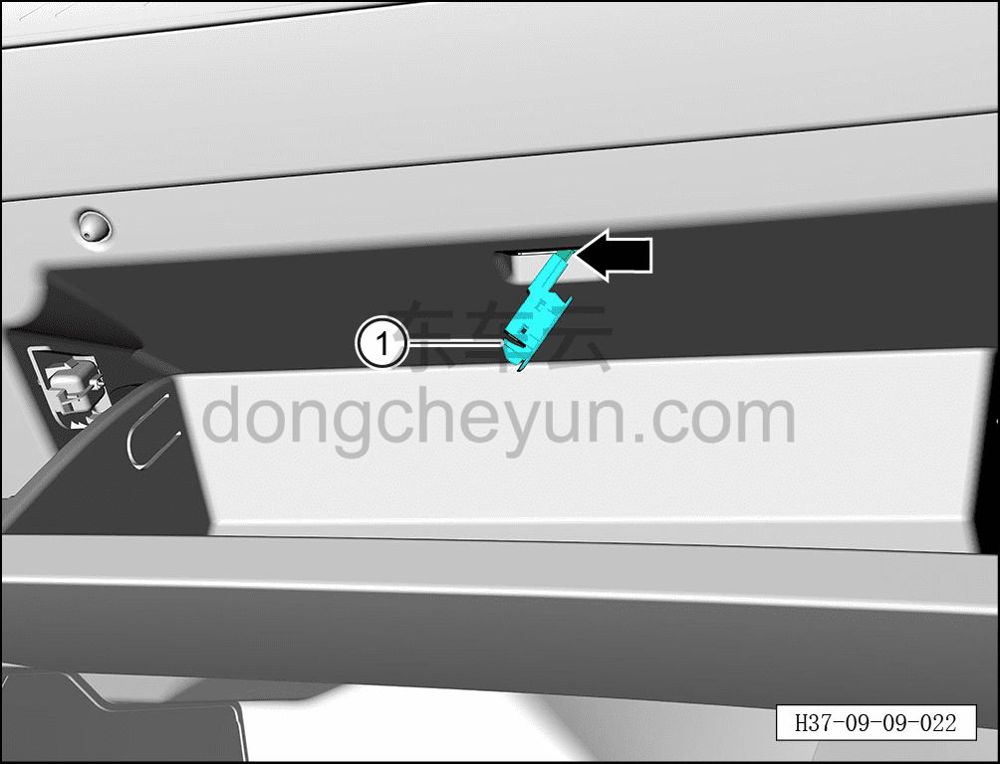

# Снятие и установка точечного источника света

> Электрическая и электронная система › Система световой сигнализации › Подсветка салона (ambient)  
> Оригинал: `拆卸与安装点光源` · [dongcheyun 56746](https://dongcheyun.com/p/56746), страница `dd4a8903417545a28df3533befaff223` · [оглавление](../README.md)

**Порядок снятия**

1. Выключите все электроприборы, отключите питание.

2. Выполните обесточивание автомобиля для ремонта. См. [3.1.4.1 Обесточивание автомобиля](../03-техническое-обслуживание/005-обесточивание-автомобиля.md)

3. Снятие точечного источника света.

a. Откройте перчаточный ящик (бардачок).

b. С помощью съёмника обивки в месте, указанном стрелкой, отсоедините точечный источник света.

**Примечание:**

**-При использовании съёмника обивки можно подложить под деталь нетканый материал, чтобы не повредить панель приборов.**

**Внимание:**

**- К тыльной стороне точечного источника света подключён жгут проводов, после снятия не тяните с усилием, чтобы не повредить жгут проводов.**

c. Удерживая фиксатор разъёма, отсоедините разъём точечного источника света.

d. Извлеките точечный источник света ①.

**Порядок установки**

Установка выполняется в обратном порядке.

**Примечание:**

**-После завершения установки необходимо проверить нормальную работу точечного источника света.**
