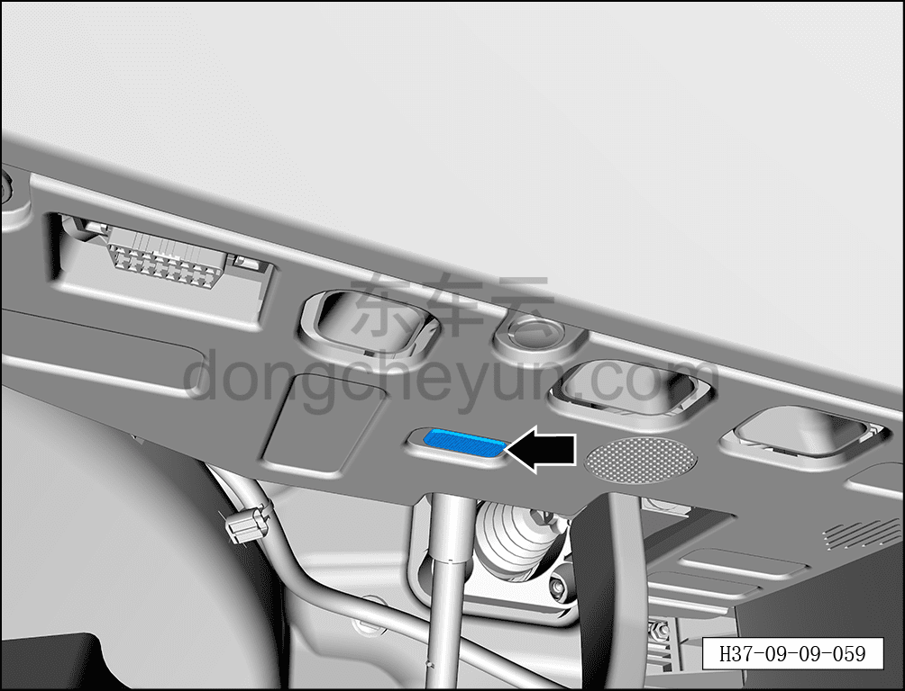
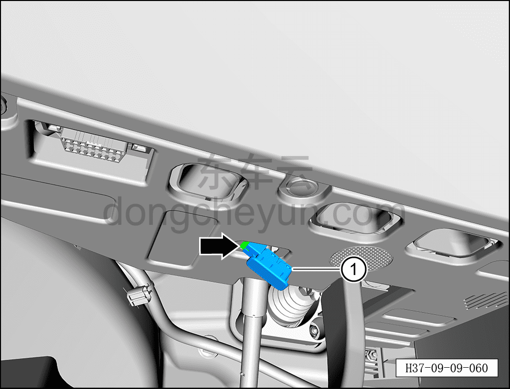
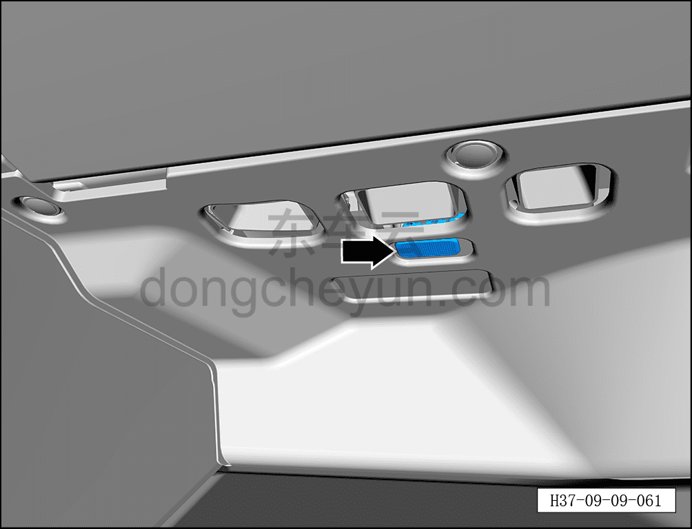
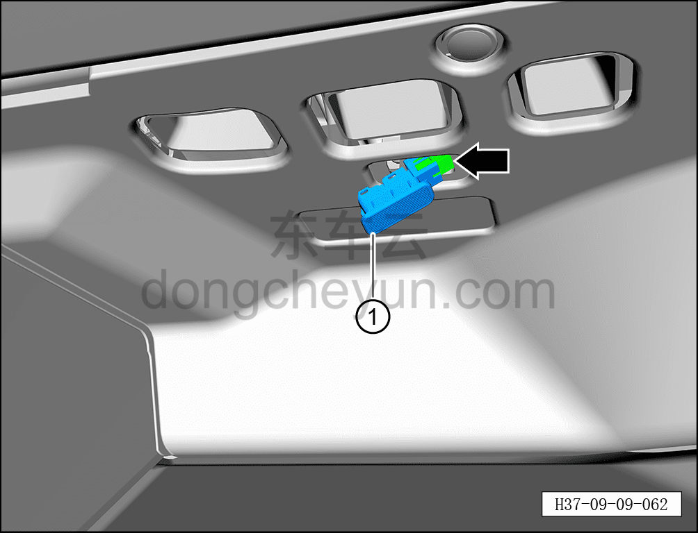
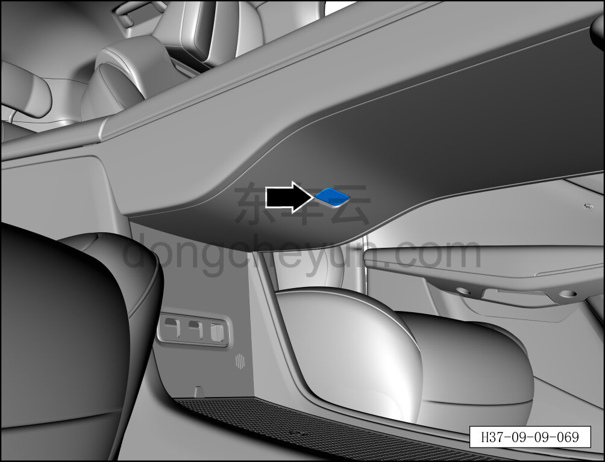
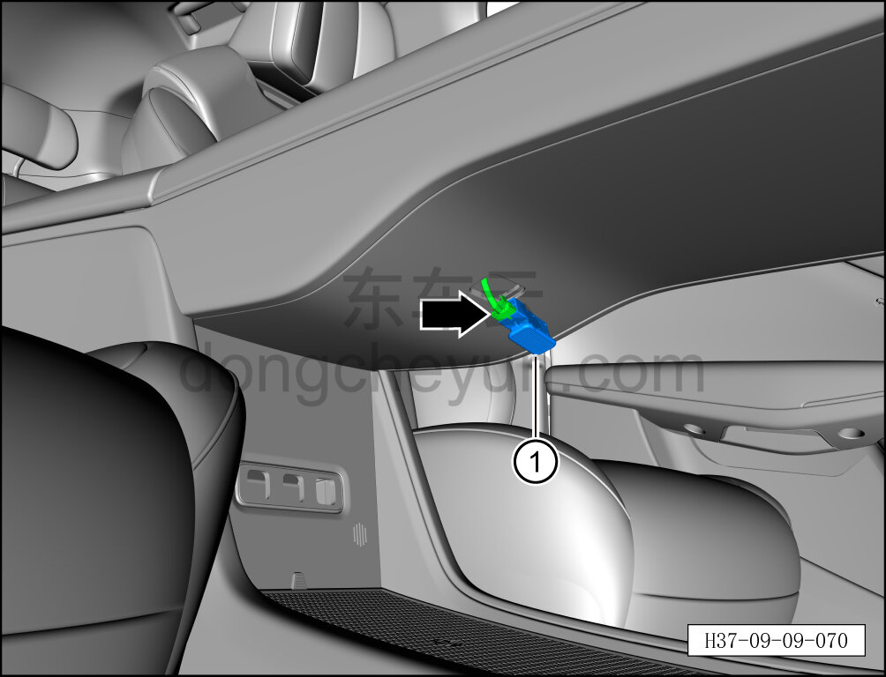
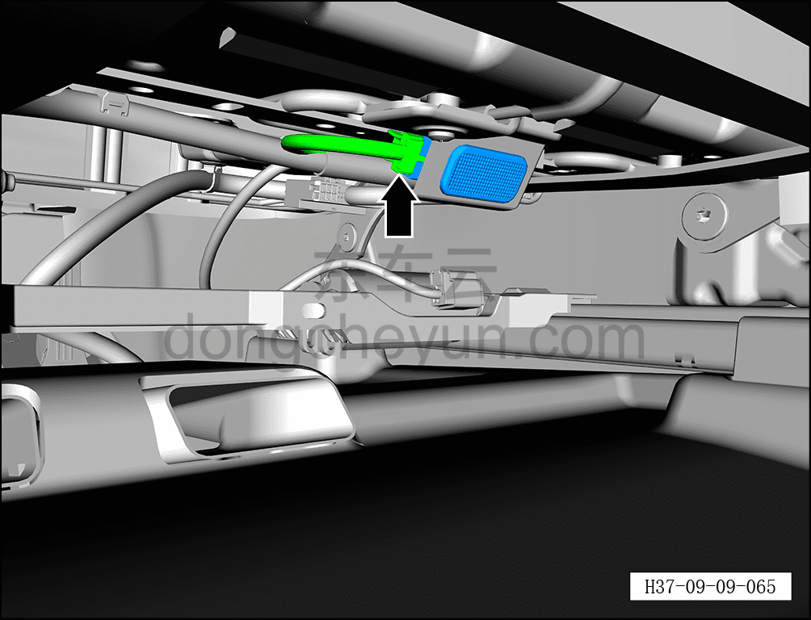
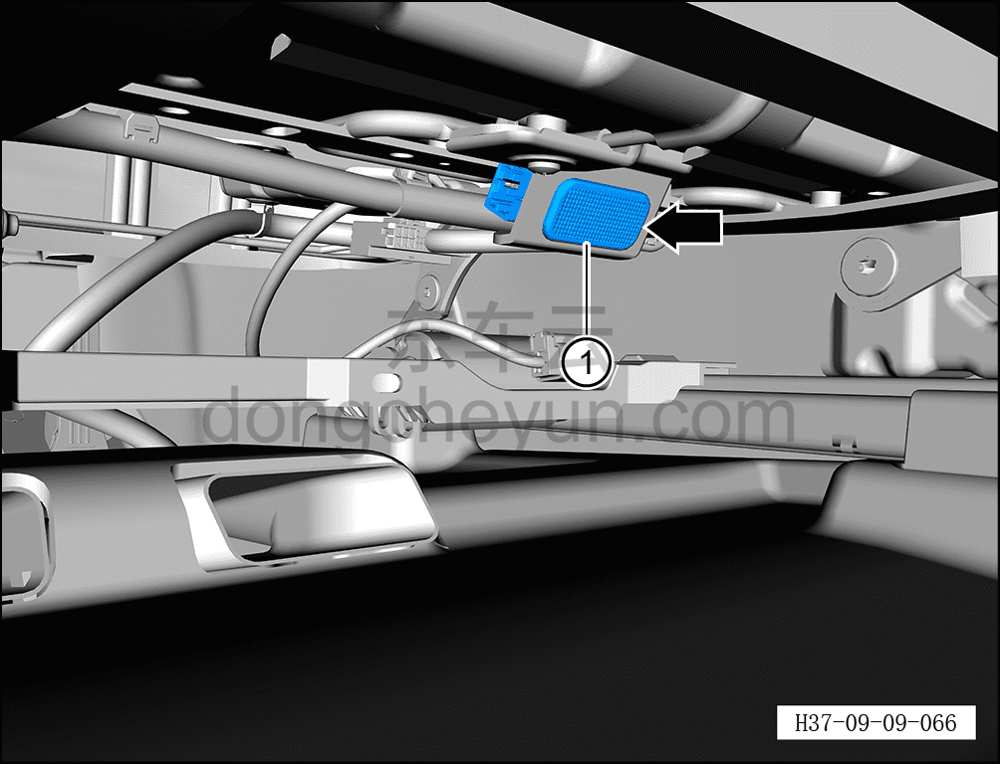

# Снятие и установка подсветки ног в панели приборов

> Электрическая и электронная система › Система световой сигнализации › Подсветка салона (ambient)  
> Оригинал: `拆卸与安装仪表板照脚灯` · [dongcheyun 56746](https://dongcheyun.com/p/56746), страница `93b60f59e5aa40d38438c618e4a0c408` · [оглавление](../README.md)

**Порядок снятия**

1. Выключите все электроприборы, отключите питание.

2. Выполните обесточивание автомобиля для ремонта. См. [3.1.4.1 Обесточивание автомобиля](../03-техническое-обслуживание/005-обесточивание-автомобиля.md)

3. Снятие подсветки ног в панели приборов.

a. Отсоедините защёлку подсветки ног со стороны водителя.

**Внимание:**

**- К тыльной стороне подсветки ног подключён жгут проводов, после снятия не тяните с усилием, чтобы не повредить жгут проводов.**

b. Удерживая фиксатор разъёма, отсоедините разъём подсветки ног со стороны водителя.

c. Извлеките подсветку ног со стороны водителя ①.

d. Отсоедините защёлку подсветки ног со стороны пассажира.

**Внимание:**

**- К тыльной стороне подсветки ног со стороны пассажира подключён жгут проводов, после снятия не тяните с усилием, чтобы не повредить жгут проводов.**

e. Удерживая фиксатор разъёма, отсоедините разъём подсветки ног со стороны пассажира.

f. Извлеките подсветку ног со стороны пассажира ①.

g. Отсоедините защёлку подсветки ног центральной консоли.

**Внимание:**

**- К тыльной стороне подсветки ног центральной консоли подключён жгут проводов, после снятия не тяните с усилием, чтобы не повредить жгут проводов.**

h. Удерживая фиксатор разъёма, отсоедините разъём подсветки ног центральной консоли.

i. Извлеките подсветку ног центральной консоли ①.

j. Отсоедините разъём подсветки ног передних сидений.

k. Удерживая фиксатор разъёма, отсоедините защёлку подсветки ног передних сидений.

l. Извлеките подсветку ног передних сидений ①.

**Порядок установки**

Установка выполняется в обратном порядке.

**Примечание:**

**-После завершения установки необходимо проверить нормальную работу подсветки ног.**
