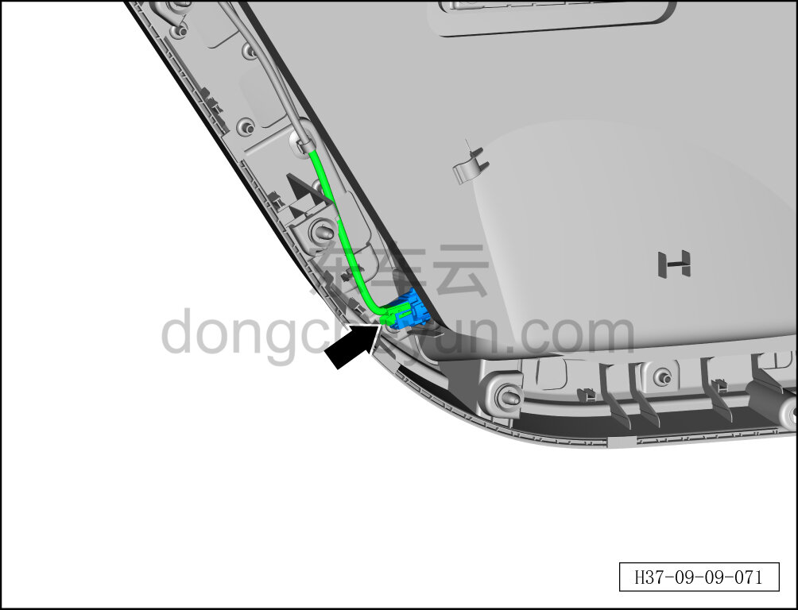
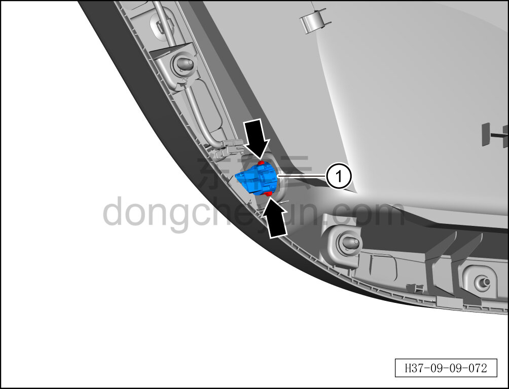

# Снятие и установка подсветки (ambient) кармана двери

> Электрическая и электронная система › Система световой сигнализации › Подсветка салона (ambient)  
> Оригинал: `拆卸与安装门储物盒氛围灯` · [dongcheyun 56746](https://dongcheyun.com/p/56746), страница `da74753e94114c2cb5f05de6c2a13674` · [оглавление](../README.md)

**Порядок снятия**

**Примечание:**

**-Далее описаны снятие и установка подсветки (ambient) кармана левой задней двери, для правой задней см. по аналогии с левой задней.**

1. Выключите все электроприборы, отключите питание.

2. Выполните обесточивание автомобиля для ремонта. См. [3.1.4.1 Обесточивание автомобиля](../03-техническое-обслуживание/005-обесточивание-автомобиля.md)

3. Снимите внутреннюю обивку левой задней двери. См. [8.4.3.1 Снятие и установка внутренней обивки левой задней двери](../08-внутренняя-и-внешняя-отделка/119-снятие-и-установка-обивки-левой-задней-двери.md)

4. Снятие подсветки (ambient) кармана двери.

a. Удерживая фиксатор разъёма, отсоедините разъём подсветки (ambient) кармана двери.

b. Удерживая защёлки с обеих сторон подсветки (ambient) кармана двери, извлеките подсветку (ambient) кармана двери ①.

**Порядок установки**

Установка выполняется в обратном порядке.

**Примечание:**

-После завершения установки необходимо проверить **нормальную работу подсветки (ambient) кармана двери.**
