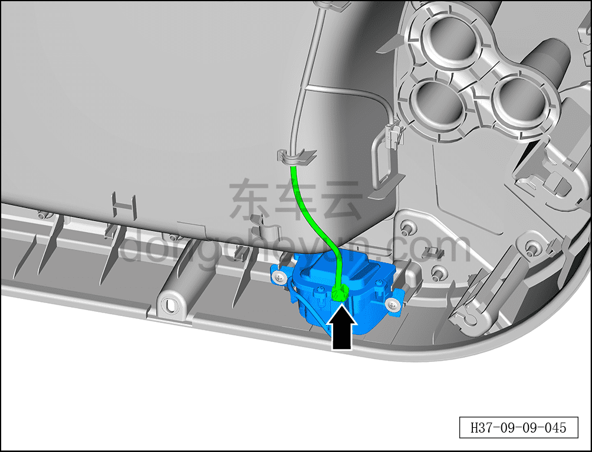
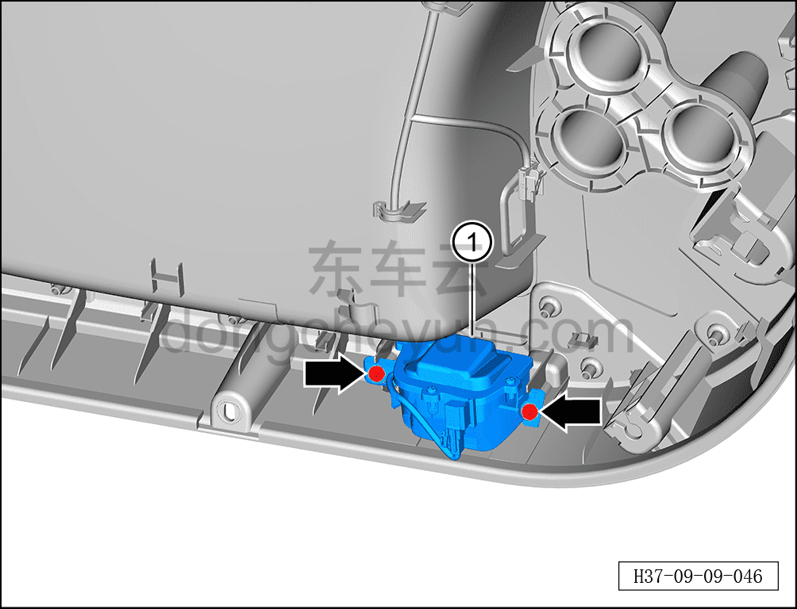

# Снятие и установка фонаря подсветки земли передней двери (левая передняя дверь)

> Электрическая и электронная система › Система световой сигнализации › Фонарь подсветки земли передней двери  
> Оригинал: `拆卸与安装前门照地灯（左前门）` · [dongcheyun 56746](https://dongcheyun.com/p/56746), страница `73b64abd61c441dc9d826073d903d39a` · [оглавление](../README.md)

**Порядок снятия**

**Примечание:**

**-Далее описаны снятие и установка фонаря подсветки земли передней двери (левая передняя дверь), для правой передней см. по аналогии с левой передней.**

**- Фонарь подсветки земли передней двери является опцией (дополнительное оснащение). **

1. Выключите все электроприборы, отключите питание.

2. Выполните обесточивание автомобиля для ремонта. См. [3.1.4.1 Обесточивание автомобиля](../03-техническое-обслуживание/005-обесточивание-автомобиля.md)

3. Снимите внутреннюю обивку левой передней двери. См. [8.4.2.1 Снятие и установка внутренней обивки левой передней двери](../08-внутренняя-и-внешняя-отделка/117-снятие-и-установка-обивки-левой-передней-двери.md)

4. Снятие фонаря подсветки земли передней двери (левая передняя дверь).

a. Удерживая фиксатор разъёма, отсоедините разъём фонаря подсветки земли передней двери (левая передняя дверь).

b. Крестовой отвёрткой выверните 2 крепёжных винта фонаря подсветки земли передней двери (левая передняя дверь).

Момент затяжки винта: 2±0.5 Н·м

c. Извлеките фонарь подсветки земли передней двери (левая передняя дверь) ①.

**Порядок установки**

Установка выполняется в обратном порядке.

**Примечание:**

**-После завершения установки необходимо проверить исправность фонаря подсветки земли передней двери (левая передняя дверь).**
