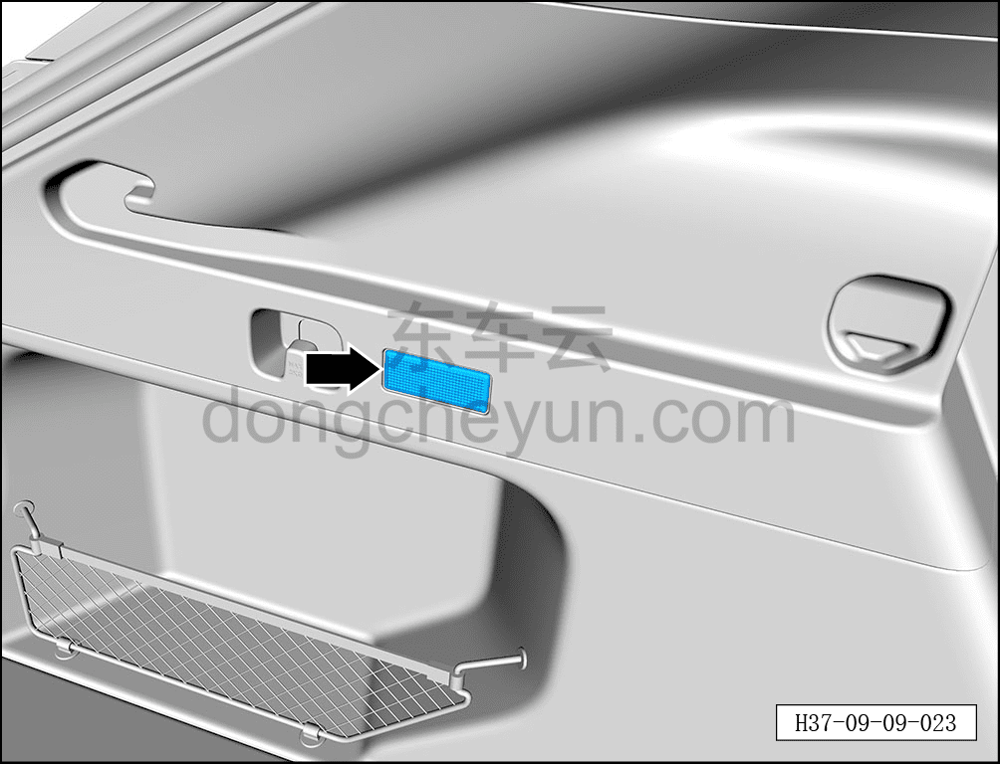
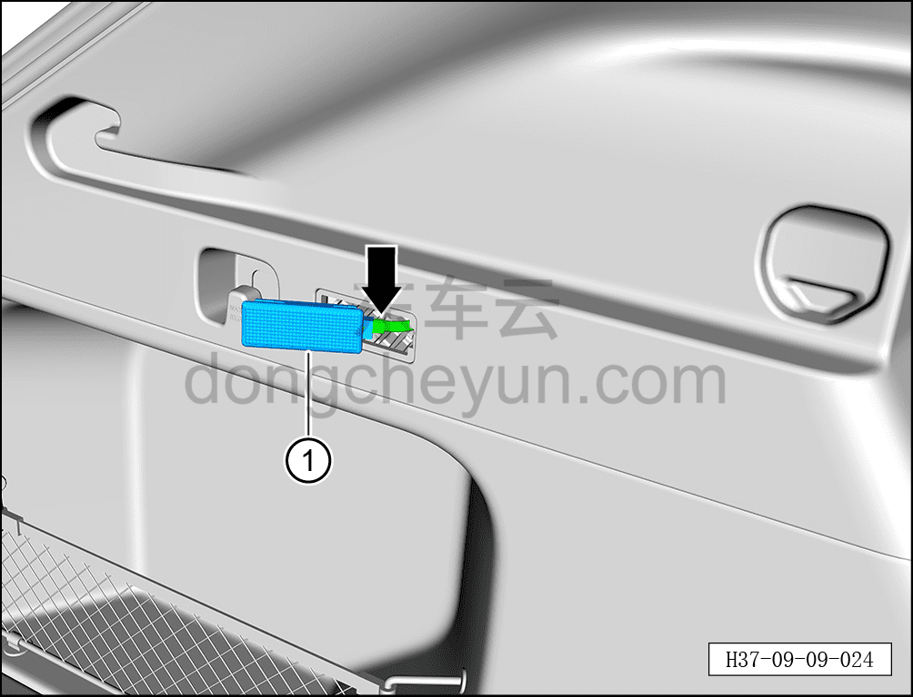

# Снятие и установка правого светильника освещения багажника

> Электрическая и электронная система › Система световой сигнализации › Внутренние светильники освещения  
> Оригинал: `拆卸与安装行李箱右照明灯` · [dongcheyun 56746](https://dongcheyun.com/p/56746), страница `69bbe48ffaa544bc8d92676936d54bcd` · [оглавление](../README.md)

**Порядок снятия**

1. Выключите все электроприборы, отключите питание.

2. Выполните обесточивание автомобиля для ремонта. См. [3.1.4.1 Обесточивание автомобиля](../03-техническое-обслуживание/005-обесточивание-автомобиля.md)

3. Снятие светильника освещения багажника с левой стороны.

a. С помощью съёмника обивки отсоедините правый светильник освещения багажника.

**Внимание:**

**- К тыльной стороне правого светильника освещения багажника подключён жгут проводов, после снятия не тяните с усилием, чтобы не повредить жгут проводов.**

b. Удерживая фиксатор разъёма, отсоедините разъём светильника освещения багажника с левой стороны.

c. Извлеките правый светильник освещения багажника ①.

**Порядок установки**

Установка выполняется в обратном порядке.

**Примечание:**

**-После завершения установки необходимо проверить нормальную работу светильника освещения багажника.**
