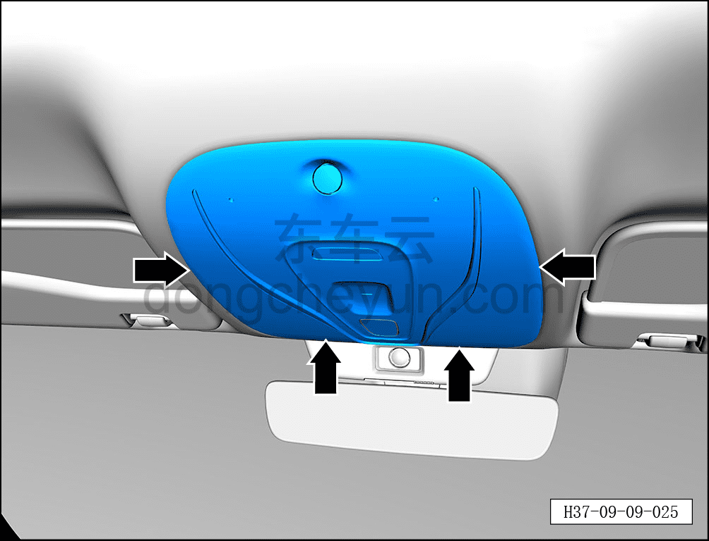
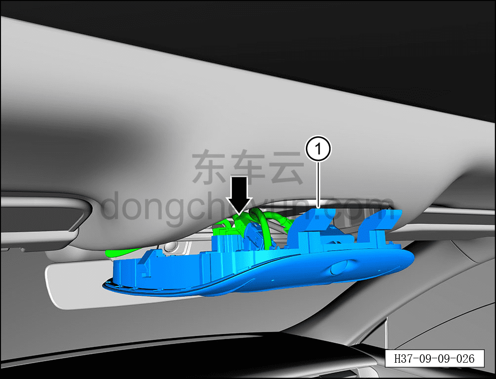

# Снятие и установка переднего потолочного светильника

> Электрическая и электронная система › Система световой сигнализации › Внутренние светильники освещения  
> Оригинал: `拆卸与安装前顶灯` · [dongcheyun 56746](https://dongcheyun.com/p/56746), страница `87971ba16cc841909cb5fb9f2138c900` · [оглавление](../README.md)

**Порядок снятия**

1. Выключите все электроприборы, отключите питание.

2. Выполните обесточивание автомобиля для ремонта. См. [3.1.4.1 Обесточивание автомобиля](../03-техническое-обслуживание/005-обесточивание-автомобиля.md)

3. Снятие переднего потолочного светильника.

a. С помощью съёмника обивки в месте, указанном стрелкой, отсоедините 4 фиксирующие защёлки переднего потолочного светильника.

**Внимание:**

**- К тыльной стороне переднего потолочного светильника подключён жгут проводов, после снятия не тяните с усилием, чтобы не повредить жгут проводов.**

b. Отсоедините 4 разъёма переднего потолочного светильника.

c. Извлеките передний потолочный светильник ①.

**Порядок установки**

Установка выполняется в обратном порядке.

**Примечание:**

**-При установке переднего потолочного светильника следите за жгутом проводов светильника, чтобы избежать его перехлёста и защемления.**

**-После завершения установки необходимо проверить исправность переднего потолочного светильника.**
