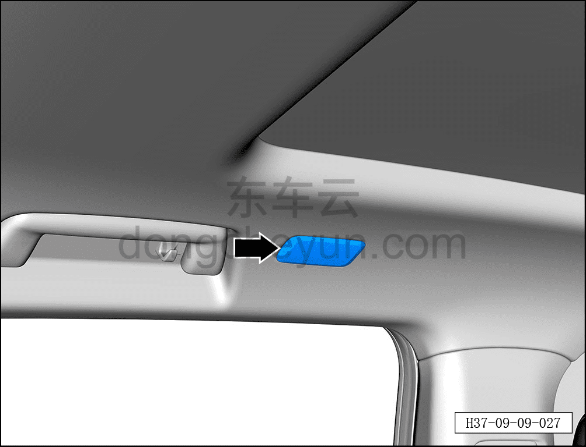

# Снятие и установка левого заднего потолочного светильника

> Электрическая и электронная система › Система световой сигнализации › Внутренние светильники освещения  
> Оригинал: `拆卸与安装左后顶灯` · [dongcheyun 56746](https://dongcheyun.com/p/56746), страница `84df3f16212d448595a022c7f777f2f4` · [оглавление](../README.md)

**Порядок снятия**

**Примечание:**

**-Далее описаны снятие и установка левого заднего потолочного светильника, для правого заднего см. по аналогии с левым задним.**

1. Выключите все электроприборы, отключите питание.

2. Выполните обесточивание автомобиля для ремонта. См. [3.1.4.1 Обесточивание автомобиля](../03-техническое-обслуживание/005-обесточивание-автомобиля.md)

3. Снятие левого заднего потолочного светильника.

a. С помощью съёмника обивки в месте, указанном стрелкой, отсоедините фиксирующую защёлку левого заднего потолочного светильника.

**Внимание:**

**- К тыльной стороне левого заднего потолочного светильника подключён жгут проводов, после снятия не тяните с усилием, чтобы не повредить жгут проводов.**

b. Отсоедините 2 разъёма левого заднего потолочного светильника.

c. Извлеките левый задний потолочный светильник ①.

**Порядок установки**

Установка выполняется в обратном порядке.

**Примечание:**

**-Место расположения защёлки — задний край заднего потолочного светильника.**

**-После завершения установки необходимо проверить исправность заднего потолочного светильника.**
